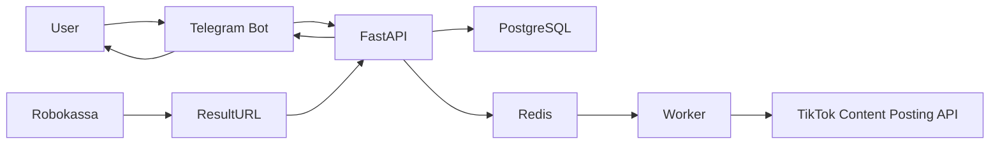

# Project Component Map

This document is the high-level navigation map for Tik_Tok_Loader components. It gives developers a single overview of the system boundaries, data flows, and final architecture principles.

## Main Components

| Component | Purpose |
| --- | --- |
| Telegram Bot | User interface, registration, FSM flows, uploads, tariffs, settings, and notifications. |
| FastAPI | REST API, TikTok OAuth, webhooks, Robokassa callbacks, business services, health checks, and metrics. |
| PostgreSQL | Primary data store for users, TikTok accounts, subscriptions, payments, upload jobs, usage counters, webhook events, audit logs, and settings. |
| Redis | Queue coordination, cache, rate limiting, OAuth state storage, and distributed locks. |
| Worker | Background processing for video validation, preparation, publication, status checks, cleanup, subscription expiry, and retries. |
| TikTok API | Official OAuth 2.0 authorization and Content Posting API video publication. |
| Robokassa | Payment acceptance for PRO and BUSINESS subscriptions through the existing merchant account. |
| Admin Panel | Administrative management, analytics, audit review, settings, users, payments, and upload queues. |

## Interaction Flows

Canonical service flows are:

- User -> Telegram Bot -> FastAPI.
- FastAPI -> PostgreSQL / Redis.
- Worker -> official TikTok Content Posting API.
- Robokassa -> ResultURL -> FastAPI.
- FastAPI -> Telegram Bot -> User.

Detailed publication and payment sequences are documented in [Sequence Flows](sequence-flows.md).

## Architecture Principles

- Modularity.
- Asynchronous processing.
- Security by default.
- Idempotent critical operations.
- Scalable API and worker boundaries.
- Complete and current documentation.
- Official TikTok APIs only.
- Automated tests for release readiness.

## Final Guidance

All specification sections form one technical requirement set for Tik_Tok_Loader. Future changes must preserve the architecture described in [Architecture Summary](architecture-summary.md), remain inside the official TikTok API model, include relevant automated tests, and update documentation together with implementation changes.
