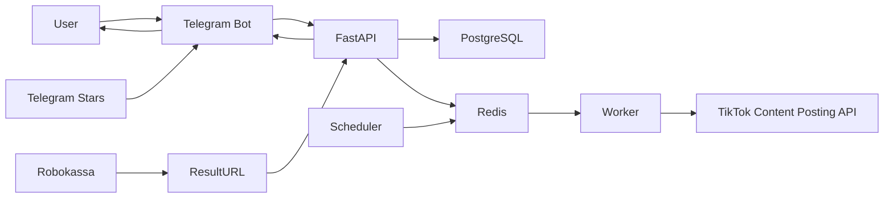
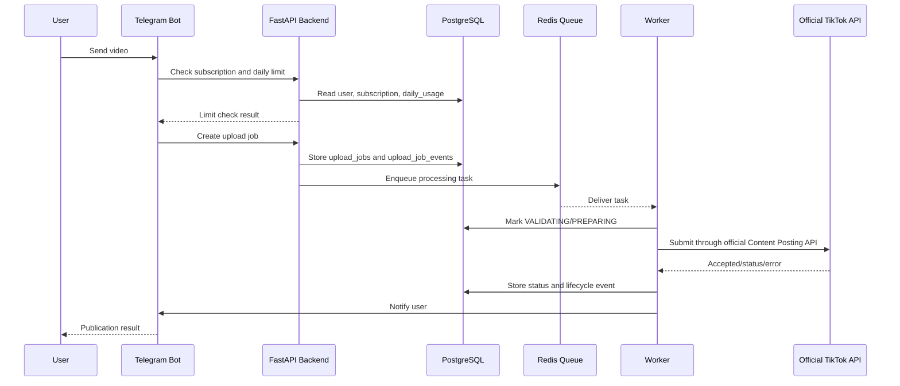
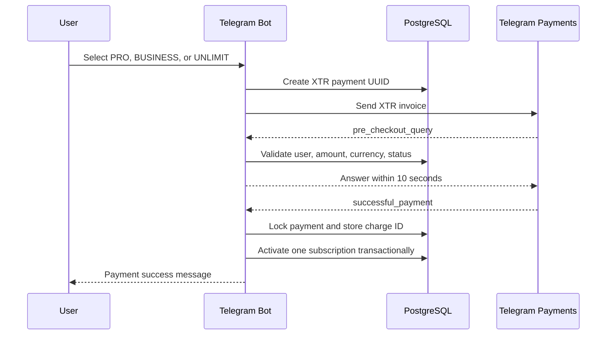

# Tik_Tok_Loader. Единая техническая спецификация

**Unified Technical Specification**

- **Версия:** 0.9.7
- **Репозиторий:** `kredavto/Tik-Tok-bot-Rus-2`
- **Дата сборки:** 2026-07-22
- **Статус:** проектная спецификация для реализации

> Публикация TikTok в проекте проектируется только через официальный TikTok Content Posting API и OAuth 2.0. Неофициальные API, автоматизация интерфейса и методы обхода ограничений не входят в допустимую архитектуру.

## Оглавление

- [1. Compliance Notes](#1-compliance-notes)
- [2. Architecture Summary](#2-architecture-summary)
- [3. Project Component Map](#3-project-component-map)
- [4. Sequence Flows](#4-sequence-flows)
- [5. Implementation Roadmap](#5-implementation-roadmap)
- [6. Non-Functional Requirements](#6-non-functional-requirements)
- [7. Logical Data Model](#7-logical-data-model)
- [8. Users Entity](#8-users-entity)
- [9. TikTok Accounts Entity](#9-tiktok-accounts-entity)
- [10. Subscriptions Entity](#10-subscriptions-entity)
- [11. Payments Entity](#11-payments-entity)
- [12. Upload Jobs Entity](#12-upload-jobs-entity)
- [13. Daily Usage Entity](#13-daily-usage-entity)
- [14. Webhook Events Entity](#14-webhook-events-entity)
- [15. Admin Actions Entity](#15-admin-actions-entity)
- [16. System Settings Entity](#16-system-settings-entity)
- [17. Administrator Guide](#17-administrator-guide)
- [18. User Guide](#18-user-guide)
- [19. Video Publication Lifecycle](#19-video-publication-lifecycle)
- [20. TikTok Developer Configuration](#20-tiktok-developer-configuration)
- [21. Telegram Stars Payments](#21-telegram-stars-payments)
- [22. Robokassa Setup](#22-robokassa-setup)
- [23. API Documentation](#23-api-documentation)
- [24. REST API Standards](#24-rest-api-standards)
- [25. API Versioning and Client Compatibility](#25-api-versioning-and-client-compatibility)
- [26. Public REST API](#26-public-rest-api)
- [27. Administrative REST API](#27-administrative-rest-api)
- [28. OpenAPI and Contract Documentation](#28-openapi-and-contract-documentation)
- [29. Error Codes and Exception Handling](#29-error-codes-and-exception-handling)
- [30. Security, Backup, and Monitoring](#30-security-backup-and-monitoring)
- [31. Security Logging and Audit](#31-security-logging-and-audit)
- [32. Confidential Data Policy](#32-confidential-data-policy)
- [33. Environment Configuration and Secrets Control](#33-environment-configuration-and-secrets-control)
- [34. Configuration](#34-configuration)
- [35. Configuration Management](#35-configuration-management)
- [36. Deployment](#36-deployment)
- [37. CI/CD and Deployment Automation](#37-cicd-and-deployment-automation)
- [38. Containerization](#38-containerization)
- [39. Staging Acceptance Runbook](#39-staging-acceptance-runbook)
- [40. Production Launch Plan](#40-production-launch-plan)
- [41. Operations Runbook](#41-operations-runbook)
- [42. SOP Checklists](#42-sop-checklists)
- [43. Maintenance Guide](#43-maintenance-guide)
- [44. Post-Launch Maintenance and Versioning](#44-post-launch-maintenance-and-versioning)
- [45. Incident Response and Disaster Recovery](#45-incident-response-and-disaster-recovery)
- [46. Incident Management](#46-incident-management)
- [47. Backup and Restore Policy](#47-backup-and-restore-policy)
- [48. Service Continuity Plan](#48-service-continuity-plan)
- [49. Data Retention](#49-data-retention)
- [50. File Storage Policy](#50-file-storage-policy)
- [51. Queue and Retry Policy](#51-queue-and-retry-policy)
- [52. Performance and Scaling](#52-performance-and-scaling)
- [53. Capacity and Performance Management](#53-capacity-and-performance-management)
- [54. Metrics and KPI](#54-metrics-and-kpi)
- [55. Observability and Diagnostics](#55-observability-and-diagnostics)
- [56. Development Standards](#56-development-standards)
- [57. GitHub Workflow](#57-github-workflow)
- [58. Feature Development Plan](#58-feature-development-plan)
- [59. Technical Debt Management](#59-technical-debt-management)
- [60. Dependencies and Third-Party Services](#60-dependencies-and-third-party-services)
- [61. Infrastructure Dependency Management](#61-infrastructure-dependency-management)
- [62. License and Third-Party Component Management](#62-license-and-third-party-component-management)
- [63. Migration and Version Compatibility Plan](#63-migration-and-version-compatibility-plan)
- [64. Release Candidate Manifest](#64-release-candidate-manifest)
- [65. Release Management](#65-release-management)
- [66. Change Acceptance Policy](#66-change-acceptance-policy)
- [67. QA Test Data and Acceptance Scenarios](#67-qa-test-data-and-acceptance-scenarios)
- [68. Test Strategy and Quality Gates](#68-test-strategy-and-quality-gates)
- [69. Acceptance Checklist](#69-acceptance-checklist)
- [70. Requirements Traceability Matrix](#70-requirements-traceability-matrix)
- [71. Glossary and Naming Conventions](#71-glossary-and-naming-conventions)
- [72. Specification Index](#72-specification-index)
- [73. Risk Management](#73-risk-management)

## Список сокращений и терминов

| Сокращение / термин | Описание |
| --- | --- |
| API | Application Programming Interface, программный интерфейс приложения |
| CI/CD | Continuous Integration / Continuous Delivery |
| CSRF | Cross-Site Request Forgery |
| FSM | Finite State Machine, конечный автомат сценариев Telegram-бота |
| JSON | JavaScript Object Notation |
| KPI | Key Performance Indicator |
| NFR | Non-Functional Requirements, нефункциональные требования |
| OAuth 2.0 | Протокол авторизации для подключения аккаунта TikTok |
| RBAC | Role-Based Access Control, ролевая модель доступа |
| REST | Representational State Transfer |
| SOP | Standard Operating Procedure, стандартная операционная процедура |
| TLS/SSL | Криптографическая защита транспортного соединения |
| UTC | Coordinated Universal Time |
| XTR | Код валюты Telegram Stars в Bot API |


# 1. Compliance Notes

Группа спецификации: Общие положения


The compliance boundary is summarized in [Architecture Summary](#2-architecture-summary).

## 1.1. Regional Restrictions

TikTok suspended live streaming and new uploads in Russia in March 2022 while it reviewed the legal implications of Russia's "fake news" law. Public reporting has also described Russia-specific content availability differences after that decision.

This project must not include:

- VPN or proxy automation.
- Geolocation spoofing.
- Device fingerprint spoofing.
- Captcha or anti-bot bypasses.
- Shared account pools.
- Credential collection for direct TikTok password login.
- Attempts to evade TikTok account, API, or regional policies.

## 1.2. Supported Publishing Model

The supported model is the official TikTok Content Posting API:

- A TikTok developer app is registered.
- The app requests and receives approval for `video.publish`.
- Each creator authorizes the app through OAuth.
- The app follows TikTok review and audit requirements.
- The bot respects API errors, account restrictions, privacy settings, and rate limits.

If the official API is unavailable for a specific user or region, the bot should keep the upload as a queued draft and tell the user that publication cannot be completed automatically.

TikTok Developer Portal setup must follow [TikTok Developer Configuration](#20-tiktok-developer-configuration).

# 2. Architecture Summary

Группа спецификации: Архитектура


Terminology and naming rules are defined in [Glossary and Naming Conventions](#71-glossary-and-naming-conventions).

The consolidated component overview is maintained in [Project Component Map](#3-project-component-map).

Non-functional requirements are defined in [Non-Functional Requirements](#6-non-functional-requirements).

## 2.1. Core Principles

- Use only the official TikTok Content Posting API.
- Use OAuth 2.0 for TikTok account authorization.
- Keep the backend asynchronous with FastAPI and aiogram 3.x.
- Preserve the modular repository structure.
- Use Docker and Docker Compose as the primary deployment mechanism.
- Store runtime configuration in `.env` and database-backed system settings.
- Keep secrets out of Git.
- Use strict typing, automated tests, and CI checks.
- Treat all previous specification sections as mandatory project requirements.

## 2.2. Key Subsystems

| Subsystem | Responsibility |
| --- | --- |
| Telegram bot | User registration, FSM flows, upload intake, tariff display, notifications |
| FastAPI backend | OAuth callbacks, webhooks, payments, admin API, health, readiness, metrics |
| PostgreSQL | Users, plans, subscriptions, payments, upload jobs, audit data, settings |
| Redis | Cache, locks, queue coordination, OAuth state, rate limiting |
| Worker | Video validation, preparation, publication workflow, cleanup, background jobs |
| Scheduler | Redis-leased dispatch and heartbeat for recurring maintenance jobs |
| Telegram Stars | In-bot payment for PRO, BUSINESS, and UNLIMIT digital subscriptions |
| Robokassa | Dormant external-channel payment integration, subject to policy approval |
| TikTok OAuth 2.0 | User authorization for official TikTok API access |
| TikTok Content Posting API | Official publication workflow |
| Admin API | Users, subscriptions, payments, plans, jobs, analytics, settings |
| Monitoring and logging | Health checks, readiness checks, metrics, JSON logs, audit trail |

Main component interaction flows are documented in [Sequence Flows](#4-sequence-flows).

## 2.3. Functional Commitments

- FREE, PRO, BUSINESS, and UNLIMIT tariffs are supported.
- FREE is assigned automatically to new users.
- Paid subscriptions expire automatically and return users to FREE.
- Daily upload limits are enforced transactionally.
- Video files are validated safely before publication processing.
- Telegram Stars payments are confirmed idempotently from `successful_payment`.
- Robokassa ResultURL remains idempotent in an approved external channel.
- Background jobs are idempotent and safe to retry only for temporary failures.
- OAuth tokens are stored encrypted.
- User, payment, publication, webhook, and admin actions are logged.
- Public API compatibility is preserved within `/api/v1`.
- Data validation and persistence must follow [Data Quality and Integrity](../data-quality-integrity.md).
- REST API format and compatibility must follow [REST API Standards](#24-rest-api-standards).
- Entity relationships must follow [Logical Data Model](#7-logical-data-model).

## 2.4. Compliance Boundary

The project must not implement:

- VPN or proxy automation.
- Geolocation masking.
- Browser automation for TikTok publishing.
- Unofficial TikTok APIs.
- Credential scraping or password-based TikTok login.
- Attempts to bypass TikTok account, API, or regional restrictions.

If TikTok returns an authorization, permission, regional, account, or policy restriction, the system must report the issue to the user and stop automatic publication attempts for that job.

## 2.5. Quality Requirements

- Non-functional requirements must be checked before production release.
- Database changes use Alembic migrations.
- New features include tests and documentation.
- CI runs linting, typing, tests, migration checks, Docker build, and secret scanning.
- Production releases require staging verification and rollback readiness.
- Monitoring, logs, and KPI must support operational decisions.
- Observability must follow [Observability and Diagnostics](#55-observability-and-diagnostics).
- Data quality controls must follow [Data Quality and Integrity](../data-quality-integrity.md).

## 2.6. Final Rule

Future development must preserve architectural integrity, security, scalability, and maintainability while staying within the official TikTok API model.

Future change acceptance must follow [Change Acceptance Policy](#66-change-acceptance-policy).

# 3. Project Component Map

Группа спецификации: Архитектура


This document is the high-level navigation map for Tik_Tok_Loader components. It gives developers a single overview of the system boundaries, data flows, and final architecture principles.

## 3.1. Main Components

| Component | Purpose |
| --- | --- |
| Telegram Bot | User interface, registration, FSM flows, uploads, tariffs, settings, and notifications. |
| FastAPI | REST API, TikTok OAuth, webhooks, Robokassa callbacks, business services, health checks, and metrics. |
| PostgreSQL | Primary data store for users, TikTok accounts, subscriptions, payments, upload jobs, usage counters, webhook events, audit logs, and settings. |
| Redis | Queue coordination, cache, rate limiting, OAuth state storage, and distributed locks. |
| Worker | Background processing for video validation, preparation, publication, status checks, cleanup, subscription expiry, and retries. |
| Scheduler | Redis-leased dispatch of subscription expiry, OAuth refresh, and retention tasks. |
| TikTok API | Official OAuth 2.0 authorization and Content Posting API video publication. |
| Telegram Stars | In-bot payment acceptance for PRO, BUSINESS, and UNLIMIT digital subscriptions. |
| Robokassa | Existing callback integration reserved for a separately approved sales channel. |
| Admin Panel | Administrative management, analytics, audit review, settings, users, payments, and upload queues. |

## 3.2. Interaction Flows



Canonical service flows are:

- User -> Telegram Bot -> FastAPI.
- FastAPI -> PostgreSQL / Redis.
- Worker -> official TikTok Content Posting API.
- Telegram Stars -> Bot API update -> PostgreSQL subscription transaction.
- Approved external channel: Robokassa -> ResultURL -> FastAPI.
- FastAPI -> Telegram Bot -> User.

Detailed publication and payment sequences are documented in [Sequence Flows](#4-sequence-flows).

## 3.3. Architecture Principles

- Modularity.
- Asynchronous processing.
- Security by default.
- Idempotent critical operations.
- Scalable API and worker boundaries.
- Complete and current documentation.
- Official TikTok APIs only.
- Automated tests for release readiness.

## 3.4. Final Guidance

All specification sections form one technical requirement set for Tik_Tok_Loader. Future changes must preserve the architecture described in [Architecture Summary](#2-architecture-summary), remain inside the official TikTok API model, include relevant automated tests, and update documentation together with implementation changes.

# 4. Sequence Flows

Группа спецификации: Архитектура


The high-level component map is documented in [Project Component Map](#3-project-component-map).

## 4.1. Video Publication Flow



Rules:

- Use Request ID and Correlation ID across bot, API, worker, and logs.
- Create `upload_jobs` before enqueueing processing.
- Record every status transition.
- Retry only temporary failures.
- Consume daily usage only after official TikTok API acceptance.
- Do not retry automatically for authorization, permission, platform, or regional restrictions.

## 4.2. Telegram Stars Payment Flow



Rules:

- FREE does not create a payment.
- Only `successful_payment` activates an in-bot subscription.
- Sending an invoice and accepting pre-checkout do not activate a subscription.
- Duplicate payment updates and charge IDs are idempotent.
- Payment status and subscription activation must be transactional.
- Never log bot tokens or sensitive payment data.

The separately approved Robokassa callback flow remains documented in
[Robokassa Setup](#22-robokassa-setup) and is not presented as an alternative in-bot checkout for digital
subscriptions.

## 4.3. Cross-Cutting Requirements

- All service-to-service operations must be logged with sanitized context.
- Use UTC timestamps in logs and database events.
- Use correlation IDs for linked operations.
- Persist webhook events before processing.
- Keep retries idempotent.
- Follow [Queue and Retry Policy](#51-queue-and-retry-policy), [Observability and Diagnostics](#55-observability-and-diagnostics), and [Error Codes and Exception Handling](#29-error-codes-and-exception-handling).

# 5. Implementation Roadmap

Группа спецификации: Управление реализацией


This document is the final implementation roadmap for Tik_Tok_Loader. It can be used as a development checklist from initial setup to production launch.

## 5.1. Roadmap Stages

| Stage | Goal | Completion Check |
| --- | --- | --- |
| 1. Infrastructure and repository preparation | Prepare repository, Docker layout, environment templates, CI skeleton, and deployment structure. | Repository structure, Docker Compose, `.env.example`, CI, and documentation entry points are present. |
| 2. Core architecture and database | Implement modular application layout, PostgreSQL schema, SQLAlchemy models, Alembic migrations, settings, logging, and Redis connectivity. | Migrations apply, database entities match documentation, health/readiness checks work. |
| 3. Telegram bot | Implement aiogram bot, FSM flows, menu, localization, keyboards, user registration, FREE assignment, plan display, and upload intake. | Bot scenarios pass tests and match FSM documentation. |
| 4. TikTok Content Posting API | Implement official OAuth 2.0 flow, encrypted token storage, token refresh, official publication client, webhook handling, and error reporting. | OAuth and mocked TikTok API tests pass; no unofficial API or bypass behavior exists. |
| 5. Robokassa integration | Implement payment creation, signature verification, ResultURL processing, idempotency, subscription activation, and payment audit. | PRO/BUSINESS/UNLIMIT external-channel payment scenarios pass, SuccessURL does not activate subscriptions. |
| 6. Workers and video processing | Implement queueing, FFprobe validation, safe FFmpeg preparation, TikTok submission jobs, cleanup, retries, and daily-limit accounting. | Upload lifecycle and queue recovery scenarios pass. |
| 7. Admin panel and analytics | Implement administrative API/panel, RBAC, settings, users, payments, upload queue, audit logs, and metrics views. | Admin operations are authenticated, audited, tested, and documented. |
| 8. CI/CD and deployment automation | Complete CI checks, Docker builds, migration checks, secret scanning, deployment guides, backup scripts, and Nginx/HTTPS setup. | CI passes and staging deployment is reproducible. |
| 9. Comprehensive testing | Run unit, integration, FSM, Robokassa, TikTok mock, queue, migration, security, and acceptance checks. | Required tests pass and QA scenarios are documented as complete. |
| 10. Production preparation and launch | Prepare production `.env`, domain, HTTPS, webhooks, TikTok app settings, Robokassa URLs, backups, monitoring, and launch smoke tests. | Production launch checklist passes and project is ready for operation. |

## 5.2. Current Status

Current implementation status: stages 1 through 9 pass the repository's automated quality gates.
Stage 10 infrastructure is active on the Netherlands server: domain and HTTPS, isolated Compose
networking, Telegram webhook delivery, PostgreSQL backup, public smoke checks, Robokassa sandbox
acceptance, production Robokassa configuration, a real Telegram Stars payment/refund scenario, and
TikTok Sandbox OAuth with encrypted token persistence and Creator Info have been verified. Stable
release `0.2.0` is the production baseline. TikTok publication remains disabled until the
controlled Content Posting, application review, and publication acceptance gates pass.

## 5.3. Control Points

Before declaring the project ready:

- All mandatory tests pass.
- Documentation is current.
- Configuration is verified.
- Security checks are complete.
- Secrets are protected.
- Backups and restore procedure are tested.
- OpenAPI and API compatibility are current.
- Technical debt and dependency/license registers are reviewed.
- Production readiness is confirmed.

## 5.4. Final Rule

All previous specification sections are used together as one requirements base for implementation and maintenance. Any roadmap stage may be split into smaller tasks, but each task must preserve the architecture, security, official TikTok API boundary, tests, and documentation rules defined in the specification.

# 6. Non-Functional Requirements

Группа спецификации: Нефункциональные требования


This document defines the non-functional requirements for Tik_Tok_Loader. These requirements apply to every component described in [Project Component Map](#3-project-component-map) and must be checked together with functional acceptance criteria before release.

## 6.1. Performance

| Requirement | Implementation Direction |
| --- | --- |
| Asynchronous processing | Keep FastAPI, aiogram handlers, database access, Redis operations, and external integrations asynchronous where supported. |
| Queues for long-running tasks | Process video validation, preparation, TikTok publication, cleanup, token refresh, payment reconciliation, and subscription expiry in workers. |
| API response time control | Monitor API response time through metrics and logs, and investigate threshold breaches during operations. |
| Minimal blocking | Avoid blocking I/O in request handlers and bot handlers; move heavy work to background jobs. |

Performance controls are detailed in [Performance and Scaling](#52-performance-and-scaling), [Capacity and Performance Management](#53-capacity-and-performance-management), and [Metrics and KPI](#54-metrics-and-kpi).

## 6.2. Reliability

| Requirement | Implementation Direction |
| --- | --- |
| Idempotency | Keep webhook handling, payment confirmation, upload-job processing, retries, and daily-limit accounting safe for repeated execution. |
| Health checks | Expose and monitor liveness, readiness, and metrics endpoints. |
| Backups | Back up PostgreSQL, production configuration, deployment files, and critical documentation according to the retention policy. |
| Safe recovery | Validate restore procedures in staging and preserve payment, subscription, user, and upload history during recovery. |

Reliability controls are detailed in [Queue and Retry Policy](#51-queue-and-retry-policy), [Backup and Restore Policy](#47-backup-and-restore-policy), [Service Continuity Plan](#48-service-continuity-plan), and [Incident Management](#46-incident-management).

## 6.3. Security

| Requirement | Implementation Direction |
| --- | --- |
| Secrets only in `.env` | Keep Telegram, TikTok, Robokassa, database, Redis, and encryption secrets out of Git and application code. |
| Token encryption | Encrypt TikTok OAuth access and refresh tokens before storing them in PostgreSQL. |
| Webhook verification | Verify TikTok and Robokassa webhook signatures before changing business state. |
| RBAC | Enforce server-side roles and permissions for administrative operations. |

Security controls are detailed in [Security, Backup, and Monitoring](#30-security-backup-and-monitoring), [TikTok Accounts Entity](#9-tiktok-accounts-entity), [Webhook Events Entity](#14-webhook-events-entity), and [Administrative REST API](#27-administrative-rest-api).

Security logging and audit controls are detailed in [Security Logging and Audit](#31-security-logging-and-audit).

Confidential data controls are detailed in [Confidential Data Policy](#32-confidential-data-policy).

## 6.4. Maintainability

| Requirement | Implementation Direction |
| --- | --- |
| Modular architecture | Keep bot, API, services, database, workers, security, and deployment code separated by responsibility. |
| Documentation | Update documentation together with code, API, schema, configuration, and operational changes. |
| Tests | Cover new behavior with unit, integration, FSM, Robokassa, TikTok mock, and queue-related tests where relevant. |
| Alembic | Apply all schema changes through Alembic migrations. |

Maintainability controls are detailed in [Development Standards](#56-development-standards), [Migration and Version Compatibility Plan](#63-migration-and-version-compatibility-plan), [OpenAPI and Contract Documentation](#28-openapi-and-contract-documentation), and [Requirements Traceability Matrix](#70-requirements-traceability-matrix).

## 6.5. Scalability

| Requirement | Implementation Direction |
| --- | --- |
| Horizontal API scaling | Support multiple FastAPI instances behind Nginx or another load balancer. |
| Horizontal worker scaling | Support multiple worker processes with Redis-backed coordination and idempotent task handling. |
| Extensible functionality | Add features through existing service boundaries, documented APIs, migrations, tests, and documentation updates. |

Scalability controls are detailed in [Performance and Scaling](#52-performance-and-scaling), [Capacity and Performance Management](#53-capacity-and-performance-management), and [Feature Development Plan](#58-feature-development-plan).

## 6.6. Acceptance Rule

A release is not production-ready until non-functional requirements are checked together with functional flows, security controls, operational readiness, and traceability coverage.

# 7. Logical Data Model

Группа спецификации: Данные


Canonical entity names are defined in [Glossary and Naming Conventions](#71-glossary-and-naming-conventions).

## 7.1. Core Entities

| Entity | Purpose |
| --- | --- |
| `users` | Telegram users and account-level settings |
| `tiktok_accounts` | Connected TikTok accounts and encrypted OAuth tokens |
| `plans` | FREE, PRO, BUSINESS, and UNLIMIT tariffs |
| `subscriptions` | Active and historical subscriptions |
| `payments` | Provider-neutral payment history for Stars and approved external channels |
| `upload_jobs` | Publication tasks and status |
| `upload_job_events` | Upload lifecycle audit trail |
| `daily_usage` | Daily upload limit counters |
| `webhook_events` | Received Telegram, TikTok, and Robokassa webhook events |
| `admin_actions` | Administrator audit log |
| `system_settings` | Runtime non-secret settings |

## 7.2. Main Relationships

| Relationship | Cardinality |
| --- | --- |
| `users` -> `subscriptions` | 1:N |
| `users` -> `payments` | 1:N |
| `users` -> `upload_jobs` | 1:N |
| `users` -> `tiktok_accounts` | 1:N |
| `users` -> `daily_usage` | 1:N |
| `plans` -> `subscriptions` | 1:N |
| `plans` -> `payments` | 1:N |
| `subscriptions` -> `payments` | 1:N |
| `upload_jobs` -> `upload_job_events` | 1:N |

`webhook_events` can reference external IDs from Telegram, TikTok, or Robokassa and should be correlated with payments, upload jobs, or users through payload metadata and diagnostic identifiers when applicable.

## 7.3. Integrity Rules

- Internal entities use UUID primary keys unless the domain requires a stable string identifier, such as `plans.id`.
- Foreign keys enforce core relationships.
- User deletion or anonymization must not break payment, subscription, publication, or audit history.
- TikTok OAuth tokens are encrypted before storage.
- Payment history is retained for accounting and audit.
- Daily usage counters are updated transactionally.
- Schema changes are applied only through Alembic migrations.
- All timestamps are UTC and timezone-aware.

## 7.4. Business Rules

- New users receive the FREE plan automatically.
- Paid subscriptions have a finite `ends_at` value.
- Expired paid subscriptions return users to FREE.
- Payments are activated only after Robokassa ResultURL validation.
- Daily usage is consumed only after official TikTok API acceptance.
- Upload lifecycle transitions are recorded in `upload_job_events`.

## 7.5. Development Requirement

Any new persistent entity must update this model, add an Alembic migration, include tests, and follow [Data Quality and Integrity](../data-quality-integrity.md).

The user entity is specified in [Users Entity](#8-users-entity).

The TikTok account entity is specified in [TikTok Accounts Entity](#9-tiktok-accounts-entity).

The subscription entity is specified in [Subscriptions Entity](#10-subscriptions-entity).

The payment entity is specified in [Payments Entity](#11-payments-entity).

The upload job entity is specified in [Upload Jobs Entity](#12-upload-jobs-entity).

The daily usage entity is specified in [Daily Usage Entity](#13-daily-usage-entity).

The webhook event entity is specified in [Webhook Events Entity](#14-webhook-events-entity).

The admin action entity is specified in [Admin Actions Entity](#15-admin-actions-entity).

The system setting entity is specified in [System Settings Entity](#16-system-settings-entity).

# 8. Users Entity

Группа спецификации: Данные


## 8.1. Purpose

`users` stores Telegram users, account-level settings, access status, and links to subscriptions, payments, publication jobs, TikTok accounts, and daily usage counters.

## 8.2. Recommended Fields

| Field | Type | Purpose |
| --- | --- | --- |
| `id` | UUID | Internal user identifier |
| `telegram_user_id` | BIGINT | Unique Telegram user identifier |
| `username` | VARCHAR | Telegram username when available |
| `language_code` | VARCHAR | Preferred interface language |
| `current_plan_id` | UUID or plan identifier | Current user tariff reference |
| `is_active` | BOOLEAN | User active state |
| `created_at` | TIMESTAMP WITH TIME ZONE | Record creation time |
| `updated_at` | TIMESTAMP WITH TIME ZONE | Last update time |

The current implementation may use internal column names such as `telegram_id` while preserving the same domain meaning. Any schema rename or added field must be delivered through Alembic migration and compatibility checks.

## 8.3. Relationships

| Relationship | Cardinality |
| --- | --- |
| `users` -> `subscriptions` | 1:N |
| `users` -> `payments` | 1:N |
| `users` -> `upload_jobs` | 1:N |
| `users` -> `tiktok_accounts` | 1:N |
| `users` -> `daily_usage` | 1:N |

## 8.4. Integrity Requirements

- Use UUID as the primary key.
- Telegram user ID must be unique.
- User changes must be transactional.
- Users must not be physically deleted without a documented deletion or anonymization procedure.
- Payment, subscription, publication, and audit history must remain consistent after user anonymization.
- User changes that affect access, roles, plans, or blocking state must be auditable.

## 8.5. Audit Requirements

Audit:

- New user registration.
- Terms acceptance.
- Plan changes.
- User blocking or unblocking.
- TikTok disconnect.
- Anonymization or deletion workflow.
- Administrator-initiated profile changes.

## 8.6. Development Requirement

Changes to the `users` entity require updated SQLAlchemy models, Alembic migrations, tests, documentation, and data quality checks.

# 9. TikTok Accounts Entity

Группа спецификации: Данные


## 9.1. Purpose

`tiktok_accounts` stores connected TikTok accounts and OAuth integration metadata for official TikTok API access.

## 9.2. Recommended Fields

| Field | Type | Purpose |
| --- | --- | --- |
| `id` | UUID | Internal record identifier |
| `user_id` | UUID | Reference to `users.id` |
| `tiktok_open_id` | VARCHAR | TikTok account identifier |
| `display_name` | VARCHAR | TikTok display name |
| `access_token` | TEXT encrypted | OAuth access token |
| `refresh_token` | TEXT encrypted | OAuth refresh token |
| `token_expires_at` | TIMESTAMP WITH TIME ZONE | Access token expiration time |
| `refresh_blocked_at` | TIMESTAMP WITH TIME ZONE | Time automatic refresh was stopped after a non-retryable error |
| `refresh_error_code` | VARCHAR | Sanitized non-retryable refresh error code |
| `created_at` | TIMESTAMP WITH TIME ZONE | Connection creation time |
| `updated_at` | TIMESTAMP WITH TIME ZONE | Last update time |

The current implementation may use internal column names such as `open_id`, `access_token_encrypted`, and `refresh_token_encrypted` while preserving the same domain meaning. Any schema rename or added field must be delivered through Alembic migration and compatibility checks.

## 9.3. Relationships

| Relationship | Cardinality |
| --- | --- |
| `users` -> `tiktok_accounts` | 1:N |
| `tiktok_accounts` -> `upload_jobs` | 1:N |

## 9.4. Security Requirements

- Store OAuth access tokens only in encrypted form.
- Store OAuth refresh tokens only in encrypted form.
- Never log tokens, decrypted token values, or raw OAuth responses containing tokens.
- Delete encrypted tokens when the user disconnects the TikTok account.
- Check access token expiration before each TikTok API call.
- Refresh access tokens safely through the official OAuth refresh flow.
- Retry only network, rate-limit, and server failures. A permanent OAuth response blocks further
  scheduled refresh attempts until the user reconnects the account.
- Do not collect TikTok passwords.

## 9.5. Integrity Requirements

- `user_id` is required.
- TikTok account identifier must be unique within the system unless a documented multi-tenant reason requires a different constraint.
- Token updates must be transactional.
- Account disconnect must be transactional and auditable.
- Upload jobs should reference the TikTok account used for publication when available.

## 9.6. Audit Requirements

Audit:

- TikTok OAuth connection.
- Token refresh success or sanitized failure.
- TikTok account disconnect.
- Permission or scope errors.
- Administrator support actions related to TikTok accounts.

## 9.7. Development Requirement

Changes to `tiktok_accounts` require updated SQLAlchemy models, Alembic migrations, tests, documentation, and security review.

# 10. Subscriptions Entity

Группа спецификации: Данные


## 10.1. Purpose

`subscriptions` stores active and historical user subscriptions for FREE, PRO, BUSINESS, and
UNLIMIT plans.

## 10.2. Recommended Fields

| Field | Type | Purpose |
| --- | --- | --- |
| `id` | UUID | Subscription identifier |
| `user_id` | UUID | Reference to `users.id` |
| `plan_id` | UUID or plan identifier | Reference to `plans.id` |
| `status` | VARCHAR | `active`, `expired`, or `cancelled` |
| `starts_at` | TIMESTAMP WITH TIME ZONE | Subscription start time |
| `expires_at` | TIMESTAMP WITH TIME ZONE | End time, `NULL` for FREE |
| `expiration_notified_at` | TIMESTAMP WITH TIME ZONE | Successful Telegram expiration notification time |
| `daily_limit` | INTEGER | Daily publication limit captured for the subscription |
| `created_at` | TIMESTAMP WITH TIME ZONE | Record creation time |
| `updated_at` | TIMESTAMP WITH TIME ZONE | Last update time |

The current implementation may use `ends_at` for the same domain meaning as `expires_at`. Any schema rename or added field must be delivered through Alembic migration and compatibility checks.

## 10.3. Relationships

| Relationship | Cardinality |
| --- | --- |
| `users` -> `subscriptions` | 1:N |
| `plans` -> `subscriptions` | 1:N |
| `subscriptions` -> `payments` | 1:N |

## 10.4. Business Rules

- New users automatically receive the FREE plan.
- FREE subscriptions have no expiration time.
- PRO, BUSINESS, and UNLIMIT subscriptions expire after the configured paid period.
- After a paid subscription expires, the user returns to FREE automatically.
- UNLIMIT uses `daily_limit=0`, which means no daily publication cap.
- Only one subscription should be active for a user at the same time.
- Switching to a paid plan must not delete historical subscription records.
- Subscription status changes must be transactional.
- The scheduler locks due rows, marks paid subscriptions expired, creates FREE, and commits before
  dispatching Telegram notifications.
- Failed notifications remain pending and are retried without creating another FREE subscription.

## 10.5. Audit Requirements

Audit:

- FREE assignment.
- Paid subscription activation.
- Subscription renewal.
- Subscription expiration.
- Cancellation.
- Manual administrator changes.
- Automatic return to FREE.

## 10.6. Integrity Requirements

- `user_id` is required.
- `plan_id` is required.
- Historical subscription records must not be deleted.
- Payments linked to subscriptions must remain available for accounting and audit.
- Subscription state changes must not partially update payments, daily limits, or user state.

## 10.7. Development Requirement

Changes to `subscriptions` require updated SQLAlchemy models, Alembic migrations, tests, documentation, and data quality checks.

# 11. Payments Entity

Группа спецификации: Данные


## 11.1. Purpose

`payments` stores the immutable history of PRO, BUSINESS, and UNLIMIT payment attempts. Telegram Stars is the
checkout provider for digital subscriptions purchased inside the bot. Robokassa is retained only for
a separately approved channel that complies with provider and platform rules.

## 11.2. Recommended Fields

| Field | Type | Purpose |
| --- | --- | --- |
| `id` | UUID | Internal payment identifier |
| `user_id` | UUID | Reference to `users.id` |
| `subscription_id` | UUID | Related subscription |
| `provider` | VARCHAR | `telegram_stars` or `robokassa` |
| `provider_invoice_id` | INTEGER | Internal/Robokassa invoice reference |
| `provider_charge_id` | VARCHAR | Unique provider confirmation ID |
| `amount_rub` | INTEGER | RUB amount snapshot where applicable |
| `amount_stars` | INTEGER | Telegram Stars amount where applicable |
| `currency` | VARCHAR | `XTR` or `RUB` |
| `status` | VARCHAR | `created`, `pending`, `paid`, `refund_pending`, `failed`, `cancelled`, `refunded` |
| `paid_at` | TIMESTAMP WITH TIME ZONE | Payment confirmation time |
| `created_at` | TIMESTAMP WITH TIME ZONE | Record creation time |

The current implementation may use internal names such as `provider_invoice_id` for `inv_id` and `amount_rub` for `amount`. Any schema rename or added field must be delivered through Alembic migration and compatibility checks.

## 11.3. Relationships

| Relationship | Cardinality |
| --- | --- |
| `users` -> `payments` | 1:N |
| `subscriptions` -> `payments` | 1:N |

## 11.4. Business Rules

- FREE does not create a payment record.
- Only PRO, BUSINESS, and UNLIMIT purchases create payment records.
- Telegram Stars activation happens only after validated `successful_payment`.
- A definitive Stars invoice rejection changes `created` to `failed`; an ambiguous transport result
  remains `created` because Telegram may still have delivered the invoice.
- Telegram Stars refund calls require a committed `refund_pending` claim; duplicate requests do not
  repeat the provider call, and Telegram's service event reconciles ambiguous outcomes.
- Robokassa activation happens only after verified ResultURL in an approved channel.
- SuccessURL is informational and must not activate a subscription.
- Repeated ResultURL notifications must be idempotent and must not activate the same subscription twice.
- Every payment status change must be auditable.

## 11.5. Security Requirements

- Do not store provider secrets or personal banking data in `payments`.
- Validate the Telegram user, amount, `XTR` currency, invoice payload, and charge ID.
- Verify digital signature before changing payment status.
- Verify amount before changing payment status.
- Verify currency when Robokassa provides it.
- Verify `InvId` before changing payment status.
- Do not log Robokassa passwords or raw secrets.
- Execute each local payment/subscription state transition atomically. External provider calls occur
  between committed transition stages and must be recoverable and idempotent.

## 11.6. Development Requirement

Changes to `payments` require updated SQLAlchemy models, Alembic migrations, tests, documentation,
provider-specific idempotency checks, and security review.

# 12. Upload Jobs Entity

Группа спецификации: Данные


## 12.1. Purpose

`upload_jobs` tracks the lifecycle of each video publication request from Telegram intake through official TikTok API submission and final status.

## 12.2. Recommended Fields

| Field | Type | Purpose |
| --- | --- | --- |
| `id` | UUID | Upload job identifier |
| `user_id` | UUID | Reference to `users.id` |
| `tiktok_account_id` | UUID | Reference to `tiktok_accounts.id` |
| `status` | VARCHAR | `NEW`, `QUEUED`, `UPLOADING`, `PROCESSING`, `PUBLISHED`, `FAILED`, `CANCELLED` |
| `video_path` | TEXT | Temporary local file path |
| `caption` | TEXT | Video description |
| `hashtags` | TEXT | Hashtags |
| `error_code` | VARCHAR | Error code when available |
| `usage_date` | DATE | Business date on which the accepted attempt was reserved |
| `usage_refunded_at` | TIMESTAMP WITH TIME ZONE | Idempotency marker for a returned attempt |
| `created_at` | TIMESTAMP WITH TIME ZONE | Record creation time |
| `updated_at` | TIMESTAMP WITH TIME ZONE | Last update time |

The current implementation may use internal names such as `local_path` for `video_path` and may store hashtags as part of `caption` until a separate field is introduced through migration.

## 12.3. Lifecycle

1. Create upload job.
2. Validate video.
3. Queue processing.
4. Upload through the official TikTok Content Posting API.
5. Receive or poll publication status.
6. Mark as published, failed, or cancelled.

The detailed lifecycle is documented in [Video Publication Lifecycle](#19-video-publication-lifecycle).

## 12.4. Status Rules

- Every job uses a unique UUID.
- Status changes must follow allowed transitions.
- Every status change must be recorded in `upload_job_events`.
- Retry is allowed only for temporary errors.
- Terminal states must not be overwritten by stale retries.
- User daily allowance is reserved only after official TikTok API acceptance.
- A final TikTok `FAILED` status returns the reservation exactly once. Repeated webhook delivery or
  polling cannot decrement the counter twice.

Daily counter rules are documented in [Daily Usage Entity](#13-daily-usage-entity).

## 12.5. Relationships

| Relationship | Cardinality |
| --- | --- |
| `users` -> `upload_jobs` | 1:N |
| `tiktok_accounts` -> `upload_jobs` | 1:N |
| `upload_jobs` -> `upload_job_events` | 1:N |

## 12.6. Development Requirement

Changes to `upload_jobs` require updated SQLAlchemy models, Alembic migrations, tests, queue/retry review, documentation, and data quality checks.

# 13. Daily Usage Entity

Группа спецификации: Данные


## 13.1. Purpose

`daily_usage` tracks publication reservations for FREE, PRO, BUSINESS, and UNLIMIT users.

## 13.2. Recommended Fields

| Field | Type | Purpose |
| --- | --- | --- |
| `id` | UUID | Usage record identifier |
| `user_id` | UUID | Reference to `users.id` |
| `usage_date` | DATE | Accounting date |
| `plan_id` | UUID or plan identifier | Plan at the time of accounting |
| `daily_limit` | INTEGER | Daily publication limit |
| `used_count` | INTEGER | Successfully accepted publications |
| `remaining_count` | INTEGER | Remaining daily limit |
| `updated_at` | TIMESTAMP WITH TIME ZONE | Last update time |

The current implementation may use `upload_count` for the same domain meaning as `used_count`. `remaining_count` may be calculated from the active plan limit and used count until a persisted field is introduced through migration.

## 13.3. Business Rules

- Create a record automatically on the first accepted publication of the day.
- The business day resets at 00:00 Europe/Moscow.
- Reserve usage only after the official TikTok API accepts the publication.
- Return the reserved attempt exactly once when TikTok reports final `FAILED`, including provider
  `internal` failures. The upload job stores the accounting date and refund timestamp.
- Do not increment usage for validation, preparation, authorization, or platform-restriction failures.
- `daily_limit=0` means unlimited. Usage is still counted for analytics but never blocks publishing.
- If a user changes plan during the day, recalculate remaining allowance without resetting already used publications.
- Reprocessing the same upload job must not increment the counter twice.

## 13.4. Integrity Requirements

- `user_id` and `usage_date` must be unique together.
- Counter updates must be transactional.
- Use locking or equivalent concurrency protection before incrementing counters.
- Counter updates must be idempotent for repeated worker attempts.
- Webhook and polling races must not refund one upload more than once.
- Usage changes must be auditable.

## 13.5. Relationships

| Relationship | Cardinality |
| --- | --- |
| `users` -> `daily_usage` | 1:N |
| `plans` -> `daily_usage` | 1:N logical reference when plan is captured |

## 13.6. Development Requirement

Changes to `daily_usage` require updated SQLAlchemy models, Alembic migrations, tests for concurrent updates, queue/retry review, and data quality checks.

# 14. Webhook Events Entity

Группа спецификации: Данные


## 14.1. Purpose

`webhook_events` stores inbound webhook events from TikTok, Robokassa, Telegram, and internal service callbacks before processing.

## 14.2. Recommended Fields

| Field | Type | Purpose |
| --- | --- | --- |
| `id` | UUID | Event identifier |
| `source` | VARCHAR | Event source: `tiktok`, `robokassa`, `telegram`, or internal source |
| `event_type` | VARCHAR | Event type |
| `external_event_id` | VARCHAR | External service event identifier |
| `payload` | JSONB | Original webhook payload |
| `processed` | BOOLEAN | Successful processing marker |
| `processed_at` | TIMESTAMP WITH TIME ZONE | Processing time |
| `created_at` | TIMESTAMP WITH TIME ZONE | Receive time |

The current implementation may use `provider` for `source`, `external_id` for `external_event_id`, and `status` for processing state. Any schema rename or added field must be delivered through Alembic migration and compatibility checks.

## 14.3. Business Rules

- Save every inbound event before processing begins.
- Identify repeated events by `source` and `external_event_id` when the external service provides an ID.
- Processing must be idempotent.
- Processing errors must be logged with sanitized reason and correlation context.
- Mark successful processing with `processed=true` or equivalent terminal processed status.
- Repeated processed events must not duplicate payments, subscription activation, upload status changes, or notifications.

## 14.4. Security Requirements

- Verify webhook signatures before trusting payload contents.
- Validate payload structure before processing.
- Do not store secret keys in `payload`.
- Mask tokens, passwords, signatures, and secrets in logs.
- Limit webhook event access to authorized administrators and support roles.

## 14.5. Sources

Supported sources:

- `telegram`
- `tiktok`
- `robokassa`
- Internal service callbacks when needed

## 14.6. Development Requirement

Changes to `webhook_events` require updated SQLAlchemy models, Alembic migrations, tests for idempotency and invalid signatures, documentation, and security review.

# 15. Admin Actions Entity

Группа спецификации: Данные


## 15.1. Purpose

`admin_actions` stores immutable audit records for administrative operations.

## 15.2. Recommended Fields

| Field | Type | Purpose |
| --- | --- | --- |
| `id` | UUID | Audit record identifier |
| `admin_user_id` | UUID | Administrator who performed the action |
| `action` | VARCHAR | Administrative action type |
| `target_type` | VARCHAR | Changed entity type |
| `target_id` | UUID or VARCHAR | Changed entity identifier |
| `details` | JSONB | Additional change details |
| `created_at` | TIMESTAMP WITH TIME ZONE | Action time |
| `ip_address` | VARCHAR | Administrative request source when available |

The implementation uses `metadata_json` for `details`. The `ip_address` field is introduced by
Alembic revision `0006_admin_console`.

## 15.3. Recorded Actions

Record:

- Plan changes.
- User blocking and unblocking.
- Manual subscription activation or cancellation.
- System settings changes.
- Safe task restart.
- Project configuration changes.
- Role or permission changes.
- User anonymization or TikTok disconnect initiated by support.

## 15.4. Integrity Requirements

- Audit records must not be modified by users.
- Audit records must not be changed after creation except by a documented retention or archival process.
- Deletion is allowed only according to approved retention policy.
- Every administrative operation must write an audit record before confirming success to the administrator.
- Search must be supported by administrator, action type, target, and time range.

Administrative REST requirements are documented in [Administrative REST API](#27-administrative-rest-api).

Security logging requirements are documented in [Security Logging and Audit](#31-security-logging-and-audit).

## 15.5. Security Requirements

- Do not store secrets, raw tokens, passwords, or Robokassa credentials in `details`.
- Mask sensitive values before writing audit metadata.
- Restrict access to authorized administrator roles.

## 15.6. Development Requirement

Changes to `admin_actions` require updated SQLAlchemy models, Alembic migrations, tests, documentation, retention review, and security review.

# 16. System Settings Entity

Группа спецификации: Данные


## 16.1. Purpose

`system_settings` stores mutable non-secret project settings that can be changed without modifying source code.

## 16.2. Recommended Fields

| Field | Type | Purpose |
| --- | --- | --- |
| `id` | UUID | Setting record identifier |
| `setting_key` | VARCHAR | Unique setting key |
| `setting_value` | TEXT or JSONB | Setting value |
| `value_type` | VARCHAR | `string`, `int`, `bool`, or `json` |
| `description` | TEXT | Setting description |
| `is_editable` | BOOLEAN | Whether admins may edit through admin UI |
| `updated_by` | UUID | Last administrator who changed the setting |
| `updated_at` | TIMESTAMP WITH TIME ZONE | Last update time |

The current implementation may use `key` for `setting_key` and `value` for `setting_value`. Any schema rename or added field must be delivered through Alembic migration and compatibility checks.

## 16.3. Example Settings

- `intake_enabled`.
- `video_retention_hours`.
- `log_retention_days`.
- `backup_retention_days`.
- `audit_log_retention_days`.

Plan prices, daily limits, duration, and sale availability are stored in `plans`, not duplicated in
`system_settings`.

## 16.4. Integrity Requirements

- Every `setting_key` must be unique.
- Validate value type before saving.
- Validate allowed ranges and enum values before saving.
- Setting updates must be transactional.
- Setting updates must be written to `admin_actions`.
- Configuration export must exclude secret-like settings.
- Seed defaults only when a key is absent; never overwrite an administrator change at startup.
- Retention workers read database values for each cleanup cycle and use `.env` as fallback.

## 16.5. Security Requirements

- Critical secrets must not be stored in `system_settings`.
- Secrets remain only in `.env` or a managed secret store.
- Do not store Telegram bot tokens, TikTok client secrets, Robokassa passwords, encryption keys, API tokens, or webhook secrets in this table.
- Restrict editing to authorized administrator roles.

## 16.6. Development Requirement

Changes to `system_settings` require updated SQLAlchemy models, Alembic migrations, tests, documentation, configuration validation, and security review.

# 17. Administrator Guide

Группа спецификации: Администрирование


## 17.1. Access

The web console is served by FastAPI at `/admin-ui/`. In production, open it only through the
configured HTTPS domain. The console keeps credentials in browser memory for the current page
only; it does not use local or session storage.

Admin API access requires:

- `ADMIN_API_TOKEN`
- `ADMIN_API_TELEGRAM_ID`, bound on the server to that token
- `ADMIN_CSRF_TOKEN` for mutating requests
- the same Telegram ID listed in `TELEGRAM_ADMIN_IDS` and provisioned as an unblocked admin user

Required headers:

```text
Authorization: Bearer <ADMIN_API_TOKEN>
X-CSRF-Token: <ADMIN_CSRF_TOKEN>
```

The caller cannot select an administrator identity in an HTTP header. The bearer credential is
resolved only to `ADMIN_API_TELEGRAM_ID`; blocked users, non-admin users, and the `USER` role are
rejected even when the bearer token is valid.

Do not expose secrets, TikTok tokens, Robokassa passwords, or raw OAuth credentials in the UI.

## 17.2. Roles

RBAC is enforced on the server. Client-side checks are only UI hints.

| Role | Access |
| --- | --- |
| USER | Telegram bot features for own account |
| SUPPORT | Statistics, users, payments, upload jobs, and error logs |
| ADMIN | SUPPORT permissions plus user, tariff, and payment management |
| SUPER_ADMIN | Full access, including system settings and role management |

The permission matrix is defined in `app.security.rbac`, so new roles and permissions can be added without changing business handlers.

## 17.3. Sections

- Dashboard and analytics: `/api/v1/admin/dashboard`, `/api/v1/admin/analytics`
- Users and user details: `/api/v1/admin/users`
- Plans and independent RUB/Stars prices: `/api/v1/admin/plans`
- Payments: `/api/v1/admin/payments`
- Upload queue and publication errors: `/api/v1/admin/upload-jobs`, `/api/v1/admin/errors`
- System settings: `/api/v1/admin/settings`
- Audit journal: `/api/v1/admin/audit-actions`
- User role management: `/api/v1/admin/users/{user_id}/role`

Legacy `/admin/*` routes remain available for compatibility but are excluded from OpenAPI. New
clients must use `/api/v1/admin/*`.

Dashboard and analytics KPI are defined in [Metrics and KPI](#54-metrics-and-kpi).

Administrative REST endpoint requirements are documented in [Administrative REST API](#27-administrative-rest-api).

## 17.4. Plan Management

PRO, BUSINESS, and UNLIMIT price, daily limit, duration, and sale availability are stored in PostgreSQL and can be changed without code edits. A zero daily limit means unlimited.

Every plan update is written to `admin_actions`.

## 17.5. User Management

Admins can:

- Search users by Telegram ID or username.
- Block or unblock users.
- Inspect connected TikTok account metadata without access to OAuth tokens.
- Inspect publication and payment history.
- Return a user to FREE without deleting subscription history.
- Review payment and subscription state.
- Review RUB and Telegram Stars revenue separately.
- Create audited Robokassa checkout links for an approved external sales channel.
- Refund eligible Stars payments through Telegram's official refund method.
- Reconcile an ambiguous Stars refund after checking the provider, choosing either `refunded` or
  `not_refunded`; the operation is permission checked and audited.

SUPER_ADMIN can assign roles. Every mutating operation requires the CSRF token and is recorded
with the request source IP when available.

Queue inspection and safe retry rules are documented in [Queue and Retry Policy](#51-queue-and-retry-policy).

Only failed jobs with a classified temporary network or queue error, no TikTok publish ID, and an
existing local video file can be restarted from the console. Authorization, permissions, platform
restrictions, invalid media, and ambiguous accepted publications are never retried automatically.

## 17.6. Runtime Settings

The application seeds editable, non-secret settings for intake and retention. Retention workers
read these values from PostgreSQL on every cleanup cycle and use `.env` values only as fallback.
Invalid typed values are rejected before persistence.

Secrets remain in `.env`; secret-like keys are excluded from the settings API and configuration
export.

## 17.7. Audit

Administrative actions are recorded in `admin_actions`. Payment and webhook processing are recorded in `webhook_events`.

Admin audit storage rules are documented in [Admin Actions Entity](#15-admin-actions-entity).

System setting edit rules are documented in [System Settings Entity](#16-system-settings-entity).

# 18. User Guide

Группа спецификации: Пользовательские сценарии


User-facing errors must follow [Error Codes and Exception Handling](#29-error-codes-and-exception-handling).

## 18.1. Start

1. Open the Telegram bot.
2. Send `/start`.
3. Accept the user agreement.
4. Connect TikTok through official OAuth 2.0.

## 18.2. Upload Video

1. Tap `📤 Загрузить видео`.
2. Send MP4, MOV, or WEBM.
3. Enter a description.
4. Enter hashtags.
5. Confirm publication.

The bot validates and prepares the video, then sends it to TikTok only through the official Content Posting API.

## 18.3. Tariffs

- FREE: 2 videos per day.
- PRO: 5 videos per day.
- BUSINESS: 10 videos per day.
- UNLIMIT: unlimited videos for 30 days, `999 XTR` or the external-channel reference price `1999 RUB`.

The tariff screen shows both Stars and RUB reference prices. Paid plans purchased inside the bot are
invoiced in Telegram Stars and activate only after Telegram confirms `successful_payment`.
Robokassa is reserved for an approved external sales channel and is not offered as an alternative
digital-goods checkout inside Telegram. Use `/paysupport` for payment support without sending
passwords, one-time codes, or card details.

Use `/terms` at any time to review the user agreement accepted during registration.

## 18.4. TikTok Disconnect

Open settings and tap `Отключить TikTok`. Stored OAuth tokens are deleted.

## 18.5. Errors

The bot shows a short user-safe message. Internal details, tokens, and provider secrets are never
shown. If TikTok accepts a video and later reports a final processing failure, the reserved daily
attempt is returned automatically.

# 19. Video Publication Lifecycle

Группа спецификации: Пользовательские сценарии


Upload job storage rules are documented in [Upload Jobs Entity](#12-upload-jobs-entity).

End-to-end publication sequence is documented in [Sequence Flows](#4-sequence-flows).

## 19.1. Statuses

- `NEW`
- `VALIDATING`
- `PREPARING`
- `QUEUED`
- `UPLOADING`
- `PROCESSING`
- `PUBLISHED`
- `FAILED`
- `CANCELLED`

## 19.2. Flow

1. User starts upload.
2. Bot checks TikTok connection and daily limit.
3. Bot receives the video.
4. Worker validates container, signature, size, duration, and FFprobe metadata.
5. Worker transcodes WEBM to MP4 when needed.
6. User description and hashtags are stored with the upload job.
7. Worker sends the video through the official TikTok API.
8. Current status is stored on `upload_jobs`.
9. Each lifecycle transition is recorded in `upload_job_events`.
10. User receives a Telegram notification.

## 19.3. Error Rules

- No daily limit is consumed when validation or preparation fails.
- Daily allowance is reserved only after official TikTok API acceptance.
- A final TikTok processing failure returns the reserved attempt exactly once, including
  retryable provider-side `internal` failures.
- Authorization and platform restriction errors are not retried automatically.
- Temporary failures can be retried by the queue system.

# 20. TikTok Developer Configuration

Группа спецификации: Интеграции


## 20.1. Application Configuration

- Store `TIKTOK_CLIENT_KEY` and `TIKTOK_CLIENT_SECRET` only in `.env` or a managed secret store.
- Do not commit TikTok credentials.
- Use separate TikTok developer applications for development, staging, and production when needed.
- Keep `TIKTOK_REDIRECT_URI` synchronized with the production HTTPS callback URL.
- Document every TikTok Developer Portal setting change in the operations journal or admin audit log.

### 20.1.1. Production portal values

Use these exact public values for the production application:

| Setting | Value |
|---|---|
| Application name | `Tik_Tok_loader` |
| Web URL | `https://loader.invest-lend.ru/` |
| Terms of Service URL | `https://loader.invest-lend.ru/legal/terms` |
| Privacy Policy URL | `https://loader.invest-lend.ru/legal/privacy` |
| Redirect URI | `https://loader.invest-lend.ru/api/v1/oauth/tiktok/callback` |
| Webhook URL | `https://loader.invest-lend.ru/api/v1/webhooks/tiktok` |
| Product | Content Posting API |
| OAuth scopes | `user.info.basic`, `video.publish` |

The application icon is stored at `app/public/static/app-icon.png`. It is an original 1024 x
1024 PNG and does not use TikTok or Telegram trademarks.

Recommended short description:

> Telegram bot that lets users securely publish their own videos to TikTok through the official API.

Recommended review explanation:

> Tik_Tok_loader is a Telegram bot for users to publish videos they own to their TikTok account.
> The user connects TikTok through OAuth 2.0 with user.info.basic and video.publish. Before upload,
> the bot queries current creator information, shows the target account and available privacy,
> interaction, and commercial-content settings, and requires explicit confirmation. A background
> worker transfers the file through the official Content Posting API and reports processing and
> final status. OAuth tokens are encrypted and users can disconnect at any time. The service does
> not collect TikTok passwords and does not use unofficial APIs, interface automation, or regional
> restriction bypasses.

## 20.2. OAuth Settings

Before release, verify:

- Redirect URI exactly matches `TIKTOK_REDIRECT_URI`.
- Required scopes are approved in TikTok Developer Portal.
- `video.publish` is approved before production publication is enabled.
- OAuth `state` validation works.
- Access token expiration is handled.
- Refresh token renewal flow works.
- Token refresh errors do not expose tokens in logs.

## 20.3. Webhook Settings

TikTok webhook configuration must:

- Use HTTPS.
- Match the production public domain.
- Signatures use the TikTok app `TIKTOK_CLIENT_SECRET`; no separate webhook secret is accepted by
  the official verification algorithm.
- Verify the `TikTok-Signature` timestamp and HMAC against the unmodified request body.
- Reject webhook timestamps older than five minutes to limit replay attacks.
- Process events idempotently.
- Log delivery, validation, and processing errors without exposing secrets.

## 20.4. Production Pre-Release Check

Before every production release:

1. Confirm TikTok Developer Portal app status.
2. Confirm production Redirect URI.
3. Confirm approved scopes.
4. Confirm webhook URL and `TIKTOK_CLIENT_SECRET` signature verification.
5. Run a test OAuth authorization with a test TikTok account.
6. Confirm encrypted token storage.
7. Confirm refresh flow behavior.
8. Confirm official Content Posting API behavior in staging or controlled production test.
9. Confirm no bypass, browser automation, or unofficial API behavior exists.

## 20.5. Review Evidence

The first review submission must include a demo video recorded with a Sandbox account. The demo
must show the complete user-controlled flow:

1. Start the Telegram bot and accept the service terms.
2. Open TikTok OAuth and approve only the requested scopes.
3. Return to the bot with the connected TikTok account displayed.
4. Upload an owned test video and review creator information.
5. Manually choose privacy and interaction settings with no preselected privacy value.
6. Show the video preview, leave commercial-content disclosure off by default, then demonstrate
   the optional multi-select disclosure controls and the applicable TikTok label.
7. Show the literal Music Usage Confirmation declaration and, for branded content, the Branded
   Content Policy declaration immediately before the publish button.
8. Show the processing status and final private post in the test TikTok account.
9. Disconnect TikTok and confirm that stored OAuth credentials are removed.

Do not submit the application for review until the portal draft, Sandbox flow, and demo video have
all been checked against the current production build.

## 20.6. Required Direct Post UX

Before every publication the bot must query `/v2/post/publish/creator_info/query/` and:

1. Display the TikTok creator nickname.
2. Require a manual choice from the returned privacy options, with no default.
3. Enforce the creator-specific maximum video duration.
4. Let the user explicitly enable Comment, Duet, and Stitch only when TikTok allows them.
5. Collect commercial-content disclosure and prevent branded content with `SELF_ONLY` visibility.
6. Display a preview of the exact video selected for publication.
7. Display the applicable Music Usage Confirmation and Branded Content Policy declaration.
8. Obtain explicit publication consent before any media is transferred to TikTok.
9. Poll `/v2/post/publish/status/fetch/` or process final Content Posting webhooks.

Unaudited TikTok clients remain restricted to `SELF_ONLY` posts and other platform limits. TikTok
also requires every target creator account to be set to private at posting time. Keep
`TIKTOK_APP_AUDITED=false` until the Direct Post audit is approved; the bot then blocks public
creator accounts before confirmation. The system must report these restrictions and must not
attempt to bypass them.

TikTok account persistence rules are documented in [TikTok Accounts Entity](#9-tiktok-accounts-entity).

## 20.7. Change Control

Changes to TikTok Developer settings must include:

- Date and owner.
- Environment.
- Changed setting.
- Reason for change.
- Expected impact.
- Verification result.
- Rollback plan when applicable.

## 20.8. Compliance Rule

If TikTok rejects authorization, scope, publication, region, account, policy, or webhook processing, the application must report the restriction and must not attempt circumvention.

# 21. Telegram Stars Payments

Группа спецификации: Интеграции


## 21.1. Scope and Compliance

PRO, BUSINESS, and UNLIMIT are digital services consumed inside Telegram. Purchases initiated by the bot must
therefore use Telegram Stars (`XTR`) in accordance with the official Telegram payment rules for
digital goods and services.

The bot must not present Robokassa, bank-card links, phone transfers, or another currency as an
alternative checkout method for the same digital subscription inside Telegram.

Official references:

- [Telegram Stars payments for bots](https://core.telegram.org/bots/payments-stars)
- [Telegram Stars API](https://core.telegram.org/api/stars)

## 21.2. Tariff Configuration

`plans.price_stars` stores the positive integer Stars price for each paid plan. The approved prices
are `199 XTR` for PRO, `499 XTR` for BUSINESS, and `999 XTR` for UNLIMIT. Values are managed through the administrative API
and panel and are independent from `price_rub`; no automatic RUB-to-XTR conversion is allowed.

## 21.3. Payment Flow

1. The user selects PRO, BUSINESS, or UNLIMIT.
2. The backend creates a `payments` row with provider `telegram_stars`, currency `XTR`, and a unique
   payment UUID.
3. The bot sends a single-chat invoice with currency `XTR`, omits `provider_token`, and puts the
   payment UUID in the invoice payload. Forwarded copies cannot be paid directly.
4. The bot validates the `pre_checkout_query` user, currency, amount, plan, and payment status and
   answers within the Telegram deadline.
5. A subscription is activated only after the bot receives `successful_payment`.
6. `telegram_payment_charge_id` is stored as `provider_charge_id` and is unique per provider.
7. Duplicate delivery returns the previously processed result and never creates another subscription.

## 21.4. Security and Support

- Do not activate a plan from an invoice send result or pre-checkout request.
- Stars availability and checkout must depend on `price_stars`, not on the independent RUB price.
- A definitive Bot API rejection marks the local order `failed`. A transport-level ambiguous result
  leaves it `created` so a delivered invoice can still pass pre-checkout validation.
- Do not trust invoice payload, user ID, amount, or currency without a database comparison.
- Never log Telegram bot tokens, payment credentials, or user banking data.
- Keep `/paysupport` available and provide a safe support process.
- Keep `/terms` available so users can review the accepted terms before and after checkout.
- Register `/terms`, `/paysupport`, and the other supported commands in Telegram when configuring
  the production webhook.
- Refunds must use Telegram's `refundStarPayment` method and update the immutable payment history to
  `refunded`; they must not be implemented as an undocumented manual balance adjustment.
- ADMIN and SUPER_ADMIN perform eligible refunds through
  `POST /api/v1/admin/payments/{payment_id}/refund-stars`. The operation first commits a
  `refund_pending` claim under a database row lock, then calls Telegram outside the transaction.
- A repeated request while `refund_pending` never sends a second refund. A definitive rejection
  returns the payment to `paid`; an ambiguous network result stays pending for reconciliation.
- Telegram's `refunded_payment` service event finalizes local payment and subscription state if the
  provider refund succeeded but the API process failed before its final database commit.
- If a network result remains ambiguous and no service event arrives, an ADMIN can perform a
  provider-side check and use the guarded reconciliation endpoint to finalize `refunded` or restore
  `paid`; the decision is recorded in `admin_actions`.
- A delayed duplicate `successful_payment` is accepted only while the local payment is `created`;
  it can never reactivate `refund_pending` or `refunded` state.
- Requested and completed refund stages are recorded in the administrator audit log. A completed
  refund returns the affected active subscription to FREE.

## 21.5. Acceptance Criteria

- Exact user, amount, currency, provider, and payment ID are validated.
- Concurrent duplicate confirmations activate one subscription.
- Reuse of a charge ID for another payment is rejected.
- PRO is invoiced for `199 XTR`, BUSINESS for `499 XTR`, and UNLIMIT for `999 XTR` by default.
- Paid-plan Stars prices can be changed without a source-code release.
- `/terms` and `/paysupport` remain available in production.
- RUB and XTR revenue are reported separately.
- Repeated Stars refund requests do not call Telegram or alter subscription state twice.
- Ambiguous refund results remain recoverable and are finalized idempotently from Telegram's service
  event or through permission-checked, CSRF-protected, audited manual reconciliation.

## 21.6. Production Acceptance Evidence

The provider-backed Telegram Stars scenario was completed on 2026-07-17 against the production
bot. The PRO Stars price was changed through the audited administrative API from the approved
`199 XTR` value to a temporary `10 XTR` acceptance value; RUB pricing was not changed.

- Telegram confirmed one `10 XTR` payment and the application persisted one unique provider charge.
- The successful payment activated one PRO subscription; two independently created but unpaid
  invoices remained non-activating records.
- The official `refundStarPayment` operation returned success, the payment moved to `refunded`,
  and the test PRO subscription moved to `cancelled`.
- Exactly one FREE subscription became active after the refund.
- The PRO Stars price was restored to `199 XTR` through the administrative API.
- Price changes and both refund stages are present in `admin_actions`; provider charge identifiers
  and personal data are intentionally excluded from this document.
- Public health, readiness, metrics, OpenAPI, security-header, and Telegram webhook smoke checks
  passed after the scenario.

# 22. Robokassa Setup

Группа спецификации: Интеграции


> Policy boundary: PRO, BUSINESS, and UNLIMIT are digital services consumed inside Telegram. The bot must use
> Telegram Stars for in-bot checkout and must not show Robokassa as an alternative payment method.
> This integration remains available only for an approved external sales channel. Operators create
> checkout links through the authenticated admin API; the Telegram bot itself continues to offer
> Stars only.

End-to-end payment sequence is documented in [Sequence Flows](#4-sequence-flows).

## 22.1. Tariff Mapping

| Plan | Amount | Period |
| --- | ---: | --- |
| PRO | 499 RUB | 30 days |
| Business | 999 RUB | 30 days |
| UNLIMIT | 1999 RUB | 30 days |

FREE does not use Robokassa.

## 22.2. Signature Rules

Payment link signature:

```text
MerchantLogin:OutSum:InvId:Password1
```

Result URL signature:

```text
OutSum:InvId:Password2
```

`ROBOKASSA_HASH_ALGORITHM` must match the technical settings of the shop and accepts `md5`,
`sha256`, or `sha512`. Signatures are compared in constant time. The application formats `OutSum`
with two decimal places when it creates a checkout and validates the exact callback value returned
by Robokassa.

## 22.3. External Checkout

An ADMIN or SUPER_ADMIN creates an order for an existing Telegram user with:

```http
POST /api/v1/admin/payments/robokassa/orders
Content-Type: application/json

{"telegram_user_id": 123456789, "plan_id": "pro"}
```

The endpoint requires the admin bearer token, admin Telegram ID, and CSRF token. It returns a
single signed `checkout_url`, records an audit action, and never returns either Robokassa password.
Do not place this endpoint or its checkout link in the Telegram digital-goods flow.

## 22.4. Activation Rules

Only Result URL activates a subscription. Success URL is informational and never changes payment or subscription status.

Subscription state and history rules are documented in [Subscriptions Entity](#10-subscriptions-entity).

Payment storage and idempotency rules are documented in [Payments Entity](#11-payments-entity).

The backend validates:

- Result URL signature.
- `InvId`.
- Amount.
- Currency when Robokassa sends it.
- Repeated notifications idempotently.

Robokassa merchant credentials must stay only in `.env`.

Payment activation and the payment-success notification outbox are committed atomically. ResultURL
returns `OK{InvId}` after the payment transaction commits even if Redis or Telegram is temporarily
unavailable. The scheduler retries pending notification events; permanent recipient errors become
terminal `rejected` events and do not block later deliveries.

## 22.5. Sandbox Acceptance

1. Use the dedicated test Password #1 and Password #2 and set `ROBOKASSA_TEST_MODE=true`.
2. Confirm the configured hash algorithm matches the shop settings.
3. Create a fresh external checkout through the admin API and open the returned URL.
4. Complete the simulated payment in Robokassa; no real money is charged.
5. Verify the public ResultURL returned `OK{InvId}`, the payment became `paid`, exactly one paid
   subscription is active, and a duplicate callback does not activate another subscription.
6. Store only sanitized evidence: timestamp, release SHA, invoice ID, amount, HTTP outcome, payment
   status, active-subscription count, and webhook status.

The current sanitized acceptance record is stored in
[Robokassa sandbox acceptance evidence](../test-evidence/robokassa-sandbox-2026-07-16.md).

Production passwords and `ROBOKASSA_TEST_MODE=false` may be installed only after this scenario
passes against the same release candidate.

# 23. API Documentation

Группа спецификации: API


OpenAPI and Swagger UI are available at:

- `/openapi.json`
- `/docs`
- `/redoc`

OpenAPI contract maintenance rules are documented in [OpenAPI and Contract Documentation](#28-openapi-and-contract-documentation).

REST response envelopes, compatibility rules, and tracing requirements are defined in [REST API Standards](#24-rest-api-standards).

Public endpoint requirements are documented in [Public REST API](#26-public-rest-api).

## 23.1. Public and Service Endpoints

| Method | Path | Purpose |
| --- | --- | --- |
| GET | `/api/v1/health` | Liveness check |
| GET | `/api/v1/ready` | PostgreSQL and Redis readiness |
| GET | `/api/v1/metrics` | Prometheus-compatible counters |
| GET | `/api/v1/oauth/tiktok/start` | Start TikTok OAuth |
| GET | `/api/v1/oauth/tiktok/callback` | TikTok OAuth callback |
| POST | `/api/v1/webhooks/telegram` | Telegram webhook receiver |
| POST | `/api/v1/webhooks/tiktok` | TikTok webhook receiver |
| POST | `/api/v1/payments/robokassa/result` | Robokassa server notification |
| GET | `/api/v1/payments/robokassa/success` | Informational success response |
| GET | `/api/v1/payments/robokassa/fail` | Informational failure response |

## 23.2. TikTok OAuth Start

```http
GET /api/v1/oauth/tiktok/start?state=<one-time-state-created-by-bot>
```

The Telegram bot creates the short-lived state and sends this URL to the user. The endpoint
rejects missing, unknown, and expired states, then redirects to official TikTok OAuth. It never
accepts a Telegram user identifier from the public request.

## 23.3. Robokassa Result

Robokassa must call:

```http
POST /api/v1/payments/robokassa/result
```

Required form fields:

- `OutSum`
- `InvId`
- `SignatureValue`

Only this endpoint can activate a paid subscription.

Robokassa requires a plain text `OK{InvId}` response. Other API responses use JSON.

## 23.4. Error Format

```json
{
  "success": false,
  "error": {
    "code": "VAL-001",
    "message": "Invalid request"
  },
  "request_id": "uuid",
  "correlation_id": "uuid"
}
```

API validation and data integrity rules are documented in [Data Quality and Integrity](../data-quality-integrity.md).

Error code catalog and exception handling rules are documented in [Error Codes and Exception Handling](#29-error-codes-and-exception-handling).

## 23.5. Authorization

Admin endpoints require:

```text
Authorization: Bearer <ADMIN_API_TOKEN>
```

The bearer token is bound server-side to `ADMIN_API_TELEGRAM_ID`. Client-controlled identity
headers are ignored and must not be used for authorization.

Mutating admin requests also require:

```text
X-CSRF-Token: <ADMIN_CSRF_TOKEN>
```

Payment administration adds:

- `POST /api/v1/admin/payments/robokassa/orders` to create an audited external-channel checkout.
- `POST /api/v1/admin/payments/{payment_id}/refund-stars` to refund a paid Stars transaction through
  Telegram. It returns `refund_pending` without a second provider call while an earlier ambiguous
  result awaits reconciliation, and persists `refunded` only after provider confirmation.
- `POST /api/v1/admin/payments/{payment_id}/reconcile-stars-refund` with outcome `refunded` or
  `not_refunded` after a provider-side check. This guarded operation finalizes or releases a pending
  refund and records the decision in `admin_actions`.

Telegram webhook requests can use:

```text
X-Telegram-Bot-Api-Secret-Token: <TELEGRAM_WEBHOOK_SECRET>
```

TikTok webhook requests must include `TikTok-Signature` in the official `t=<timestamp>,s=<hmac>`
format. The API validates HMAC-SHA256 over `<timestamp>.<raw_body>` with
`TIKTOK_CLIENT_SECRET` and rejects timestamps outside the five-minute replay window.

TikTok OAuth, webhook, and developer portal checks are documented in [TikTok Developer Configuration](#20-tiktok-developer-configuration).

## 23.6. Examples

Start TikTok OAuth:

```bash
curl "https://your-domain.example/api/v1/oauth/tiktok/start?state=$OAUTH_STATE"
```

List upload jobs:

```bash
curl "https://your-domain.example/api/v1/admin/upload-jobs?limit=50&offset=0" \
  -H "Authorization: Bearer $ADMIN_API_TOKEN"
```

## 23.7. Admin API

The browser console is available at `/admin-ui/`. Its API is served under `/api/v1/admin`.

See [Administrator Guide](#17-administrator-guide) and [Administrative REST API](#27-administrative-rest-api).

# 24. REST API Standards

Группа спецификации: API


## 24.1. General Rules

- Public REST methods use the `/api/v1` prefix.
- JSON is the default exchange format.
- Use correct HTTP status codes.
- Use a consistent response envelope.
- Include Request ID in every response.
- Include Correlation ID when the operation belongs to a broader workflow.
- Document API changes in OpenAPI and `CHANGELOG.md`.

OpenAPI contract rules are documented in [OpenAPI and Contract Documentation](#28-openapi-and-contract-documentation).

API version lifecycle and client compatibility rules are documented in [API Versioning and Client Compatibility](#25-api-versioning-and-client-compatibility).

Robokassa ResultURL is the only intentional exception when a plain text `OK{InvId}` response is required by Robokassa.

Administrative endpoints follow [Administrative REST API](#27-administrative-rest-api).

Public endpoints follow [Public REST API](#26-public-rest-api).

## 24.2. Successful Response

```json
{
  "success": true,
  "data": {},
  "request_id": "uuid"
}
```

When available, include:

```json
{
  "success": true,
  "data": {},
  "request_id": "uuid",
  "correlation_id": "uuid"
}
```

## 24.3. Error Response

```json
{
  "success": false,
  "error": {
    "code": "TT-001",
    "message": "Operation cannot be completed"
  },
  "request_id": "uuid",
  "correlation_id": "uuid"
}
```

Error codes are defined in [Error Codes and Exception Handling](#29-error-codes-and-exception-handling).

## 24.4. Compatibility

- Do not remove existing response fields within the same major API version.
- Add new fields as optional.
- Keep public `/api/v1` behavior backward compatible.
- Introduce a new API version for incompatible changes.
- Document request, response, and error changes in OpenAPI.
- Update `CHANGELOG.md` for behavior changes.

## 24.5. Request Tracing

Each request should have:

- Request ID for the specific inbound request.
- Correlation ID for related operations across API, bot, worker, webhooks, payments, and logs.

Tracing rules are documented in [Observability and Diagnostics](#55-observability-and-diagnostics).

# 25. API Versioning and Client Compatibility

Группа спецификации: API


This document defines the public API versioning strategy, client compatibility rules, and deprecation process for Tik_Tok_Loader.

## 25.1. Versioning Strategy

- Current public REST API methods use the `/api/v1` prefix.
- Backward-incompatible changes must be released only under a new major API prefix, such as `/api/v2`.
- Minor changes must not break existing clients.
- Each active API version must have current documentation and OpenAPI coverage.
- Robokassa ResultURL response format exceptions must remain documented because Robokassa may require plain text responses.

## 25.2. Compatible Changes

The following changes are allowed within the same major version when documented:

- Adding optional response fields.
- Adding optional request fields.
- Adding new endpoints.
- Adding new error codes without changing existing error semantics.
- Improving validation messages without exposing internal details.
- Extending enum-like values only when existing clients can safely ignore new values.

## 25.3. Breaking Changes

The following require a new major version or an approved migration path:

- Removing or renaming response fields.
- Changing field types or meanings.
- Changing required request fields.
- Removing endpoints.
- Changing authentication requirements for existing endpoints.
- Changing status codes or error response shape in a way that breaks existing clients.
- Changing idempotency behavior for webhooks, payments, or upload jobs.

## 25.4. Version Lifecycle

| Stage | Description |
| --- | --- |
| Development | Version is designed, implemented, tested, and documented. |
| Staging publication | Version is deployed to staging for integration and acceptance testing. |
| Production release | Version is available for production clients. |
| Support period | Version receives fixes and compatible additions. |
| Deprecation | Clients are warned about planned retirement and migration path. |
| Retirement | Version is removed only after the transition period and release approval. |

## 25.5. Deprecation Policy

- Announce deprecation before retirement.
- Document the replacement endpoint, field, or behavior.
- Avoid removing critical endpoints without a transition period.
- Keep OpenAPI and user-facing API documentation updated during deprecation.
- Log and monitor usage of deprecated endpoints when practical.
- Include deprecation and retirement dates in release notes when known.

## 25.6. Compatibility Criteria

New versions should preserve, where possible:

- Response envelope shape.
- Error code semantics.
- Request ID and Correlation ID behavior.
- Authentication model.
- Idempotency guarantees.
- Payment and webhook processing behavior.
- Existing endpoint behavior until an explicit migration path exists.

All exceptions must be described in documentation, OpenAPI, `CHANGELOG.md`, and release notes.

## 25.7. Release Requirements

Before releasing an API change:

- Update [OpenAPI and Contract Documentation](#28-openapi-and-contract-documentation).
- Update [REST API Standards](#24-rest-api-standards) when shared rules change.
- Update public or administrative API documentation.
- Add or update tests for compatibility and error behavior.
- Document deprecation or migration steps when needed.
- Review impact through [Change Acceptance Policy](#66-change-acceptance-policy).

# 26. Public REST API

Группа спецификации: API


## 26.1. General Requirements

- Public endpoints use the `/api/v1` prefix.
- JSON is the default exchange format.
- Standard HTTP status codes are used.
- Every request receives a Request ID.
- Related operations should include a Correlation ID.
- Responses follow [REST API Standards](#24-rest-api-standards).
- Errors follow [Error Codes and Exception Handling](#29-error-codes-and-exception-handling).

Robokassa ResultURL may return plain text `OK{InvId}` when required by Robokassa.

## 26.2. Core Endpoints

| Method | Endpoint | Purpose |
| --- | --- | --- |
| GET | `/api/v1/health` | Service liveness check |
| GET | `/api/v1/ready` | Application readiness check |
| GET | `/api/v1/oauth/tiktok/start` | Start TikTok OAuth authorization |
| GET | `/api/v1/oauth/tiktok/callback` | Complete TikTok OAuth |
| POST | `/api/v1/webhooks/tiktok` | Receive TikTok webhook |
| POST | `/api/v1/payments/robokassa/result` | Process Robokassa ResultURL |

Additional service endpoints, such as Telegram webhook and metrics, are documented in [API Documentation](#23-api-documentation).

The OAuth start endpoint accepts only a short-lived random `state` previously created by the
Telegram bot. Public callers cannot select a Telegram user identifier or create an account link.

## 26.3. Compatibility Requirements

- Do not remove existing response fields without a new API version.
- Add new response fields as optional.
- Keep backward compatibility within `/api/v1`.
- Document changes in OpenAPI.
- Update `CHANGELOG.md` for behavior changes.

Detailed API lifecycle and deprecation rules are documented in [API Versioning and Client Compatibility](#25-api-versioning-and-client-compatibility).

## 26.4. Error Handling

Errors use the shared response envelope:

```json
{
  "success": false,
  "error": {
    "code": "TT-001",
    "message": "Operation cannot be completed"
  },
  "request_id": "uuid"
}
```

Internal implementation details, stack traces, tokens, secrets, SQL errors, and raw external service responses must not be exposed to users.

# 27. Administrative REST API

Группа спецификации: API


## 27.1. Access Requirements

- All administrative endpoints require authentication.
- The bearer token maps to `ADMIN_API_TELEGRAM_ID` on the server; callers cannot select their RBAC
  identity through a request header.
- Role and permission checks are enforced on the server.
- Mutating requests require CSRF protection where applicable.
- Every administrative request should have a Request ID.
- Related operations should include a Correlation ID.
- Administrative changes must be recorded in `admin_actions`.
- Responses use JSON and follow [REST API Standards](#24-rest-api-standards).
- Errors use [Error Codes and Exception Handling](#29-error-codes-and-exception-handling).

API version lifecycle and compatibility rules are documented in [API Versioning and Client Compatibility](#25-api-versioning-and-client-compatibility).

## 27.2. Implemented Endpoints

| Method | Endpoint | Purpose |
| --- | --- | --- |
| GET | `/api/v1/admin/session` | Current role and permissions |
| GET | `/api/v1/admin/dashboard` | Operational counters |
| GET | `/api/v1/admin/analytics` | Tariff, registration, upload, and revenue analytics |
| GET | `/api/v1/admin/users` | User list |
| GET | `/api/v1/admin/users/{id}` | User profile |
| POST | `/api/v1/admin/users/{id}/block` | Block user |
| POST | `/api/v1/admin/users/{id}/unblock` | Unblock user |
| POST | `/api/v1/admin/users/{id}/force-free` | Expire active plan and create FREE subscription |
| POST | `/api/v1/admin/users/{id}/anonymize` | Apply the approved anonymization procedure |
| PATCH | `/api/v1/admin/users/{id}/role` | Change role; SUPER_ADMIN only |
| GET | `/api/v1/admin/plans` | Tariff list |
| PATCH | `/api/v1/admin/plans/{id}` | Update tariff parameters |
| GET | `/api/v1/admin/payments` | Provider-neutral payment list with RUB/XTR amounts |
| POST | `/api/v1/admin/payments/robokassa/orders` | Create an audited external Robokassa checkout |
| POST | `/api/v1/admin/payments/{id}/refund-stars` | Refund a paid Stars transaction through Telegram |
| POST | `/api/v1/admin/payments/{id}/reconcile-stars-refund` | Audit and resolve an ambiguous Stars refund |
| GET | `/api/v1/admin/upload-jobs` | Publication queue |
| GET | `/api/v1/admin/errors` | Failed publications |
| POST | `/api/v1/admin/upload-jobs/{id}/retry` | Retry an eligible temporary failure |
| GET | `/api/v1/admin/settings` | System settings |
| PUT | `/api/v1/admin/settings/{key}` | Update one typed system setting |
| GET | `/api/v1/admin/audit-actions` | Filterable audit journal |
| GET | `/api/v1/admin/configuration/export` | Export non-secret runtime configuration |
| POST | `/api/v1/admin/configuration/import` | Validate and import runtime configuration |

Legacy `/admin/*` aliases are temporarily supported but omitted from OpenAPI.

## 27.3. Transaction Rules

Mutating operations must be transactional:

- User blocking and unblocking.
- Plan updates.
- System setting updates.
- Manual subscription changes.
- Safe task restart.
- Configuration import.
- Robokassa order creation, Telegram Stars refunds, and refund reconciliation.

The safe retry endpoint rejects jobs already accepted by TikTok and any error that is not explicitly
classified as temporary. It also verifies that the local source file still exists.

The audit record must be created in the same transaction as the change when possible.

## 27.4. Audit Requirements

Log in `admin_actions`:

- Administrator ID.
- Action type.
- Target type.
- Target ID.
- Sanitized details.
- UTC timestamp.
- Request source when available.

Do not write secrets, raw tokens, passwords, or Robokassa credentials to audit details.

## 27.5. Compatibility

- Keep `/api/v1/admin` backward compatible within the same major API version.
- Add new response fields as optional.
- Document endpoint changes in OpenAPI and `CHANGELOG.md`.
- Follow [Change Acceptance Policy](#66-change-acceptance-policy) before release.

# 28. OpenAPI and Contract Documentation

Группа спецификации: API


## 28.1. Required OpenAPI Contents

OpenAPI must include:

- All REST endpoints.
- Request schemas.
- Response schemas.
- Error response schemas.
- Error code descriptions.
- Authorization requirements.
- Successful request examples.
- Error request examples.
- API versioning details.

## 28.2. Contract Requirements

- Any API change must update OpenAPI in the same change set.
- Changes must be checked for backward compatibility.
- New required request fields are allowed only in a new major API version.
- New response fields should be optional within the same major version.
- API contracts are the source for generated documentation.
- `CHANGELOG.md` must describe behavior or contract changes.

API versioning and deprecation rules are documented in [API Versioning and Client Compatibility](#25-api-versioning-and-client-compatibility).

## 28.3. Availability

Developers can use:

- `/openapi.json`
- `/docs`
- `/redoc`

Swagger UI or equivalent interactive documentation is recommended for internal administrator and developer use only.

## 28.4. Release Quality Criteria

Before release:

- OpenAPI matches implemented endpoints.
- Request and response schemas validate.
- Error examples use documented error codes.
- Authorization requirements are current.
- Examples remain accurate.
- Compatibility impact is documented.

## 28.5. Development Requirement

Any endpoint, schema, status code, error code, authentication requirement, or response envelope change must update this contract documentation and related tests.

# 29. Error Codes and Exception Handling

Группа спецификации: API


## 29.1. Error Code Prefixes

| Prefix | Area |
| --- | --- |
| `AUTH` | Authorization and authentication |
| `PAY` | Telegram Stars and Robokassa payments |
| `TT` | TikTok API |
| `VAL` | Validation |
| `SYS` | System errors |
| `NET` | Network errors |

## 29.2. Code Format

Use stable unique codes:

```text
PREFIX-NNN
```

Examples:

| Code | Meaning | Retry |
| --- | --- | --- |
| `AUTH-001` | Missing or invalid admin token | No |
| `AUTH-002` | TikTok OAuth state mismatch | No |
| `PAY-001` | Invalid Robokassa signature | No |
| `PAY-002` | Robokassa payment amount mismatch | No |
| `PAY-003` | Duplicate Robokassa notification | Idempotent handling |
| `TT-001` | TikTok authorization failed | No |
| `TT-002` | TikTok permission or scope is missing | No |
| `TT-003` | TikTok platform or regional restriction | No |
| `TT-004` | Temporary TikTok service error | Yes |
| `VAL-001` | Invalid request payload | No |
| `VAL-002` | Invalid video format | No |
| `VAL-003` | Video exceeds configured limits | No |
| `SYS-001` | Unexpected internal error | Investigate |
| `SYS-002` | Configuration error | No |
| `NET-001` | Temporary network failure | Yes |
| `NET-002` | External service timeout | Yes |

## 29.3. REST Error Format

REST APIs return a consistent JSON structure:

```json
{
  "success": false,
  "error": {
    "code": "VAL-001",
    "message": "Invalid request"
  },
  "request_id": "uuid",
  "correlation_id": "uuid"
}
```

REST response envelope rules are documented in [REST API Standards](#24-rest-api-standards).

Public API error behavior is documented in [Public REST API](#26-public-rest-api).

The public `message` must be safe for users and must not expose tokens, secrets, stack traces, internal paths, SQL errors, or raw external API responses.

## 29.4. Logging Rules

Technical details belong in structured JSON logs, not in user-facing messages.

Logs should include:

- Error code.
- Request ID.
- Correlation ID.
- User ID when available.
- Upload job ID when available.
- Payment ID or Robokassa `InvId` when available.
- External service name.
- Retry classification.
- Sanitized technical reason.

Logs must mask secrets and tokens.

## 29.5. User Messages

User messages should:

- Be short and understandable.
- Explain the next safe action when possible.
- Avoid internal details.
- Distinguish temporary failures from required user/admin action.

## 29.6. Retry Strategy

Retry only:

- Temporary network errors.
- Temporary external service errors.
- Worker interruption before a terminal state is saved.

Do not retry automatically:

- Authorization failures.
- Missing permissions.
- TikTok regional, account, policy, or platform restrictions.
- Invalid Robokassa configuration or signature.
- Invalid user input.
- Invalid video files.

## 29.7. Development Requirement

Every new failure path must define:

- Stable error code.
- Public message.
- Log details.
- Retry classification.
- Test coverage for expected handling.

# 30. Security, Backup, and Monitoring

Группа спецификации: Безопасность


Security and reliability non-functional requirements are summarized in [Non-Functional Requirements](#6-non-functional-requirements).

Security logging and audit requirements are defined in [Security Logging and Audit](#31-security-logging-and-audit).

Confidential data handling rules are defined in [Confidential Data Policy](#32-confidential-data-policy).

## 30.1. Application Security

- External callbacks must use HTTPS.
- Secrets stay only in `.env` or a managed secret store.
- TikTok OAuth tokens are encrypted before database storage.
- Internal business IDs use UUID where the domain does not require a stable public code.
- Robokassa ResultURL signatures are verified before activation.
- TikTok webhook signatures are always checked with `TIKTOK_CLIENT_SECRET`, the raw request body,
  and a five-minute timestamp tolerance.
- API rate limiting uses Redis.
- Logs are JSON and must not include tokens, passwords, or Robokassa secrets.
- Uploaded files must follow [File Storage Policy](#50-file-storage-policy).

TikTok account token storage rules are documented in [TikTok Accounts Entity](#9-tiktok-accounts-entity).

Webhook storage and validation rules are documented in [Webhook Events Entity](#14-webhook-events-entity).

## 30.2. Server Baseline

Ubuntu 24.04 LTS:

```bash
sudo adduser deploy
sudo usermod -aG docker deploy
sudo sed -i 's/^#PasswordAuthentication yes/PasswordAuthentication no/' /etc/ssh/sshd_config
sudo sed -i 's/^#PermitRootLogin prohibit-password/PermitRootLogin no/' /etc/ssh/sshd_config
sudo systemctl restart ssh
sudo ufw allow OpenSSH
sudo ufw allow 80/tcp
sudo ufw allow 443/tcp
sudo ufw enable
```

Use SSH keys in Termius. Do not enable password login.

## 30.3. Backups

Run before every update:

```bash
bash deploy/backup_postgres.sh
tar -czf backups/config_$(date -u +%Y%m%dT%H%M%SZ).tgz .env deploy docker-compose.yml
```

Restore drill:

```bash
docker compose cp backups/tiktok_loader_YYYYMMDDTHHMMSSZ.dump postgres:/tmp/restore.dump
docker compose exec postgres pg_restore --clean --if-exists --username tiktok --dbname tiktok_loader /tmp/restore.dump
```

Test restore on a staging server before relying on backups.

Full backup and recovery rules are documented in [Backup and Restore Policy](#47-backup-and-restore-policy).

Infrastructure update controls are documented in [Infrastructure Dependency Management](#61-infrastructure-dependency-management).

## 30.4. Update and Rollback

1. Create a PostgreSQL and config backup.
2. Pull the new release.
3. Run `docker compose build`.
4. Run `docker compose run --rm api alembic upgrade head`.
5. Start services.
6. If health/readiness fail, restore the previous image and database backup.

## 30.5. Monitoring

- `GET /health` for liveness.
- `GET /ready` for PostgreSQL and Redis readiness.
- `GET /metrics` for Prometheus-compatible counters.
- JSON logs can be collected by Docker logging drivers or an external collector.

# 31. Security Logging and Audit

Группа спецификации: Безопасность


This document defines logging, security audit, and incident investigation requirements for Tik_Tok_Loader.

Confidential data masking and secret-handling rules are defined in [Confidential Data Policy](#32-confidential-data-policy).

## 31.1. Log Categories

The system must maintain structured logs for:

- Application services.
- Telegram bot handlers and FSM flows.
- REST API requests, responses, webhook processing, and errors.
- Background worker tasks.
- Security events.
- Administrative audit actions.

## 31.2. Required Events

The following events must be logged or audited with sanitized context:

| Event | Required Record |
| --- | --- |
| Administrator login | Security log and, where applicable, `admin_actions` entry. |
| System setting change | `admin_actions` entry with changed key, old/new non-secret values where safe, administrator, timestamp, and request context. |
| TikTok connection | Diagnostic log and persisted account state update. |
| TikTok disconnection | Diagnostic log, token deletion event, and audit entry when initiated by support or administrator. |
| Payment creation | Payment record, diagnostic log, and correlation context. |
| Payment confirmation | Robokassa webhook event, payment status update, subscription update, and diagnostic log. |
| Upload status change | Upload job event and diagnostic log with job, user, and status identifiers. |
| Authorization failure | Security log with error code, request context, and masked identity details. |
| Access denial | Security log with role, permission, endpoint/action, and request context. |

## 31.3. Storage Requirements

Logs and audit records must:

- Use structured JSON format.
- Use UTC timestamps.
- Include `request_id` and `correlation_id` when available.
- Mask confidential data before persistence or transport.
- Exclude raw TikTok OAuth tokens, Robokassa passwords, Telegram bot token, encryption keys, private keys, and `.env` values.
- Support search by Request ID, Correlation ID, user, upload job, payment, webhook event, and administrator.
- Follow configured retention periods for logs, audit records, webhook events, and backups.

Retention rules are defined in [Data Retention](#49-data-retention).

## 31.4. Investigation Use

Logs are used for:

- Operational diagnostics.
- Security incident investigation.
- Administrative operation proof.
- External integration troubleshooting.
- Payment and publication status reconciliation.

Incident response must use logs together with database audit records, webhook history, payment history, and upload lifecycle events. Procedures are documented in [Incident Response and Disaster Recovery](#45-incident-response-and-disaster-recovery) and [Incident Management](#46-incident-management).

## 31.5. Access Control

- Security logs and administrative audit logs are available only to authorized administrator roles.
- Sensitive log exports must be protected like production data.
- Audit records must not be changed after creation except through approved retention or archival procedures.

Administrative audit storage is documented in [Admin Actions Entity](#15-admin-actions-entity).

## 31.6. Acceptance Rule

A release is not production-ready unless security logging, masking, searchable request context, audit storage, and retention behavior are verified for critical user, payment, publication, OAuth, and administrative flows.

# 32. Confidential Data Policy

Группа спецификации: Безопасность


This document defines how Tik_Tok_Loader handles, stores, protects, audits, and rotates confidential data.

Environment-specific secret control rules are defined in [Environment Configuration and Secrets Control](#33-environment-configuration-and-secrets-control).

## 32.1. Confidential Data Categories

| Category | Examples |
| --- | --- |
| TikTok OAuth tokens | Access tokens, refresh tokens, token expiry metadata |
| Robokassa secrets | Merchant login, Password #1, Password #2 |
| Telegram secrets | Telegram bot token, webhook secret |
| Encryption keys | Token encryption key, administrative API or CSRF secrets |
| Backups with personal data | PostgreSQL dumps, configuration backups, audit exports |
| Production configuration | `.env`, Nginx production configuration with sensitive paths or headers |

## 32.2. Storage Rules

- Store secrets only in `.env` files on the server or in an approved secret store.
- Store TikTok OAuth tokens only in encrypted form in PostgreSQL.
- Do not commit `.env`, private keys, raw tokens, production backups, or secret exports to Git.
- Do not include secrets in repository backups.
- Minimize the number of services and operators with access to secrets.
- Keep critical secrets out of `system_settings`; database settings are for non-secret runtime configuration only.
- Protect backups that may contain personal data or encrypted tokens with access controls and retention limits.

## 32.3. Access Control

- Apply least-privilege access for administrators, operators, service accounts, containers, and CI jobs.
- Restrict administrative access to authorized roles.
- Review access rights regularly and after personnel, infrastructure, or ownership changes.
- Log administrative operations involving confidential data with masked values.
- Do not display raw secrets in dashboards, admin panels, logs, error messages, or support exports.

## 32.4. Runtime Handling

- Load secrets from environment variables during service startup.
- Validate required secrets at startup and fail safely when configuration is incomplete.
- Mask secrets before logging request bodies, headers, webhook payloads, exceptions, configuration dumps, or audit metadata.
- Do not store sensitive values in Telegram FSM state, Redis cache, or task payloads unless required and protected by expiration and masking.
- Avoid passing raw tokens between services when an internal identifier can be used instead.

## 32.5. Rotation

The system must support planned replacement of:

- TikTok OAuth tokens through the official refresh and disconnect/reconnect flows.
- Robokassa passwords through environment configuration updates.
- Telegram bot token through environment configuration updates and webhook reconfiguration when applicable.
- Encryption keys through a documented key-rotation procedure.
- Administrative tokens and CSRF secrets through environment configuration updates.

Rotation should be possible without changing application architecture and with minimal downtime.

## 32.6. Backup and Recovery

- Treat PostgreSQL backups, configuration backups, and audit exports as confidential data.
- Store production `.env` outside Git and restore it only from a protected source.
- Do not copy production backups into development environments unless data is anonymized or access is approved.
- Verify retention and deletion of old backups according to [Data Retention](#49-data-retention).

## 32.7. Audit and Incident Handling

- Log access changes, administrative secret-related operations, token disconnects, and configuration changes with masked details.
- Investigate suspected secret exposure through [Security Logging and Audit](#31-security-logging-and-audit) and [Incident Response and Disaster Recovery](#45-incident-response-and-disaster-recovery).
- Rotate affected secrets after confirmed or suspected exposure.
- Document incident scope, affected data, actions taken, and preventive measures.

## 32.8. Related Documents

- [Configuration](#34-configuration)
- [Security, Backup, and Monitoring](#30-security-backup-and-monitoring)
- [Security Logging and Audit](#31-security-logging-and-audit)
- [Backup and Restore Policy](#47-backup-and-restore-policy)
- [TikTok Accounts Entity](#9-tiktok-accounts-entity)
- [Data Retention](#49-data-retention)

# 33. Environment Configuration and Secrets Control

Группа спецификации: Безопасность


This document defines how Tik_Tok_Loader manages configuration across environments and protects secrets used by the application.

## 33.1. Environments

| Environment | Purpose |
| --- | --- |
| Development | Local development and debugging. |
| Staging | Integration, pre-release, and acceptance testing. |
| Production | User-facing runtime operation. |

## 33.2. Configuration Requirements

- Use a separate `.env` file for every environment.
- Do not copy production secrets into development or staging.
- Keep real `.env` files outside Git.
- Keep only `.env.example` and non-secret environment templates in the repository.
- Record configuration changes in `CHANGELOG.md`, the operations journal, or `admin_actions`, depending on the change type.
- Validate required configuration values at startup.
- Fail startup safely when required parameters are missing or invalid.
- Keep environment configuration aligned with [Configuration](#34-configuration) and `.env.example`.

## 33.3. Secrets Management

- Store secrets outside the repository.
- Limit access by least privilege.
- Rotate secrets regularly.
- Rotate secrets immediately after suspected compromise.
- Keep production secret ownership documented.
- Do not expose secrets through logs, admin UI, support exports, metrics, OpenAPI examples, or error messages.
- Do not store sensitive values in Telegram FSM state or long-lived Redis records.

Secret categories and rotation rules are defined in [Confidential Data Policy](#32-confidential-data-policy).

## 33.4. Environment Separation

Development, staging, and production must have separate values for:

- Telegram bot token and webhook secret.
- TikTok client key, client secret, redirect URI, and webhook secret.
- Robokassa credentials and callback URLs.
- PostgreSQL and Redis credentials.
- Token encryption keys.
- Administrative API and CSRF secrets.
- The fixed administrative API principal ID; it must be allowlisted and must not be accepted from a
  client-controlled identity header.
- Public base URL.

## 33.5. Release Compliance Check

Before every release, verify:

- Environment variables match the current documentation.
- `.env.example` is current and contains no real secrets.
- Production secrets are current, protected, and not reused in non-production environments.
- Required settings pass startup validation.
- Callback URLs match the target environment.
- Any configuration changes are documented.

Run the target-specific gate before staging or production deployment:

```bash
python3 tools/validate_deploy_env.py --env-file .env --environment production
```

The validator reports variable names and validation rules only; it never prints configured secret
values.

## 33.6. Incident Rule

If a secret may be compromised, treat it as a security incident, rotate the affected secret, review logs and audit records, and document the response through [Security Logging and Audit](#31-security-logging-and-audit) and [Incident Response and Disaster Recovery](#45-incident-response-and-disaster-recovery).

# 34. Configuration

Группа спецификации: Конфигурация


Only `.env.example` is stored in Git. Real `.env` files are environment-specific and must not be committed.

Confidential data handling and secret rotation rules are defined in [Confidential Data Policy](#32-confidential-data-policy).

Environment-specific configuration and secret control rules are defined in [Environment Configuration and Secrets Control](#33-environment-configuration-and-secrets-control).

Use separate files for development, staging, and production, then copy the selected file to `.env` on the server.

Application: `APP_ENV`, `APP_VERSION`, `APP_HOST`, `APP_PORT`, `PUBLIC_BASE_URL`, `TIMEZONE`.

Ingress: `DEPLOY_INGRESS` is `nginx` for direct TLS termination or `cloudflared` when a dedicated
Cloudflare Tunnel publishes the loopback API port.

Telegram: `TELEGRAM_BOT_TOKEN`, `TELEGRAM_WEBHOOK_SECRET`, `TELEGRAM_ADMIN_IDS`.

Database: `DATABASE_URL`, `POSTGRES_DB`, `POSTGRES_USER`, `POSTGRES_PASSWORD`.

Redis: `REDIS_URL`.

TikTok API: `TIKTOK_CLIENT_KEY`, `TIKTOK_CLIENT_SECRET`, `TIKTOK_REDIRECT_URI`,
`TIKTOK_PUBLISH_ENABLED`, and `TIKTOK_APP_AUDITED`. Keep `TIKTOK_APP_AUDITED=false` until TikTok
approves the Direct Post audit; unaudited clients can post only to TikTok accounts that are private
at posting time and only with `SELF_ONLY` visibility.

Telegram delivery: `TELEGRAM_DELIVERY_MODE` is `polling` for local development and `webhook` for
production. Webhook mode also requires `TELEGRAM_WEBHOOK_SECRET`,
`TELEGRAM_WEBHOOK_PATH`, and an HTTPS `PUBLIC_BASE_URL`.
`TELEGRAM_WEBHOOK_CHECK_SECONDS` controls the read-only production drift monitor and must be at
least 30 seconds.

`TIKTOK_WEBHOOK_SECRET` is retained only as a deprecated compatibility variable. Official TikTok
webhook verification uses `TIKTOK_CLIENT_SECRET`.

TikTok Developer Portal setup and pre-release checks are described in [TikTok Developer Configuration](#20-tiktok-developer-configuration).

Robokassa: `ROBOKASSA_MERCHANT_LOGIN`, `ROBOKASSA_PASSWORD_1`, `ROBOKASSA_PASSWORD_2`,
`ROBOKASSA_RESULT_URL`, `ROBOKASSA_SUCCESS_URL`, `ROBOKASSA_FAIL_URL`,
`ROBOKASSA_TEST_MODE`, and `ROBOKASSA_HASH_ALGORITHM`. The hash algorithm must be `md5`, `sha256`,
or `sha512` and must match the shop's technical settings.

Security: `TOKEN_ENCRYPTION_KEY`, `ADMIN_API_TOKEN`, `ADMIN_API_TELEGRAM_ID`,
`ADMIN_CSRF_TOKEN`. The API principal ID must be numeric, included in `TELEGRAM_ADMIN_IDS`, and
provisioned in PostgreSQL with a non-USER administrative role.

Scheduler: `SCHEDULER_TICK_SECONDS`, `SUBSCRIPTION_SWEEP_SECONDS`,
`TOKEN_REFRESH_SWEEP_SECONDS`, `RETENTION_SWEEP_SECONDS`, `STATUS_RECONCILE_SECONDS`,
`TOKEN_REFRESH_LEAD_SECONDS`, and `MAINTENANCE_BATCH_SIZE`.

The scheduler uses Redis leases so multiple instances do not enqueue the same periodic task in
one interval. Values must remain above the minimums validated by `Settings`.

Generate Fernet key:

```bash
python -c "from cryptography.fernet import Fernet; print(Fernet.generate_key().decode())"
```

After `.env` is filled, local deployment starts with:

```bash
docker compose up -d
```

Runtime non-secret settings and tariffs can be exported/imported through the admin API. See [Configuration Management](#35-configuration-management).

# 35. Configuration Management

Группа спецификации: Конфигурация


## 35.1. Sources

- Secrets are stored only in `.env` or a managed secret store.
- Runtime non-secret settings are stored in PostgreSQL `system_settings`.
- Tariffs, RUB reference prices, and independent Telegram Stars prices are stored in PostgreSQL
  `plans`.

System setting storage rules are documented in [System Settings Entity](#16-system-settings-entity).

Environment-specific `.env` and secret management rules are documented in [Environment Configuration and Secrets Control](#33-environment-configuration-and-secrets-control).

## 35.2. Export

```bash
curl https://your-domain.example/admin/configuration/export \
  -H "Authorization: Bearer $ADMIN_API_TOKEN"
```

The export contains no secret-like keys such as passwords, tokens, keys, or secrets.

## 35.3. Import

```bash
curl -X POST https://your-domain.example/admin/configuration/import \
  -H "Authorization: Bearer $ADMIN_API_TOKEN" \
  -H "X-CSRF-Token: $ADMIN_CSRF_TOKEN" \
  -H "Content-Type: application/json" \
  -d @runtime-config.json
```

Before import, the current runtime configuration is recorded in `admin_actions` as an audit backup.

## 35.4. Audit

The following are recorded:

- Tariff updates.
- System setting updates.
- Configuration export.
- Configuration import.
- Administrative actions.

## 35.5. Startup Validation

Required settings are validated during startup. Missing required parameters cause safe startup failure without logging secrets.

## 35.6. Documentation Rule

Any configuration change that affects behavior must update this guide, `.env.example`, and related tests where applicable.

# 36. Deployment

Группа спецификации: Эксплуатация


Target: VPS in the Netherlands, managed through Termius or any SSH client.

## 36.1. Server Checklist

1. Create an Ubuntu 24.04 VPS in the Netherlands.
2. Point a domain or subdomain to the server.
3. Connect through Termius with SSH keys.
4. Update the system and install Docker.
5. Clone `kredavto/Tik-Tok-bot-Rus-2`.
6. Create production `.env`.
7. Start Docker Compose.
8. Configure Nginx and HTTPS.
9. Configure Telegram, TikTok, and Robokassa webhooks.
10. Check service health.

For first go-live, follow [Production Launch Plan](#40-production-launch-plan).

Infrastructure runtime updates must follow [Infrastructure Dependency Management](#61-infrastructure-dependency-management).

## 36.2. Commands

```bash
git clone https://github.com/kredavto/Tik-Tok-bot-Rus-2.git
cd Tik-Tok-bot-Rus-2
cp .env.example .env
nano .env
docker compose up -d --build
docker compose logs -f api bot worker scheduler
```

When the host already uses ports 80/443 and Cloudflare Tunnel provides HTTPS, keep the application
on an isolated loopback port and omit the bundled Nginx service. Set:

```dotenv
DEPLOY_INGRESS=cloudflared
API_HOST_PORT=8081
```

The override publishes only the API on `127.0.0.1:${API_HOST_PORT:-8081}` and places `nginx` behind
an explicit profile. Configure the tunnel hostname to `http://localhost:8081`. PostgreSQL and Redis
remain unexposed. Use a different `API_HOST_PORT` for every stack on the same server. The checked
`preflight`, `deploy`, and `rollback` scripts read `DEPLOY_INGRESS` and apply the override
automatically.

For staging and production, use the checked automation instead of running these commands
individually:

```bash
ENV_FILE=.env bash deploy/preflight.sh production
ENV_FILE=.env bash deploy/deploy.sh production vX.Y.Z
```

The checked-out application version must equal `APP_VERSION` in `.env`. A release candidate such as
`0.2.0-rc.1` is accepted for staging and rejected for production until promoted to a stable SemVer.
Each deployment records a deterministic source manifest under `.deploy/release-manifest.json`.
The one-shot `runtime-init` service gives the unprivileged application user access to the bind-mounted
`data/` and `backups/` directories before API, bot, and worker processes start.

The complete certificate bootstrap, deployment, backup, restore, rollback, and CI procedure is in
[CI/CD and Deployment Automation](#37-cicd-and-deployment-automation).

Run migrations explicitly before first start or during deploy:

```bash
docker compose run --rm api alembic upgrade head
```

Migration safety, compatibility, and rollback rules are documented in [Migration and Version Compatibility Plan](#63-migration-and-version-compatibility-plan).

Health checks:

```bash
curl https://your-domain.example/health
curl https://your-domain.example/ready
curl https://your-domain.example/metrics
docker compose ps scheduler
```

After HTTPS is active, open the administrative console at:

```text
https://your-domain.example/admin-ui/
```

Access requires `ADMIN_API_TOKEN`, `ADMIN_CSRF_TOKEN`, and a server-bound
`ADMIN_API_TELEGRAM_ID` listed in `TELEGRAM_ADMIN_IDS`. Provision that database user with an
administrative role before first access. Generate independent high-entropy values for production.
The browser console does not persist credentials after the page is reloaded or closed.

The API image contains `alembic.ini` and the complete `alembic/` migration tree. The scheduler
healthcheck reads its Redis heartbeat; an unhealthy scheduler means subscription expiry, token
refresh, and retention cleanup are not being dispatched.

## 36.3. Systemd Alternative

Use Docker Compose for the first deployment. If systemd is required, copy
`deploy/tiktok-loader-bot.service` to `/etc/systemd/system/` and adjust paths.

## 36.4. Robokassa URLs

Configure these in the Robokassa dashboard after the HTTP webhook service is added:

- Result URL: `https://your-domain.example/api/v1/payments/robokassa/result`
- Success URL: `https://your-domain.example/api/v1/payments/robokassa/success`
- Fail URL: `https://your-domain.example/api/v1/payments/robokassa/fail`

The FastAPI service exposes Robokassa result, success, and fail endpoints.

## 36.5. Telegram Webhook

Development can use `TELEGRAM_DELIVERY_MODE=polling`. Production uses
`TELEGRAM_DELIVERY_MODE=webhook`; the deployment command registers and verifies
`https://<domain>/api/v1/webhooks/telegram`, FastAPI verifies
`X-Telegram-Bot-Api-Secret-Token` and dispatches the update through aiogram. FSM data is stored in
Redis so multiple API instances share state. The bot service monitors the registered URL for
configuration drift without changing it automatically.

Manage the webhook explicitly inside the container when diagnosing a deployment:

```bash
docker compose run --rm --no-deps bot python -m app.bot.webhook verify
docker compose run --rm --no-deps bot python -m app.bot.webhook configure
```

Never configure a bot token that has appeared in chat, logs, source files, or Git. Revoke it in
BotFather and place the replacement only in the server-side `.env`.

## 36.6. Environments

Use separate files outside Git for each environment:

- `.env.development`
- `.env.staging`
- `.env.production`

Copy the selected file to `.env` on the server. Never commit real `.env` files.

With `DEPLOY_INGRESS=nginx`, staging and production use
`NGINX_TEMPLATE=https.conf.template`, set `DOMAIN` to the `PUBLIC_BASE_URL` host, and provide
`fullchain.pem` and `privkey.pem` under `TLS_CERT_DIR`. With `DEPLOY_INGRESS=cloudflared`, the
dedicated tunnel terminates public TLS and the checked deploy scripts skip local certificate-file
validation while keeping the API bound to loopback.

# 37. CI/CD and Deployment Automation

Группа спецификации: Эксплуатация


This document defines the automated quality gates and the supported staging and production
deployment procedure for Tik_Tok_Loader.

## 37.1. CI Pipeline

GitHub Actions runs four jobs:

- `Quality and security`: Ruff formatting and linting, MyPy, OpenAPI contract validation, Python
  bytecode compilation, Bash syntax, ShellCheck, and secret scanning.
- `Migrations and tests`: PostgreSQL 16 and Redis integration services, Alembic upgrade/check,
  downgrade-to-base/upgrade verification on a disposable database, the full test suite, XML
  coverage output, and a 45% project coverage floor.
- `Container build`: Docker Compose model validation, application image build, and verification
   that the runtime image uses the unprivileged `appuser` account.
- `Release candidate manifest`: runs only after the preceding jobs, validates version consistency
  and migration topology, hashes the tracked source tree, and uploads deterministic release
  evidence for 30 days.

The container job starts only after the quality and integration jobs pass. Manifest generation
starts only after all three preceding jobs pass. The workflow has read-only repository permissions
and cancels superseded runs for the same branch or pull request.

## 37.2. Secret Gate

`python tools/check_secrets.py` compares the current scan with `.secrets.baseline`. New findings
fail CI and report only the file, line, and detector type. A second non-baselined check always
rejects Telegram bot token patterns and private-key blocks.

The two approved generated specification artifacts are not opaque exceptions: the gate extracts
text from DOCX and PDF and applies the same high-risk token and private-key checks. Every other
tracked DOCX or PDF is rejected.

Baseline changes require code review. A finding must never be added to the baseline to conceal a
real credential. Rotate any credential that has appeared in chat, source, a pull request, logs, or
CI output before using the project in staging or production.

## 37.3. Server Prerequisites

- Ubuntu 24.04 LTS.
- Docker Engine with the Compose plugin.
- Git, Python 3, curl, and SSH key access.
- A domain pointing to the server.
- A real environment file at `.env`, readable only by the deployment operator.
- For `DEPLOY_INGRESS=nginx`, TLS files at `${TLS_CERT_DIR}/fullchain.pem` and
  `${TLS_CERT_DIR}/privkey.pem`; Cloudflare ingress validates the dedicated tunnel separately.

Run the configuration gate before a release:

```bash
ENV_FILE=.env bash deploy/preflight.sh staging
ENV_FILE=.env bash deploy/preflight.sh production
```

The gate validates environment identity, exact HTTPS callback contracts, domain consistency,
webhook mode, secret length and uniqueness, Fernet key format, Robokassa mode, and required TikTok
credentials when publication is enabled. It also validates certificate lifetime, hostname and
private-key matching, the Docker daemon, the Compose model, and available disk space. It never
prints secret values.

## 37.4. TLS Bootstrap

For the first certificate, temporarily start the HTTP Nginx template and use Certbot webroot:

```bash
NGINX_TEMPLATE=http.conf.template docker compose up -d api nginx
sudo certbot certonly --webroot \
  --webroot-path "$(pwd)/deploy/nginx/acme" \
  --domain loader.example.net
sudo install -m 0644 /etc/letsencrypt/live/loader.example.net/fullchain.pem \
  deploy/nginx/certs/fullchain.pem
sudo install -m 0600 /etc/letsencrypt/live/loader.example.net/privkey.pem \
  deploy/nginx/certs/privkey.pem
docker compose restart nginx
```

Replace the example domain. Keep `NGINX_TEMPLATE=https.conf.template` in staging and production.
Automate certificate renewal with a root-owned Certbot deploy hook that refreshes the two copied
files and runs `docker compose exec -T nginx nginx -s reload`.

## 37.5. Automated Deployment

Deploy an immutable tag or reviewed commit:

```bash
ENV_FILE=.env bash deploy/deploy.sh staging v0.2.0
ENV_FILE=.env bash deploy/deploy.sh production v0.2.0
```

The script:

- runs the full environment, TLS, Docker, Compose, and disk preflight;
- rejects tracked local changes;
- creates and verifies a PostgreSQL backup;
- records the previous Git revision under ignored `.deploy/`;
- fetches and checks out the requested commit in detached mode;
- verifies version consistency and writes `.deploy/release-manifest.json` before image construction;
- builds images with refreshed base layers;
- applies Alembic migrations;
- requires the one-shot `migrate` service to complete before application services start;
- starts Compose services;
- configures and verifies the Telegram webhook without dropping pending updates; and
- checks versioned health/readiness/metrics, OpenAPI callbacks, admin security headers, and the
  Telegram webhook through the public URL.

The deployment operator must still configure Telegram, TikTok, and Robokassa dashboards and run
the acceptance scenarios. Termius is an SSH client for these server-side commands; it does not
change the deployment procedure.

The full automated test-layer map and external acceptance boundary are documented in
[Test Strategy and Quality Gates](#68-test-strategy-and-quality-gates).
The provider-backed rehearsal and evidence format are defined in
[Staging Acceptance Runbook](#39-staging-acceptance-runbook).
The deterministic artifact contract is defined in
[Release Candidate Manifest](#64-release-candidate-manifest).

## 37.6. Backup and Restore

Create a verified custom-format PostgreSQL archive:

```bash
ENV_FILE=.env bash deploy/backup_postgres.sh
```

The command uses the database container's configured user and database, verifies the archive with
`pg_restore --list`, writes a SHA-256 sidecar and metadata, applies mode `0600`, and removes files
older than `BACKUP_RETENTION_DAYS`.

Restore is destructive and requires explicit confirmation:

```bash
ENV_FILE=.env bash deploy/restore_postgres.sh \
  backups/tiktok_loader_YYYYMMDDTHHMMSSZ.dump --confirm
```

The restore verifies the checksum and archive, creates a pre-restore safety backup, stops public
and background application services, recreates the database, restores data, applies migrations,
starts services, and runs smoke tests. On failure, application services remain stopped for
investigation. Use `--skip-pre-backup` only in a documented disaster-recovery case.

## 37.7. Application Rollback

```bash
ENV_FILE=.env bash deploy/rollback.sh production <previous-tag-or-commit> --confirm
```

Rollback creates a fresh backup and changes application code only. It never runs `alembic
downgrade`. The target application must be schema-compatible. Restore an older database backup
only after impact review and according to the recovery plan.

# 38. Containerization

Группа спецификации: Эксплуатация


## 38.1. Services

- `bot`: Telegram bot on aiogram.
- `api`: FastAPI backend.
- `worker`: Dramatiq background workers.
- `scheduler`: recurring task dispatch with Redis leases and heartbeat.
- `migrate`: one-shot Alembic migration gate that must complete before application services start.
- `postgres`: PostgreSQL 16.
- `redis`: Redis cache, locks, and queue backend.
- `nginx`: reverse proxy for public HTTP/HTTPS traffic.

## 38.2. Startup

```bash
cp .env.example .env
docker compose up -d
```

## 38.3. Networking

PostgreSQL and Redis are not published to the host. Application services communicate over the dedicated `internal` Docker network. Nginx is attached to both `internal` and `public` networks and is the only public entrypoint.

## 38.4. Volumes

- `postgres_data`: persistent PostgreSQL data.
- `redis_data`: Redis persistence.
- `./data`: uploaded video workspace.
- `./backups`: database and configuration backups.

## 38.5. Healthchecks

Compose includes healthchecks for:

- PostgreSQL via `pg_isready`.
- Redis via `redis-cli ping`.
- API via `/health`.
- Nginx via `/health` proxy.
- Scheduler via its Redis heartbeat.

API, bot, worker, and scheduler wait for the one-shot `migrate` service. This prevents concurrent
schema upgrades when API or worker processes are scaled horizontally.

Service continuity requirements are documented in [Service Continuity Plan](#48-service-continuity-plan).

## 38.6. Production Notes

- Keep secrets only in `.env`.
- Do not expose PostgreSQL or Redis ports.
- Use `NGINX_TEMPLATE=https.conf.template` and put copied TLS certificate/key files under
  `TLS_CERT_DIR`, or terminate HTTPS at a managed load balancer with an approved Compose override.
- Application containers run as `appuser`, drop Linux capabilities, enable `no-new-privileges`,
  and use an isolated temporary filesystem.
- Update base images regularly.

# 39. Staging Acceptance Runbook

Группа спецификации: Эксплуатация


This runbook is the mandatory rehearsal before the first production deployment. Use isolated
staging credentials, a staging domain, Robokassa test mode, and a TikTok test account approved for
the application's official scopes.

## 39.1. Entry Criteria

- The release commit passed all GitHub Actions jobs.
- The CI run contains the `release-candidate-manifest` artifact for the same full Git SHA.
- DNS points the staging domain to the Netherlands VPS.
- A valid TLS certificate and matching private key are installed.
- The Telegram token has never appeared in chat, source, logs, or Git.
- TikTok Developer Portal contains the exact staging Redirect URI and webhook URL.
- Robokassa test settings contain the exact ResultURL, SuccessURL, and FailURL.
- A verified PostgreSQL backup can be created and restored on a disposable database.

## 39.2. Automated Gate

Copy `deploy/env.staging.example` to the server-side `.env`, replace every placeholder, and run:

```bash
ENV_FILE=.env bash deploy/preflight.sh staging
ENV_FILE=.env bash deploy/deploy.sh staging <reviewed-tag-or-commit>
docker compose ps
```

The preflight validates the environment without printing secrets, checks certificate lifetime,
hostname and key matching, validates the Compose model, checks Docker, and enforces a free-disk
floor. Deployment creates a verified database backup, applies migrations, starts services,
configures the Telegram webhook, runs public smoke tests, and writes the server-side release
manifest before image construction.

The public smoke test verifies the versioned health, readiness and metrics endpoints, required
OpenAPI paths, admin security headers, and the webhook URL returned by Telegram. It does not send
messages, create payments, or publish a video.

## 39.3. Manual Acceptance Scenarios

Record the UTC start/end time, release commit, operator, test account identifiers, and sanitized
result for every scenario. Never attach tokens, signatures, passwords, payment credentials, or raw
OAuth payloads.

| ID | Scenario | Expected result |
| --- | --- | --- |
| `QA-REG-001` | New user runs `/start` and accepts terms | User and active FREE subscription are created once |
| `QA-OAUTH-001` | User connects TikTok through OAuth 2.0 | Account metadata is stored and tokens are encrypted |
| `QA-LIMIT-001` | FREE user submits within and beyond the daily limit | Two accepted posts are allowed; the next request is rejected |
| `QA-PAY-001` | User pays for PRO through Robokassa test mode | ResultURL activates one 30-day subscription idempotently |
| `QA-PAY-002` | ResultURL is delivered twice | Payment and subscription are not duplicated |
| `QA-UPL-001` | User submits a supported test video | Job reaches TikTok through the official API and receives a final status |
| `QA-UPL-002` | Worker experiences a controlled temporary failure | Retry is bounded and the usage counter is not charged twice |
| `QA-EXP-001` | A paid subscription is expired in staging data | Scheduler returns the user to FREE and preserves history |
| `QA-ADM-001` | Administrator reviews users, payments, jobs, settings and audit | RBAC applies and changing actions appear in the audit log |
| `QA-DR-001` | Backup is restored into a disposable database | Schema and critical record counts match the source backup |

## 39.4. Evidence Package

Store sanitized evidence in the release record or pull request:

- release tag and full Git SHA;
- release-candidate manifest filename and aggregate source-tree SHA-256;
- GitHub Actions run URL;
- preflight and smoke-test pass timestamps;
- Docker image tag and `docker compose ps` status;
- Alembic current revision;
- backup filename, checksum, and restore-test result;
- the table of manual scenario results;
- approved exceptions with owner and expiry date.

## 39.5. Exit Decision

Staging is accepted only when all automated checks and critical manual scenarios pass, no P1/P2
defect remains open, and the rollback target is known. Production credentials must be separate,
Robokassa test mode must be disabled, and the production launch still requires an explicit owner
decision. The accepted prerelease must be promoted to a stable SemVer and pass CI again before
production deployment.

# 40. Production Launch Plan

Группа спецификации: Эксплуатация


End-to-end implementation stages are documented in [Implementation Roadmap](#5-implementation-roadmap).

## 40.1. Preparation

- Domain name points to the production server.
- HTTPS certificate is issued and valid.
- Production `.env` is filled and stored outside Git.
- Production secrets are not reused in development or staging.
- PostgreSQL connection works.
- Redis connection works.
- Telegram webhook or polling mode is configured intentionally.
- TikTok OAuth Redirect URI matches the production callback URL.
- Existing Robokassa merchant settings are verified.
- Robokassa ResultURL, SuccessURL, and FailURL use the production HTTPS domain.
- Backup procedure is tested.

Environment and secret readiness must follow [Environment Configuration and Secrets Control](#33-environment-configuration-and-secrets-control).

## 40.2. First Startup

```bash
ENV_FILE=.env bash deploy/preflight.sh production
ENV_FILE=.env bash deploy/deploy.sh production vX.Y.Z
docker compose ps
```

Follow [CI/CD and Deployment Automation](#37-cicd-and-deployment-automation) for first-certificate bootstrap,
verified backup creation, and deployment behavior.

Production is allowed only after the complete [Staging Acceptance Runbook](#39-staging-acceptance-runbook)
has passed for the same release commit. A Telegram token previously disclosed in chat, source,
logs, or Git must be revoked in BotFather; only its replacement may be placed in the production
`.env`.

## 40.3. Smoke Test

The deployment script automatically verifies versioned health/readiness/metrics endpoints,
OpenAPI callback contracts, admin security headers, and the Telegram webhook registered at the
public HTTPS URL. Then perform these provider-backed scenarios:

1. Register a new Telegram user with `/start`.
2. Accept the user agreement.
3. Confirm FREE plan is assigned.
4. Start TikTok OAuth connection.
5. Confirm TikTok OAuth callback succeeds.
6. Create a PRO Telegram Stars invoice and complete the in-bot acceptance scenario.
7. Through the separately approved external channel, generate a Robokassa PRO payment link.
8. Complete a Robokassa test payment and confirm ResultURL activates PRO exactly once.
9. Upload one test video.
10. Confirm validation, preparation, queueing, worker processing, and TikTok API submission.
11. Confirm admin metrics and logs are visible.
12. Restore the release backup into a disposable database and compare critical record counts.

## 40.4. Success Criteria

- All containers are running.
- Healthchecks are green.
- Telegram, TikTok, and Robokassa callbacks work.
- FREE, PRO, BUSINESS, and UNLIMIT limits match the specification.
- No critical errors appear in logs.
- Metrics are available to administrators.
- Backups are present and restorable.

## 40.5. Handover

Save and hand over:

- Production `.env` location and owner.
- Backup location and restore instructions.
- Domain and certificate details.
- Robokassa merchant settings.
- TikTok developer app settings.
- Telegram bot settings.
- Operations runbook and incident process.
- Current Git commit and release version.

# 41. Operations Runbook

Группа спецификации: Эксплуатация


## 41.1. Daily Operations

- Check Telegram bot availability.
- Check FastAPI `/health` and `/ready`.
- Review `/metrics` for queue size and error counters.
- Confirm the latest PostgreSQL backup exists.
- Confirm backup verification follows [Backup and Restore Policy](#47-backup-and-restore-policy).
- Review critical JSON logs for `api`, `bot`, `worker`, `scheduler`, `postgres`, `redis`, and `nginx`.
- Confirm the `scheduler` container is healthy and its subscription sweep is running.
- Use Request ID and Correlation ID when investigating related API, worker, payment, and publication events.
- Check Robokassa ResultURL events in `webhook_events`.

## 41.2. Weekly Operations

- Check disk usage for Docker volumes, `./data`, and `./backups`.
- Check storage directories and cleanup health according to [File Storage Policy](#50-file-storage-policy).
- Review PostgreSQL slow queries and run `EXPLAIN ANALYZE` for suspicious queries.
- Check dependency updates and base image updates.
- Verify SSL certificate expiration date.
- Review worker throughput and retry patterns.
- Review capacity thresholds according to [Capacity and Performance Management](#53-capacity-and-performance-management).
- Review operational KPI from [Metrics and KPI](#54-metrics-and-kpi).

## 41.3. Monthly Operations

- Perform a restore drill from the latest backup on staging.
- Record restore drill results according to [Backup and Restore Policy](#47-backup-and-restore-policy).
- Verify retention cleanup for temporary videos, webhook logs, audit logs, and backups.
- Review performance bottlenecks and queue latency.
- Review resource headroom and scaling needs.
- Review business and quality KPI trends.
- Review data quality checks according to [Data Quality and Integrity](../data-quality-integrity.md).
- Confirm scheduled maintenance tasks still run.
- Review admin audit log for unexpected changes.

## 41.4. Update Checklist

Before update:

1. Set `intake_enabled=false` if the update affects upload processing.
2. Create a PostgreSQL backup.
3. Record the current Git tag and `APP_VERSION`.
4. Confirm `CHANGELOG.md` is updated.

During update:

1. Run `ENV_FILE=.env bash deploy/deploy.sh <environment> <release-tag>`.
2. Preserve `.deploy/previous_revision` with the release record.
3. Do not run an automatic Alembic downgrade during application rollback.

After update:

1. Check `/health`, `/ready`, and `/metrics`.
2. Test `/start`, TikTok OAuth start, tariff display, Robokassa payment link generation, and upload queue creation.
3. Watch logs for at least 15 minutes.
4. Re-enable intake with `intake_enabled=true`.

## 41.5. Goal

Maintenance should keep the service stable, secure, predictable, and recoverable while preserving user data integrity.

Service continuity requirements are documented in [Service Continuity Plan](#48-service-continuity-plan).

## 41.6. Incidents

Use [Incident Management](#46-incident-management) to classify P1-P4 incidents, record impact, manage escalation, and run post-incident reviews.

Standard preflight, post-update, and diagnostic checklists are in [SOP Checklists](#42-sop-checklists).

Tracing, event correlation, and log search requirements are described in [Observability and Diagnostics](#55-observability-and-diagnostics).

Executable release, backup, restore, rollback, and smoke-test procedures are described in
[CI/CD and Deployment Automation](#37-cicd-and-deployment-automation).

# 42. SOP Checklists

Группа спецификации: Эксплуатация


## 42.1. Daily Administrator Checklist

- Check Telegram bot availability.
- Check FastAPI `/health` and `/ready`.
- Check worker container status.
- Confirm a PostgreSQL backup completed during the last 24 hours.
- Review critical JSON logs for `api`, `bot`, and `worker`.
- Check publication queue size and failed job count.

## 42.2. Weekly Checklist

- Check disk usage for Docker volumes, temporary video storage, and backups.
- Check PostgreSQL health and connection count.
- Check Redis health and memory usage.
- Review dependency and base image security updates.
- Verify TLS/SSL certificate expiration date.

Infrastructure update rules are documented in [Infrastructure Dependency Management](#61-infrastructure-dependency-management).

## 42.3. Production Preflight

- Production `.env` is filled and not committed.
- PostgreSQL is reachable from application containers.
- Redis is reachable from application containers.
- HTTPS and certificates are valid.
- Telegram webhook or polling mode is configured intentionally.
- TikTok OAuth redirect URI matches the developer console.
- TikTok callback URL is public HTTPS.
- TikTok Developer Portal scopes, webhook, and test OAuth authorization are verified.
- Robokassa ResultURL, SuccessURL, and FailURL match production domain.
- `TOKEN_ENCRYPTION_KEY` is generated and stored securely.
- Backups are configured and tested.

## 42.4. Configuration Change Checklist

Before changing production configuration:

1. Create a PostgreSQL backup.
2. Export or save the current application configuration.
3. Record the planned change, owner, and expected impact.
4. Apply the configuration change.
5. Restart only the services affected by the change.
6. Check `/health`, `/ready`, and `/metrics`.
7. Verify the affected user or admin scenario.
8. Record the final result in the admin audit log or operations journal.

## 42.5. Post-Update Checklist

- All containers are running.
- PostgreSQL, Redis, API, and Nginx healthchecks pass.
- Alembic migrations applied successfully.
- `/health`, `/ready`, and `/metrics` respond.
- User `/start` flow works.
- TikTok OAuth start URL works.
- Robokassa test payment link is generated.
- Upload job can be queued.
- Worker processes queued jobs.
- Logs show no new critical errors.

## 42.6. Diagnostics

Logs:

```bash
docker compose logs --tail=200 api bot worker
```

Queue and Redis:

```bash
docker compose exec redis redis-cli ping
docker compose exec redis redis-cli llen dramatiq:default
```

Database:

```bash
docker compose exec postgres pg_isready -U tiktok -d tiktok_loader
```

Disk:

```bash
df -h
docker system df
```

External services:

- Check Telegram bot API status.
- Check TikTok developer app status.
- Check Robokassa merchant dashboard.

## 42.7. Incident Documentation

For significant incidents, record:

- Date and time.
- Problem description.
- User impact.
- Actions taken.
- Final resolution.
- Preventive recommendations.

Use [Incident Management](#46-incident-management) for priority classification and post-incident review.

## 42.8. Emergency Procedure

For a critical incident:

1. Stop risky operations, such as new upload intake, if continued processing can increase impact.
2. Classify the incident priority and affected services.
3. Estimate user impact for publishing, payments, OAuth, and admin access.
4. Restore service using the approved runbook, rollback, or backup restore procedure.
5. Verify `/health`, `/ready`, queues, payments, and publication status integrity.
6. Document root cause, actions taken, final status, and prevention steps.

# 43. Maintenance Guide

Группа спецификации: Эксплуатация


## 43.1. Source of Truth

GitHub repository `kredavto/Tik-Tok-bot-Rus-2` is the single source of code.

All changes should go through pull requests. Direct production edits are not allowed.

## 43.2. Versioning

Use Semantic Versioning:

- `MAJOR` for incompatible API or data model changes.
- `MINOR` for backward-compatible features.
- `PATCH` for fixes.

Every release updates `CHANGELOG.md`.

## 43.3. Production Update Procedure

1. Create PostgreSQL and configuration backups.
2. Pull the latest approved release from GitHub.
3. Build Docker images.
4. Apply Alembic migrations.
5. Start services.
6. Check `/health`, `/ready`, `/metrics`.
7. Watch JSON logs for errors.

## 43.4. Rollback Procedure

1. Stop application services.
2. Restore the previous Docker image or Git tag.
3. Restore PostgreSQL from the pre-update backup when the migration is not backward compatible.
4. Start services.
5. Validate health and readiness.

## 43.5. Support Operations

Administrators can use the admin API to inspect:

- User profile and block state.
- Active subscription.
- Payment history.
- Upload jobs and publication errors.
- Audit log entries.

Users can disconnect TikTok from the bot settings. This deletes stored TikTok OAuth tokens.

## 43.6. Routine Maintenance

Use [Operations Runbook](#41-operations-runbook) for daily, weekly, and monthly checks.

After the first production launch, use [Post-Launch Maintenance and Versioning](#44-post-launch-maintenance-and-versioning) for release planning, change control, quality gates, and post-release monitoring.

Dependency updates and third-party integration checks are described in [Dependencies and Third-Party Services](#60-dependencies-and-third-party-services).

## 43.7. Feature Development

Before adding a feature, assess:

- API compatibility.
- Database schema changes and Alembic migration needs.
- Telegram bot user journeys.
- Security and privacy impact.
- Test coverage and documentation updates.
- Dependency and third-party service compatibility.

# 44. Post-Launch Maintenance and Versioning

Группа спецификации: Эксплуатация


## 44.1. Release Cycle

Every production change follows the same controlled cycle:

1. Plan the change and document expected impact.
2. Develop in a dedicated feature branch.
3. Complete code review.
4. Run CI checks.
5. Verify the change in staging.
6. Deploy to production from an approved release.
7. Monitor service health, logs, metrics, payments, and publication flow after release.

## 44.2. Maintenance Schedule

### 44.2.1. Daily

- Check Telegram bot availability.
- Check API health and readiness.
- Check PostgreSQL and Redis availability.
- Review publication queue size.
- Confirm backup job completion.

### 44.2.2. Weekly

- Review error logs.
- Review failed TikTok publication jobs.
- Review failed Robokassa payments.
- Check disk usage and container health.
- Check for security updates in dependencies and base images.

### 44.2.3. Monthly

- Analyze PostgreSQL query performance.
- Review worker throughput and queue latency.
- Test backup restore in a non-production environment.
- Review retention cleanup for temporary videos, logs, and backups.
- Review release notes and pending technical debt.

Technical debt review rules are documented in [Technical Debt Management](#59-technical-debt-management).

## 44.3. Change Management

Each change must include:

- Updated documentation when behavior, operations, or configuration changes.
- Alembic migration when the database schema changes.
- Tests for new or changed behavior.
- `CHANGELOG.md` entry for user-visible, operational, or security-relevant changes.
- Security and privacy impact review when user data, tokens, payments, or admin functions are affected.

Configuration changes should be made through `.env` or system settings, audited, and backed up before critical updates.

## 44.4. Release Quality Gates

A release can proceed only when:

- All required tests pass.
- CI has no blocking failures.
- No critical security finding remains open.
- Documentation matches the implemented version.
- Existing user scenarios remain compatible.
- Staging verification is complete.
- Rollback path is known and current backup exists.

## 44.5. Post-Release Monitoring

After each production deployment, monitor:

- `/health`, `/ready`, and `/metrics`.
- Telegram bot command response time.
- TikTok OAuth callback errors.
- TikTok publication failures.
- Robokassa ResultURL processing.
- Active subscription activation and expiration.
- Worker queue size and retry count.
- Critical application logs.

## 44.6. Stability Goal

The maintenance process must keep development predictable, reduce release risk, and preserve stable service operation while the project evolves.

# 45. Incident Response and Disaster Recovery

Группа спецификации: Эксплуатация


Incident classification and postmortem process are described in [Incident Management](#46-incident-management).

Backup selection and restore verification must follow [Backup and Restore Policy](#47-backup-and-restore-policy).

Continuity measures and planned maintenance rules are documented in [Service Continuity Plan](#48-service-continuity-plan).

Security investigation logging requirements are defined in [Security Logging and Audit](#31-security-logging-and-audit).

## 45.1. Critical Failure Procedure

1. Stop intake of new uploads by setting `intake_enabled=false` through the admin settings API.
2. Check `/health`, `/ready`, and `/metrics`.
3. Inspect JSON logs for `web`, `bot`, `worker`, `postgres`, `redis`, and `nginx`.
4. Create a backup before repair with `bash deploy/backup_postgres.sh`.
5. Restart services with `docker compose restart web bot worker`.
6. Restore PostgreSQL from backup if data or migrations are corrupted.
7. Verify queue integrity before resuming workers.
8. Set `intake_enabled=true` after recovery.

## 45.2. Queue Recovery

- `NEW`, `VALIDATING`, `PREPARING`, `QUEUED`, and `UPLOADING` jobs can be retried.
- `PROCESSING` jobs must be checked against TikTok status before retry.
- Daily usage is consumed only after official TikTok acceptance, so failed video preparation does not consume quota.

## 45.3. Monitoring Checklist

- Telegram bot process is running.
- FastAPI `/ready` returns `ready`.
- PostgreSQL accepts connections.
- Redis responds to ping.
- Worker logs show task processing.
- Nginx serves HTTPS.
- `/metrics` contains queue size, publication counts, payment counts, and subscription counts.

## 45.4. Audit

Critical operations are recorded in:

- `admin_actions` for administrator changes.
- `webhook_events` for Telegram, TikTok, and Robokassa events.
- Structured JSON logs for service-level diagnostics.

# 46. Incident Management

Группа спецификации: Эксплуатация


## 46.1. Priorities

| Priority | Example | Target Response |
| --- | --- | --- |
| P1 | Telegram bot or API is fully unavailable | Immediate response |
| P2 | Video publication or Robokassa payments are unavailable | Same business day |
| P3 | Partial errors in isolated functions | Planned fix |
| P4 | Cosmetic UI or documentation issue | Backlog |

## 46.2. Response Flow

1. Record the incident.
2. Assign priority.
3. Estimate user impact.
4. Apply temporary mitigation when needed.
5. Fix the root cause.
6. Verify service health and key user flows.
7. Document results and follow-up actions.

## 46.3. Incident Record Template

```text
Incident ID:
Priority:
Started at:
Detected by:
Affected services:
User impact:
Current status:
Mitigation:
Root cause:
Resolution:
Follow-up actions:
Closed at:
```

## 46.4. Availability Checks

- Telegram bot responds to `/start`.
- FastAPI `/health` and `/ready` return success.
- Nginx HTTPS endpoint is reachable.
- PostgreSQL and Redis healthchecks are green.
- Worker queue size is not growing unexpectedly.
- Latest backup exists and is readable.
- Robokassa ResultURL events are received.
- TikTok API errors are not above baseline.
- SSL certificate is valid and not close to expiration.

## 46.5. Escalation

- P1: stop intake if uploads or payments may be corrupted, notify project owner, keep checking every 15 minutes.
- P2: notify project owner, isolate failing integration, keep existing queue data intact.
- P3: open a tracked issue and schedule a fix.
- P4: add to documentation or UI backlog.

## 46.6. Post-Incident Review

After every P1/P2 incident:

1. Write a short postmortem.
2. Identify the root cause and contributing factors.
3. Add tests or monitoring where useful.
4. Update runbooks and deployment checks.
5. Track follow-up actions to completion.

Risk controls are summarized in [Risk Management](#73-risk-management).

# 47. Backup and Restore Policy

Группа спецификации: Надежность


## 47.1. Backup Objects

Back up:

- PostgreSQL database.
- Production `.env` stored only on the server or in a managed secret store.
- Project documentation.
- Nginx configuration.
- Docker Compose configuration.
- Deployment scripts.
- Audit logs when required by the retention policy.

Do not commit production backups or real `.env` files to Git.

Backups containing personal or secret-related data must follow [Confidential Data Policy](#32-confidential-data-policy).

## 47.2. Backup Policy

- Run PostgreSQL backups regularly.
- Keep multiple backup generations.
- Verify every backup job completed successfully.
- Store backups outside the running database container.
- Protect backups with access controls.
- Periodically test restore on staging or an isolated recovery host.
- Apply `BACKUP_RETENTION_DAYS` for backup retention.

## 47.3. Backup Verification

For each backup, record:

- UTC timestamp.
- Environment.
- Backup file name.
- Database revision.
- Application version or Git commit.
- File size.
- Exit status.
- Verification result.

Failed backup jobs must be treated as operational incidents.

The supported command is `ENV_FILE=.env bash deploy/backup_postgres.sh`. It creates a PostgreSQL
custom archive, verifies it with `pg_restore --list`, and writes `.sha256` and `.meta` sidecars.

## 47.4. Restore Procedure

1. Identify the failure cause and affected components.
2. Stop risky operations, including new upload intake if needed.
3. Prepare infrastructure: Docker, volumes, network, `.env`, Nginx, and HTTPS.
4. Restore PostgreSQL from the latest valid backup when data recovery is required.
5. Restore configuration files from the protected source.
6. Start PostgreSQL, Redis, API, bot, worker, and Nginx.
7. Apply required Alembic migrations only after confirming version compatibility.
8. Check `/health`, `/ready`, and `/metrics`.
9. Verify key user scenarios.
10. Document the incident and recovery actions.

Use `ENV_FILE=.env bash deploy/restore_postgres.sh <archive> --confirm`. The script keeps
application services stopped if restoration fails. Full command behavior is documented in
[CI/CD and Deployment Automation](#37-cicd-and-deployment-automation).

## 47.5. Recovery Success Criteria

After recovery, these must work correctly:

- Telegram user authorization and `/start`.
- TikTok OAuth connection.
- Video upload queueing and worker processing.
- Robokassa ResultURL payment processing.
- Subscription state and tariff limits.
- Admin API and audit log access.
- Queue state without duplicate publication or duplicate quota consumption.
- User, subscription, payment, and publication history.

Continuity planning and planned maintenance rules are documented in [Service Continuity Plan](#48-service-continuity-plan).

## 47.6. Restore Drill

At least periodically:

1. Restore the latest backup to staging.
2. Apply migrations for the target version.
3. Run smoke tests.
4. Verify payments, subscriptions, and upload job integrity.
5. Record restore duration and issues found.

## 47.7. Documentation Requirement

Every significant recovery must record:

- Incident date and priority.
- Root cause.
- Backup selected.
- Data loss assessment.
- Recovery steps.
- Validation result.
- Preventive actions.

# 48. Service Continuity Plan

Группа спецификации: Надежность


## 48.1. Critical Services

The service depends on:

- Telegram bot.
- FastAPI.
- PostgreSQL.
- Redis.
- Publication worker.
- Nginx.

Each critical service must have a health check, logs, and a documented recovery path.

## 48.2. Continuity Measures

- Use Docker restart policies for application services.
- Monitor service state through health checks.
- Keep PostgreSQL backups current and verified.
- Keep recovery instructions current.
- Verify rollback readiness before production updates.
- Keep `.env`, Nginx, and Docker Compose configuration recoverable from protected storage.
- Use idempotent queue, webhook, and payment processing to support safe restarts.

## 48.3. Planned Maintenance

When possible:

1. Schedule maintenance during low-activity periods.
2. Announce maintenance to administrators and support staff.
3. Create PostgreSQL and configuration backups.
4. Stop risky operations such as new upload intake if needed.
5. Apply changes.
6. Check `/health`, `/ready`, and `/metrics`.
7. Verify registration, TikTok OAuth, upload queueing, Robokassa payment flow, and admin functions.
8. Document the result and any follow-up actions.

## 48.4. External Service Degradation

If Telegram, TikTok, Robokassa, or another external dependency is degraded:

- Keep internal state consistent.
- Retry only temporary failures.
- Do not retry authorization, regional, policy, or invalid payment errors automatically.
- Notify users with a clear message when a user-facing action cannot be completed.
- Record external errors in logs and webhook history.

## 48.5. Recovery Readiness

Operations must keep these ready:

- Current backup and restore instructions.
- Recent tested backup.
- Current production `.env` location and owner.
- Current deployment commit or release tag.
- Rollback path.
- Incident response contacts and procedure.

## 48.6. Success Criteria

The service is operating successfully when:

- Bot and API respond predictably.
- PostgreSQL and Redis are healthy.
- Workers process queues without uncontrolled backlog.
- Nginx serves HTTPS endpoints.
- User, subscription, publication, and payment history remain intact.
- Recovery from component failures is safe and documented.

# 49. Data Retention

Группа спецификации: Надежность


## 49.1. Configuration

```env
VIDEO_RETENTION_HOURS=24
LOG_RETENTION_DAYS=90
BACKUP_RETENTION_DAYS=14
AUDIT_LOG_RETENTION_DAYS=365
```

## 49.2. Policy

- Temporary videos are removed after processing or retention expiry.
- TikTok OAuth tokens are encrypted and deleted when the user disconnects TikTok.
- Robokassa payment history is retained for accounting and audit.
- Webhook and upload lifecycle logs follow `LOG_RETENTION_DAYS`.
- Admin audit logs follow `AUDIT_LOG_RETENTION_DAYS`.
- Backups follow `BACKUP_RETENTION_DAYS`.

Temporary video storage rules are defined in [File Storage Policy](#50-file-storage-policy).

## 49.3. User Data Deletion

Admin endpoint:

```http
POST /admin/users/{user_id}/anonymize
```

This removes TikTok tokens and anonymizes personal Telegram profile data while preserving records required for financial and legal audit.

# 50. File Storage Policy

Группа спецификации: Надежность


## 50.1. Storage Principles

- Store user videos only for the time required to process them.
- Separate temporary, processing, completed, and failed data.
- Use unique identifiers for directories and files.
- Do not expose internal file paths to users.
- Do not keep user files longer than the configured retention policy.
- Store file paths in PostgreSQL only for internal processing and audit.

## 50.2. Directory Structure

Recommended production layout:

```text
storage/
├── uploads/
├── processing/
├── completed/
├── failed/
└── temp/
```

Directory purpose:

| Directory | Purpose |
| --- | --- |
| `uploads/` | Newly received Telegram video files |
| `processing/` | Files currently being validated or transcoded |
| `completed/` | Files kept briefly after successful processing when needed for diagnostics |
| `failed/` | Files kept briefly after failed validation or processing when allowed by retention policy |
| `temp/` | Short-lived intermediate files |

## 50.3. Cleanup Policy

- Delete temporary files after successful or failed processing.
- Delete expired files on a scheduled cleanup task.
- Log cleanup actions with UTC timestamps.
- Monitor free disk space daily.
- Alert administrators before disk usage becomes critical.
- Follow `VIDEO_RETENTION_HOURS` for video retention.

## 50.4. Security Requirements

- Never execute uploaded files.
- Validate MIME type, extension, container signature, size, duration, and FFprobe metadata.
- Use generated internal filenames instead of user-provided names.
- Normalize and validate paths to prevent path traversal.
- Restrict storage permissions to application service users and containers.
- Do not expose internal storage paths in Telegram messages, API responses, or admin UI.
- Keep PostgreSQL and Redis separate from file storage volumes.

## 50.5. Operational Checks

Administrators should monitor:

- Free disk space.
- Number and size of files in each storage directory.
- Cleanup task success.
- Failed cleanup operations.
- Upload jobs pointing to missing files.
- Unexpected files outside the allowed directory structure.

## 50.6. Recovery Notes

If disk space is exhausted:

1. Stop new upload intake.
2. Check queue state and currently processing jobs.
3. Run scheduled cleanup or manually remove expired temporary files.
4. Confirm PostgreSQL still has consistent upload job statuses.
5. Restart affected workers.
6. Re-enable upload intake after health checks pass.

# 51. Queue and Retry Policy

Группа спецификации: Надежность


## 51.1. Background Task Types

The worker layer handles:

- Video preparation.
- Publication through the official TikTok Content Posting API.
- Publication status checks.
- OAuth token refresh.
- Temporary file cleanup.
- Subscription expiration checks.
- Return to FREE plan after paid subscription expiration.
- Delivery of durable payment-success notifications.

## 51.2. Queue Rules

- Every queued task must have a unique identifier.
- Tasks must be idempotent.
- Upload status must be updated after each processing stage.
- Retries are allowed only for temporary failures.
- The same upload job must not be processed concurrently.
- Redis locks are used to prevent duplicate processing.
- PostgreSQL stores the durable task state.
- Redis may cache short-lived status and coordination data.
- All actor coroutines in one Dramatiq process run on one persistent asyncio event loop. Worker
  threads submit coroutines to that loop so the shared SQLAlchemy async pool is never reused across
  incompatible event loops.

## 51.3. Periodic Maintenance

The dedicated `scheduler` service dispatches maintenance actors through Dramatiq. A Redis lease
is acquired for each periodic task before dispatch, which allows multiple scheduler instances to
run without intentionally enqueueing the same interval twice. If broker dispatch fails, the lease
is released so the next scheduler tick can retry.

The current periodic tasks are:

- Expire due PRO, BUSINESS, and UNLIMIT subscriptions and create the replacement FREE subscription.
- Refresh TikTok access tokens before their expiry.
- Remove temporary files and expired operational records according to the retention policy.
- Redispatch pending payment-success notification outbox events.

Subscription selection uses PostgreSQL `FOR UPDATE SKIP LOCKED`. Expiration notifications use a
per-subscription Redis lock and a durable `expiration_notified_at` marker.

Robokassa activation creates a `payment_success_notification` outbox event in the same PostgreSQL
transaction as the paid subscription. A per-event Redis lock prevents concurrent delivery. The
event becomes `processed` only after Telegram accepts the message. Pending payment outbox events
are excluded from retention cleanup and remain recoverable after broker, worker, or Telegram
outages.

## 51.4. Retryable Errors

Automatic retry is allowed for:

- Deterministic byte-range chunk uploads rejected with a temporary TikTok 5xx response.
- Publication status checks that have not yet reached a terminal TikTok status.
- Temporary Telegram notification failures.
- Temporary Redis or database connectivity issues when retrying is safe.
- TikTok token refresh requests that fail because of network errors, HTTP 429, or HTTP 5xx.

The complete publication actor is not automatically replayed after an ambiguous failure because
the official API may already have accepted the publication. Such jobs are marked failed for
operator review. A full retry requires evidence that TikTok did not accept the earlier request.

Retry classification must follow [Error Codes and Exception Handling](#29-error-codes-and-exception-handling).

## 51.5. Non-Retryable Errors

Do not retry automatically for:

- Missing or insufficient TikTok OAuth permissions.
- TikTok regional, account, or platform restrictions.
- Invalid Robokassa configuration.
- Invalid Robokassa signature, amount, currency, or `InvId`.
- Invalid user video format, unsupported container, or corrupted file.
- User cancellation.
- Policy or authorization rejection from an official external API.
- TikTok refresh-token rejection or another permanent OAuth error. The account is marked as
  refresh-blocked until the user reconnects it through the official OAuth flow.
- Telegram `Forbidden`, `Bad Request`, or `Not Found` responses for a payment recipient. The
  affected outbox event becomes `rejected` so it cannot starve newer notifications.

## 51.6. Status Updates

Upload jobs use the lifecycle statuses documented in [Video Publication Lifecycle](#19-video-publication-lifecycle).

Upload job persistence rules are documented in [Upload Jobs Entity](#12-upload-jobs-entity).

Each transition should include:

- Upload job ID.
- User ID.
- Previous status.
- New status.
- UTC timestamp.
- Human-readable reason.
- Correlation ID when available.

## 51.7. Duplicate Prevention

To prevent duplicate publication and duplicate quota consumption:

- Worker processing must acquire a per-upload lock.
- Daily limits are consumed transactionally.
- Daily usage counters follow [Daily Usage Entity](#13-daily-usage-entity).
- Payments are activated only through Robokassa ResultURL after signature validation.
- Webhook handling must be idempotent.
- Terminal states must not be overwritten by stale retries.

## 51.8. Administrative Control

Administrators should be able to inspect:

- Queue size.
- Waiting task count.
- Processing task count.
- Failed task count.
- Retry count.
- Last error reason.
- Correlation ID.
- Related user, payment, or upload job.

Administrators may safely restart individual failed tasks only when the failure is retryable and the task has no active processing lock.

## 51.9. Operational Goal

Queue processing must preserve data integrity, avoid duplicate publication attempts, avoid duplicate payment activation, and keep enough diagnostic data for safe recovery.

# 52. Performance and Scaling

Группа спецификации: Производительность


Performance-related non-functional requirements are summarized in [Non-Functional Requirements](#6-non-functional-requirements).

## 52.1. Goals

- Fast Telegram command responses.
- Long-running work is handled by workers.
- Redis is used for cache, locks, OAuth state, rate limiting, and queue coordination.
- PostgreSQL queries use indexes for common filters and ordering.

Operational KPI for performance and reliability are defined in [Metrics and KPI](#54-metrics-and-kpi).

Capacity thresholds and scaling actions are documented in [Capacity and Performance Management](#53-capacity-and-performance-management).

## 52.2. Scaling API

Set:

```env
API_WORKERS=2
```

Run multiple `web` containers behind Nginx or another load balancer when needed.

## 52.3. Scaling Workers

Set:

```env
DRAMATIQ_PROCESSES=2
DRAMATIQ_THREADS=8
```

Worker operations use Redis locks for upload-job idempotency and daily-limit safety.

Queue retry behavior and safe task restart rules are documented in [Queue and Retry Policy](#51-queue-and-retry-policy).

## 52.4. Database

Admin lists use pagination:

```http
GET /admin/users?limit=50&offset=0
GET /admin/payments?limit=50&offset=0
GET /admin/upload-jobs?status=FAILED&limit=50&offset=0
```

Use PostgreSQL `EXPLAIN ANALYZE` during performance reviews.

## 52.5. Safe Restarts

- Upload state is persisted in PostgreSQL.
- Queue state is coordinated through Redis and Dramatiq.
- Daily quota is consumed only after official TikTok API acceptance.

# 53. Capacity and Performance Management

Группа спецификации: Производительность


## 53.1. Controlled Resources

Monitor:

- CPU usage.
- Memory usage.
- Free disk space.
- PostgreSQL CPU, memory, connections, locks, slow queries, and storage.
- Redis memory, latency, connected clients, and key growth.
- Active worker task count.
- Publication queue length.
- API response time.
- Upload processing duration.
- External API error rates.

## 53.2. Threshold Events

Investigate when any of these trends appear:

- API response time grows above the expected baseline.
- Publication queue length increases continuously.
- Worker retries increase.
- Free disk space becomes low.
- PostgreSQL slow queries or lock waits increase.
- Redis memory usage approaches configured limits.
- TikTok publication errors increase.
- Robokassa webhook failures increase.
- Background task processing time increases.

## 53.3. Scaling Actions

Use the least risky action that addresses the bottleneck:

- Increase worker processes or threads for queue backlog.
- Add more FastAPI instances behind Nginx or a load balancer for API pressure.
- Optimize PostgreSQL queries and add indexes for slow queries.
- Increase PostgreSQL resources when query optimization is not enough.
- Increase disk capacity before storage reaches critical usage.
- Tune Redis memory and persistence settings when queue/cache pressure grows.
- Move heavy processing to additional worker hosts when a single server is saturated.

## 53.4. Review Cadence

Daily:

- Check service availability, queue size, and disk space.

Weekly:

- Review worker throughput, API latency, PostgreSQL slow queries, and Redis health.

Monthly:

- Review growth trends, resource headroom, queue latency, publication success rate, and payment reliability.
- Plan capacity increases before thresholds become incidents.
- Update operational documentation when scaling rules change.

## 53.5. Capacity Planning Inputs

Use:

- Metrics from `/metrics`.
- Admin dashboard KPI.
- Docker resource usage.
- PostgreSQL query analysis.
- Redis diagnostics.
- Worker queue metrics.
- Incident history.
- Growth in users, uploads, subscriptions, and payments.

## 53.6. Operational Goal

Capacity management must keep user-facing flows responsive, avoid uncontrolled queue growth, protect data integrity, and give administrators enough lead time to scale infrastructure safely.

# 54. Metrics and KPI

Группа спецификации: Производительность


## 54.1. Technical KPI

Track these indicators for operational stability:

| Metric | Purpose |
| --- | --- |
| Telegram bot availability | Confirms users can interact with the bot |
| FastAPI availability | Confirms callbacks, health checks, and internal API are reachable |
| Average publication processing time | Measures upload lifecycle performance |
| Successful publication rate | Tracks reliability of video publication flow |
| Average API response time | Tracks backend responsiveness |
| Worker queue size | Shows publication backlog and scaling pressure |
| Worker retry count | Shows temporary failures and external service instability |

## 54.2. Business Metrics

Track these indicators for project growth:

| Metric | Purpose |
| --- | --- |
| New users | Measures registration growth |
| Active FREE users | Shows free-tier usage |
| Active PRO users | Shows paid PRO adoption |
| Active BUSINESS users | Shows paid BUSINESS adoption |
| Active UNLIMIT users | Shows paid UNLIMIT adoption |
| FREE to PRO conversion | Measures PRO monetization |
| FREE to BUSINESS conversion | Measures BUSINESS monetization |
| FREE to UNLIMIT conversion | Measures UNLIMIT monetization |
| Successful payments | Measures provider-specific payment flow |
| Revenue by plan | Supports pricing and growth analysis |

## 54.3. Quality Metrics

Track these indicators for release and support quality:

| Metric | Purpose |
| --- | --- |
| Critical error count | Shows production stability |
| Repeated failure count | Shows recurring defects or external instability |
| Incident recovery time | Measures time to restore normal service |
| Pre-release test pass rate | Shows release readiness |
| Failed webhook count | Tracks Telegram, TikTok, and Robokassa callback issues |
| Failed publication count by reason | Helps prioritize reliability work |

## 54.4. Administrative Dashboard

The admin dashboard should expose:

- Current service availability.
- User counts by tariff.
- New registrations by period.
- Publication volume and success rate.
- RUB and Telegram Stars successful payments and revenue by period, reported separately.
- Conversion FREE to PRO, FREE to BUSINESS, and FREE to UNLIMIT.
- Queue size, processing latency, and failed jobs.
- Critical errors and repeated failures.

## 54.5. Operational Use

Use metrics to:

- Detect incidents.
- Plan worker and API scaling.
- Evaluate release quality.
- Identify bottlenecks in publication processing.
- Review monetization and tariff performance.
- Prioritize technical debt and reliability work.

Capacity planning and threshold handling are described in [Capacity and Performance Management](#53-capacity-and-performance-management).

Metrics must never include TikTok OAuth tokens, Robokassa secrets, Telegram bot tokens, or raw user video contents.

Diagnostic event and log correlation requirements are described in [Observability and Diagnostics](#55-observability-and-diagnostics).

# 55. Observability and Diagnostics

Группа спецификации: Наблюдаемость


Security logging and audit requirements are defined in [Security Logging and Audit](#31-security-logging-and-audit).

## 55.1. Unified Tracing

- Assign a Request ID to every incoming HTTP request.
- Use a Correlation ID for related operations across API, bot, worker, database events, and external callbacks.
- Propagate diagnostic identifiers from FastAPI handlers to worker jobs and logs.
- Store timestamps in UTC with timezone-aware values.
- Include user, upload job, payment, webhook event, and admin action identifiers when available.

## 55.2. Diagnostic Events

Record structured events for:

- User authorization and registration.
- TikTok OAuth connection and disconnection.
- Upload job creation.
- Upload status changes.
- Video validation and preparation failures.
- TikTok API authorization, permission, regional, rate limit, and service errors.
- Robokassa payment creation, ResultURL processing, and payment confirmation.
- Telegram webhook processing.
- Administrative actions.
- Configuration changes.
- Background job retries and terminal failures.

Queue retry policy and duplicate-prevention rules are documented in [Queue and Retry Policy](#51-queue-and-retry-policy).

Webhook event persistence rules are documented in [Webhook Events Entity](#14-webhook-events-entity).

## 55.3. Log Requirements

Logs must:

- Use structured JSON format.
- Use UTC timestamps.
- Include stable error codes for handled failures.
- Include `request_id` and `correlation_id` when available.
- Be searchable by Telegram user ID, internal user ID, upload job ID, payment ID, and webhook event ID.
- Mask TikTok OAuth tokens, Robokassa secrets, Telegram bot tokens, API tokens, passwords, and encryption keys.
- Avoid storing raw user video contents.
- Follow configurable retention periods.

Error code and exception handling rules are documented in [Error Codes and Exception Handling](#29-error-codes-and-exception-handling).

## 55.4. Cross-Service Diagnostics

For a publication flow, the same correlation context should connect:

1. Telegram upload intake.
2. Upload job record.
3. Queue enqueue event.
4. Worker validation and preparation.
5. TikTok API submission and status handling.
6. User notification.
7. Admin dashboard status and logs.

See [Sequence Flows](#4-sequence-flows) for component interaction order.

For a payment flow, the same correlation context should connect:

1. Payment order creation.
2. Robokassa payment link generation.
3. ResultURL callback.
4. Signature and amount validation.
5. Subscription activation.
6. User notification.
7. Audit and webhook history.

## 55.5. Operational Diagnostics

Administrators should be able to search diagnostics by:

- Telegram ID.
- Internal user UUID.
- TikTok account UUID.
- Upload job UUID.
- Payment UUID and Robokassa `InvId`.
- Webhook event UUID.
- Request ID.
- Correlation ID.

Administrative audit storage rules are documented in [Admin Actions Entity](#15-admin-actions-entity).

## 55.6. Goal

Diagnostic data must make it possible to identify failure causes quickly, analyze performance, verify external integration behavior, and simplify long-term maintenance without exposing confidential data.

# 56. Development Standards

Группа спецификации: Разработка


All development must preserve the requirements in [Architecture Summary](#2-architecture-summary) and the subsystem boundaries in [Project Component Map](#3-project-component-map).

The full documentation entry point is [Specification Index](#72-specification-index).

## 56.1. Repository Structure

```text
Tik-Tok-bot-Rus-2/
├── app/
├── tests/
├── docs/
├── deploy/
├── alembic/
├── docker-compose.yml
├── Dockerfile
├── .env.example
└── README.md
```

## 56.2. Coding Standards

- Python 3.12.
- Type hints for public functions, methods, and data structures.
- Ruff for linting and formatting checks.
- Public functions and classes should include docstrings when their behavior is not obvious from the name and type signature.
- Business logic, API handlers, data access, security, worker code, and infrastructure code stay in separate modules.

Project terminology and naming rules are documented in [Glossary and Naming Conventions](#71-glossary-and-naming-conventions).

## 56.3. Git Workflow

1. Create a feature branch from the latest `main`.
2. Make focused commits.
3. Add or update tests.
4. Add Alembic migrations for schema changes.
5. Update documentation and `CHANGELOG.md`.
6. Open a pull request.
7. Pass CI.
8. Complete code review before merge.

Do not commit:

- `.env`
- secrets
- private keys
- production backups
- raw OAuth tokens

Repository workflow details and branch protection recommendations are documented in [GitHub Workflow](#57-github-workflow).

Feature expansion rules are documented in [Feature Development Plan](#58-feature-development-plan).

Database validation, constraints, transactions, and data consistency rules are documented in [Data Quality and Integrity](../data-quality-integrity.md).

Entity relationships are documented in [Logical Data Model](#7-logical-data-model).

Post-launch change acceptance rules are documented in [Change Acceptance Policy](#66-change-acceptance-policy).

Technical debt tracking and review rules are documented in [Technical Debt Management](#59-technical-debt-management).

## 56.4. Quality Gates

Before merge:

```bash
ruff format --check .
ruff check .
mypy app
pytest
docker compose run --rm api alembic upgrade head
docker compose build
detect-secrets scan --all-files --exclude-files '\.git/.*|\.env\.example'
```

## 56.5. Compatibility

Public REST methods use `/api/v1`. New API versions must be introduced without breaking existing clients.

REST response format and API compatibility rules are documented in [REST API Standards](#24-rest-api-standards).

# 57. GitHub Workflow

Группа спецификации: Разработка


## 57.1. Repository

The source of truth is `kredavto/Tik-Tok-bot-Rus-2`.

GitHub stores source code, documentation, CI history, pull requests, issues, and release tags.

## 57.2. Development Flow

1. Create a feature branch from `main`.
2. Keep the branch synchronized with `main`.
3. Implement focused changes.
4. Add or update tests.
5. Update documentation and `CHANGELOG.md` when behavior changes.
6. Open a pull request.
7. Wait for CI.
8. Complete code review.
9. Merge only after checks pass.

## 57.3. Branch Protection Recommendations

Enable these settings for `main`:

- Require pull request before merge.
- Require status checks to pass.
- Require branches to be up to date before merge.
- Require code review.
- Block force pushes.
- Block direct pushes.
- Run secret scanning.

## 57.4. Task Description Standard

Each change should document:

- Goal.
- Expected result.
- Affected components.
- Specification reference.
- Acceptance criteria.

For new product functionality, follow [Feature Development Plan](#58-feature-development-plan).

## 57.5. Completion Criteria

A task is complete when:

- Code is implemented.
- Tests pass.
- Documentation is current.
- CI is green.
- Changes are ready for a release.

## 57.6. Release Tags

Release tags should follow SemVer, for example:

```text
v0.1.0
```

Sign releases when project policy requires it.

# 58. Feature Development Plan

Группа спецификации: Разработка


## 58.1. Principles

- Preserve the modular architecture.
- Keep public `/api/v1` behavior backward compatible.
- Add tests and documentation for every new feature.
- Apply database changes only through Alembic migrations.
- Reuse existing service layers instead of duplicating business logic.
- Use existing authorization, logging, configuration, audit, and error-handling mechanisms.

## 58.2. Feature Delivery Flow

1. Prepare a technical description.
2. Define affected modules, API methods, data model, background tasks, and user scenarios.
3. Assess security, privacy, performance, and operational impact.
4. Create a dedicated Git feature branch.
5. Implement the feature in the correct module boundaries.
6. Add or update unit, integration, FSM, and service tests as needed.
7. Add Alembic migrations for schema changes.
8. Update documentation and `CHANGELOG.md`.
9. Verify the feature in staging.
10. Release a new SemVer version.

## 58.3. Compatibility Requirements

New features must:

- Integrate through existing service, repository, API, bot, and worker layers.
- Avoid duplicating tariff, payment, upload, OAuth, and RBAC logic.
- Preserve existing Telegram user flows unless a migration path is documented.
- Keep existing API fields stable within the same major version.
- Use existing request ID, correlation ID, JSON logging, and audit logging.
- Keep configuration in `.env` or database-backed system settings.

## 58.4. Quality Control

Before merging a feature:

- Code review is complete.
- CI/CD passes.
- Tests cover the changed behavior.
- Alembic migrations apply and downgrade strategy is understood.
- Performance impact is checked for queues, database queries, and API endpoints.
- Security review is complete for user data, OAuth tokens, payments, admin actions, and webhooks.
- Documentation and `CHANGELOG.md` are current.
- Any introduced or removed technical debt is recorded according to [Technical Debt Management](#59-technical-debt-management).

## 58.5. Release Readiness

A feature is release-ready only after staging verification confirms:

- Main user scenarios still work.
- Admin workflows still work.
- Robokassa payment behavior remains idempotent.
- TikTok OAuth and official API behavior remain compliant.
- Daily limits and subscription expiration still behave correctly.
- Monitoring, logs, and audit events include the new behavior.

# 59. Technical Debt Management

Группа спецификации: Разработка


This document defines how Tik_Tok_Loader records, prioritizes, reviews, and resolves technical debt during project evolution.

## 59.1. Sources of Technical Debt

Technical debt may come from:

- Temporary architecture compromises.
- Outdated dependencies or infrastructure components.
- Insufficient test coverage.
- Duplicated business logic.
- Code review findings.
- Performance bottlenecks found during operations.
- Documentation gaps discovered during release or incident review.

## 59.2. Debt Record Format

Every technical debt item must have:

| Field | Purpose |
| --- | --- |
| `id` | Unique identifier in `TD-###` format |
| `title` | Short description |
| `source` | Origin: code review, incident, release, dependency update, architecture review, or QA |
| `reason` | Why the debt exists |
| `priority` | `High`, `Medium`, or `Low` |
| `owner` | Responsible person or team |
| `affected_area` | Component, module, API, test suite, deployment area, or documentation section |
| `remediation_plan` | Planned fix or mitigation |
| `target_release` | Planned release or review date |
| `status` | `Open`, `In Progress`, `Deferred`, `Resolved`, or `Accepted Risk` |

## 59.3. Prioritization

- Critical security issues are resolved first and must not be deferred without explicit risk acceptance.
- Stability, data integrity, payment, OAuth, publication, and recovery issues are planned for the nearest practical release.
- Medium-priority maintainability and test coverage issues are scheduled into the roadmap.
- Low-priority improvements are grouped and reviewed during regular planning.

## 59.4. Review Rules

- Review technical debt before every release.
- Update status, owner, priority, and target release during review.
- Assess the impact of unresolved debt on release quality.
- Convert repeated incidents or recurring review comments into debt records.
- Close a debt item only after implementation, tests, and documentation are updated where relevant.

## 59.5. Release Control

A release may proceed with open technical debt only when:

- No unresolved critical security debt remains.
- Stability and data integrity risks are understood.
- Remaining items have owners and target releases.
- Risk acceptance is documented for deferred high-priority items.

## 59.6. Documentation

Technical debt decisions that affect architecture, testing, deployment, operations, or user behavior must update the corresponding documentation and `CHANGELOG.md` when resolved.

# 60. Dependencies and Third-Party Services

Группа спецификации: Зависимости


## 60.1. Core Dependencies

The project depends on:

- Python 3.12.
- FastAPI.
- aiogram 3.x.
- SQLAlchemy 2.x.
- Alembic.
- Redis.
- PostgreSQL 16.
- FFmpeg and FFprobe.
- Docker and Docker Compose.

Python dependency versions are constrained in `pyproject.toml`. Runtime service versions are controlled by Docker images and production deployment configuration.

Infrastructure runtime update rules are documented in [Infrastructure Dependency Management](#61-infrastructure-dependency-management).

License and third-party component registry rules are documented in [License and Third-Party Component Management](#62-license-and-third-party-component-management).

## 60.2. External Integrations

Supported production integrations are:

- Telegram Bot API.
- Official TikTok Content Posting API.
- Telegram Stars through the official Bot API.
- Existing Robokassa merchant account for a separately approved external channel.

The project must not use unofficial TikTok APIs, browser automation, credential scraping, or methods that bypass TikTok platform restrictions.

## 60.3. Update Policy

- Check dependency and base image updates regularly.
- Prioritize security updates for Python libraries, Docker images, PostgreSQL, Redis, Nginx, and FFmpeg.
- Test updates in staging before production.
- Do not update critical libraries directly in production.
- Keep version constraints explicit.
- Document relevant dependency and integration changes in `CHANGELOG.md`.
- Keep license and source metadata current for third-party components.

## 60.4. Compatibility Checks

Before releasing dependency updates, verify:

- Telegram bot FSM flows still work.
- FastAPI endpoints remain compatible.
- Alembic migrations still apply cleanly.
- SQLAlchemy async database access is stable.
- Redis queue and cache behavior is unchanged.
- FFmpeg and FFprobe validation still accepts supported video formats.
- Robokassa signature validation and ResultURL idempotency still work.
- TikTok OAuth and Content Posting API clients still match official API behavior.

## 60.5. Third-Party Service Control

For each external service, maintain:

- Current dashboard owner and access process.
- Production callback URLs.
- Test mode procedure where supported.
- Incident contact or status page.
- Last successful integration test date.

## 60.6. Release Rule

A release that changes dependencies or third-party integration behavior can proceed only after CI passes, staging verification is complete, documentation is updated, and rollback steps are known.

# 61. Infrastructure Dependency Management

Группа спецификации: Зависимости


This document defines how Tik_Tok_Loader controls infrastructure component versions, operating system updates, container updates, and runtime dependency compatibility.

## 61.1. Controlled Components

| Component | Control Area |
| --- | --- |
| Ubuntu Server 24.04 LTS | OS packages, kernel security updates, SSH, firewall, and system libraries |
| Docker Engine and Docker Compose | Container runtime, Compose plugin, networking, and volumes |
| Nginx | Reverse proxy, TLS termination, headers, and upstream routing |
| PostgreSQL | Database engine version, backup compatibility, migrations, and extensions |
| Redis | Queue/cache runtime version, memory behavior, and persistence settings |
| Python and project libraries | Python runtime, application dependencies, and version constraints |
| Docker base images | Security patches, Python image compatibility, and OS package updates |

## 61.2. Update Policy

- Check OS, Docker, Docker Compose, Nginx, PostgreSQL, Redis, Python library, and base image updates regularly.
- Test updates in staging before production rollout.
- Create a production backup before updating production infrastructure.
- Document performed updates in `CHANGELOG.md` or the operations journal, depending on release scope.
- Verify compatibility after every update.
- Avoid direct critical infrastructure changes in production without a rollback plan.

## 61.3. Security Control

- Install critical security updates in a timely manner.
- Review Docker base image vulnerabilities before release.
- Remove unused OS packages, Python libraries, containers, images, and volumes when safe.
- Keep TLS/SSL certificate expiration under regular control.
- Confirm PostgreSQL and Redis remain inaccessible from the public internet.
- Keep secrets in `.env` or an approved secret store only.

## 61.4. Production Update Procedure

1. Review the change scope and affected services.
2. Create a PostgreSQL backup and save current production configuration.
3. Apply the update in staging.
4. Run migrations and acceptance checks in staging when applicable.
5. Schedule production work in a low-activity window.
6. Apply the update to production.
7. Restart only affected services when possible.
8. Check `/health`, `/ready`, and `/metrics`.
9. Verify key user scenarios.
10. Review logs for new critical errors.
11. Document the update result.

## 61.5. Compatibility Checks

After infrastructure updates, verify:

- Telegram bot responds to `/start`.
- FastAPI health, readiness, and metrics endpoints respond.
- PostgreSQL accepts connections and Alembic state is correct.
- Redis accepts connections and queues operate normally.
- Worker processes jobs without duplicate processing.
- Nginx serves HTTPS and proxies callbacks correctly.
- Robokassa ResultURL processing still verifies signatures.
- TikTok OAuth start and callback URLs still match public HTTPS configuration.
- Video validation and FFmpeg/FFprobe behavior remain compatible.

## 61.6. Successful Update Criteria

An infrastructure update is successful only when:

- All services pass health checks.
- Key user flows work correctly.
- Logs contain no new critical errors.
- Backup and rollback paths are known.
- Update actions and outcomes are documented.

## 61.7. Related Documents

- [Dependencies and Third-Party Services](#60-dependencies-and-third-party-services)
- [License and Third-Party Component Management](#62-license-and-third-party-component-management)
- [Deployment](#36-deployment)
- [Release Management](#65-release-management)
- [Security, Backup, and Monitoring](#30-security-backup-and-monitoring)
- [SOP Checklists](#42-sop-checklists)
- [Capacity and Performance Management](#53-capacity-and-performance-management)

# 62. License and Third-Party Component Management

Группа спецификации: Зависимости


This document defines how Tik_Tok_Loader tracks third-party components, validates licenses, and controls dependency security.

## 62.1. Component Registry

The dependency registry must cover:

- Python runtime and project packages from `pyproject.toml`.
- FastAPI and aiogram.
- SQLAlchemy and Alembic.
- Redis and PostgreSQL.
- FFmpeg and FFprobe.
- Docker, Docker Compose, and Nginx.
- Docker base images.
- CI tools, linters, type checkers, test tools, and secret scanners.

Each registry entry should include:

| Field | Purpose |
| --- | --- |
| Component | Package, image, binary, or service name |
| Version | Current allowed or deployed version |
| Source | Package index, official image, vendor site, OS package, or repository |
| License | License name and link when available |
| Usage | Runtime, development, CI, deployment, or operations |
| Owner | Person or team responsible for review |
| Notes | Exceptions, constraints, or special usage conditions |

## 62.2. License Checks

- Record licenses for all external libraries and runtime components.
- Check license compatibility before adding a dependency.
- Document exceptions and special conditions before release approval.
- Recheck license metadata when dependencies are upgraded.
- Avoid dependencies with unclear origin or incompatible licensing.

## 62.3. Security Control

- Regularly check known vulnerabilities for Python packages, Docker base images, OS packages, PostgreSQL, Redis, Nginx, FFmpeg, and CI tools.
- Update dependencies only after staging verification.
- Remove unused libraries, binaries, images, and tooling when safe.
- Keep versions constrained in dependency files and deployment configuration.
- Document dependency and component changes in `CHANGELOG.md` when they affect runtime, security, operations, or compatibility.

## 62.4. Review Before Adding a Dependency

Before adding a third-party component:

1. Confirm the component is necessary and not already covered by an existing dependency.
2. Confirm the source is trustworthy.
3. Confirm the license is acceptable for the project.
4. Confirm maintenance activity and security posture.
5. Confirm staging compatibility.
6. Update dependency files, documentation, tests, and `CHANGELOG.md` where relevant.

## 62.5. Release Requirements

Before release:

- Dependency versions are documented.
- License exceptions are reviewed.
- Known critical vulnerabilities are resolved or explicitly risk-accepted.
- Unused dependencies are reviewed for removal.
- Staging verification passes after dependency changes.

## 62.6. Related Documents

- [Dependencies and Third-Party Services](#60-dependencies-and-third-party-services)
- [Infrastructure Dependency Management](#61-infrastructure-dependency-management)
- [Release Management](#65-release-management)
- [Technical Debt Management](#59-technical-debt-management)

# 63. Migration and Version Compatibility Plan

Группа спецификации: Релизы


## 63.1. Migration Rules

- Apply all database schema changes only through Alembic.
- Review and test every migration before production.
- Avoid irreversible schema or data changes without a separate rollback plan.
- Keep migrations safe to re-run where the operation can reasonably be idempotent.
- Keep schema migrations and application code compatible during rolling or staged deployment when possible.
- Never edit an already-applied production migration; create a new migration instead.

## 63.2. Migration Preflight

Before applying migrations:

1. Confirm CI has passed.
2. Review Alembic migration scripts.
3. Apply migrations in staging.
4. Run automated tests.
5. Run acceptance checks for registration, TikTok OAuth, upload queue, Robokassa payment, and admin flows.
6. Create a production PostgreSQL backup.
7. Record current Git tag, `APP_VERSION`, and database revision.

## 63.3. Version Compatibility

- New application versions must preserve existing user data.
- Public `/api/v1` changes should remain backward compatible.
- Tariff changes that affect stored records must include data migration logic.
- Documentation and `CHANGELOG.md` must be updated with the release.
- Workers and API must agree on upload status values, payment status values, and queue payload formats.
- New columns should prefer nullable or defaulted rollout paths when zero-downtime compatibility is required.

## 63.4. Production Update Procedure

1. Create PostgreSQL and configuration backups.
2. Deploy the approved application version.
3. Apply Alembic migrations.
4. Check `/health`, `/ready`, and `/metrics`.
5. Verify key user scenarios.
6. Monitor errors, queues, payments, publication success, and external callbacks.

## 63.5. Rollback Procedure

If the update fails:

1. Stop new upload intake when needed.
2. Revert to the previous stable application version.
3. Restore the database backup if the failed migration changed data incompatibly.
4. Restart services.
5. Check health, readiness, queue state, payment processing, and publication state.
6. Document the incident and corrective action.

## 63.6. Post-Update Control

After every update, monitor:

- API and bot error logs.
- Worker queue size and retries.
- Failed upload jobs.
- Robokassa ResultURL processing.
- TikTok OAuth and publication errors.
- Database consistency checks.
- User support reports.
- Overall system stability.

## 63.7. Development Requirement

Any new database entity or schema change must include an Alembic migration, data quality rules, tests, documentation, and a compatibility assessment before release.

# 64. Release Candidate Manifest

Группа спецификации: Релизы


The release candidate manifest is deterministic, secret-free evidence that identifies the exact
source tree proposed for staging. It complements CI results and provider-backed acceptance records;
it does not replace either of them.

## 64.1. Current Release

The current stable production version is `0.2.0`. The version is synchronized across
`pyproject.toml`, `app.__version__`, the application configuration default, and all environment
templates. `CHANGELOG.md` contains a matching release heading.

The release was promoted from `0.2.0-rc.1` after automated quality gates, production Robokassa
acceptance, and a real Telegram Stars payment and refund scenario passed. TikTok Sandbox OAuth and
Creator Info acceptance completed on 2026-07-20. TikTok publication stays disabled by configuration
until the controlled Content Posting scenario and application-review gates are complete. The
manifest builder continues to reject any prerelease when the supplied runtime environment contains
`APP_ENV=production`.

## 64.2. Manifest Contents

The JSON artifact contains:

- schema version, project name, application version, and release channel;
- target environment when a runtime `.env` is supplied;
- full Git commit SHA and deterministic commit timestamp;
- path, byte size, and SHA-256 digest for every tracked source file;
- aggregate SHA-256 digest for the tracked source tree;
- the single Alembic head and migration count;
- the list of required quality gates; and
- version-source identifiers and their common non-secret version value.

The artifact never copies file contents, environment values other than `APP_ENV` and
`APP_VERSION`, tokens, passwords, signatures, OAuth payloads, or payment data.

## 64.3. Local Generation

Generate evidence only from a clean tracked worktree:

```bash
python tools/build_release_candidate.py
```

The default output is written under ignored `dist/release/`. For a staging deployment:

```bash
python tools/build_release_candidate.py \
  --env-file .env \
  --output .deploy/release-manifest.json
```

`--allow-dirty` is available only for development diagnostics. A manifest created with that option
is not release evidence because its Git SHA may not describe working-tree changes.

## 64.4. CI and Deployment

GitHub Actions creates `release-candidate-manifest` only after quality, PostgreSQL integration,
migration, coverage, container-build, and non-root checks succeed. The artifact is retained for 30
days and is attached to the exact workflow commit.

The deployment script regenerates `.deploy/release-manifest.json` after checking out the requested
commit and before building the application image. It also compares the server-side `APP_VERSION`
with every version source. A mismatch, dirty tracked tree, invalid SemVer, multiple Alembic heads,
or production prerelease stops deployment before image construction.

## 64.5. Staging Evidence

Record these values in the staging acceptance result:

- manifest filename and artifact URL;
- application version and full Git SHA;
- aggregate source-tree SHA-256;
- Alembic head;
- CI workflow URL; and
- sanitized acceptance outcomes from the staging runbook.

The production approver must be able to match the promoted stable commit to the accepted release
candidate and review every change introduced during promotion.

# 65. Release Management

Группа спецификации: Релизы


## 65.1. Environments

| Environment | Purpose |
| --- | --- |
| Development | Local development and debugging |
| Staging | Pre-release acceptance testing |
| Production | User-facing runtime |

Environment templates live in `deploy/env.*.example`. Real `.env.*` files are not committed.

## 65.2. Release Requirements

- CI passes.
- Alembic migrations are tested.
- Docker images build.
- `CHANGELOG.md` is updated.
- OpenAPI contract is current when REST API behavior changes.
- QA acceptance scenarios pass in staging.
- Requirements traceability matrix is current.
- `APP_VERSION`, `app.__version__`, and `pyproject.toml` follow SemVer.
- Production backup is created before deployment.
- Risk impact is reviewed before production deployment.

## 65.3. Release Flow

1. Create a release branch and assign a SemVer prerelease such as `0.2.0-rc.1`.
2. Synchronize version sources and update the changelog.
3. Run CI and retain the deterministic release-candidate manifest.
4. Deploy the candidate to staging.
5. Run acceptance tests and attach sanitized evidence to the manifest record.
6. Promote the accepted source to a stable version such as `0.2.0`.
7. Run CI again and approve the stable release.
8. Back up production.
9. Deploy the stable version to production.
10. Check `/health`, `/ready`, `/metrics` and monitor core scenarios.

Manifest generation, prerelease restrictions, and promotion evidence are defined in
[Release Candidate Manifest](#64-release-candidate-manifest).

Post-launch release planning, routine checks, and quality gates are described in [Post-Launch Maintenance and Versioning](#44-post-launch-maintenance-and-versioning).

Dependency and third-party service updates must follow [Dependencies and Third-Party Services](#60-dependencies-and-third-party-services).

Infrastructure runtime updates must follow [Infrastructure Dependency Management](#61-infrastructure-dependency-management).

New functionality must satisfy [Feature Development Plan](#58-feature-development-plan) before release approval.

Database migration and version compatibility rules are documented in [Migration and Version Compatibility Plan](#63-migration-and-version-compatibility-plan).

Every release candidate must satisfy [Change Acceptance Policy](#66-change-acceptance-policy).

Acceptance testing must follow [QA Test Data and Acceptance Scenarios](#67-qa-test-data-and-acceptance-scenarios).

Requirement coverage must follow [Requirements Traceability Matrix](#70-requirements-traceability-matrix).

Documentation completeness must follow [Specification Index](#72-specification-index).

Environment configuration and secret readiness must follow [Environment Configuration and Secrets Control](#33-environment-configuration-and-secrets-control).

Technical debt must be reviewed according to [Technical Debt Management](#59-technical-debt-management).

License and third-party component checks must follow [License and Third-Party Component Management](#62-license-and-third-party-component-management).

API versioning, compatibility, and deprecation checks must follow [API Versioning and Client Compatibility](#25-api-versioning-and-client-compatibility).

Implementation stage readiness must follow [Implementation Roadmap](#5-implementation-roadmap).

## 65.4. Production Update

```bash
ENV_FILE=.env bash deploy/deploy.sh production vX.Y.Z
```

The deployment command rejects prerelease versions for `APP_ENV=production`.

## 65.5. Rollback

1. Stop intake with `intake_enabled=false` when publication behavior is affected.
2. Confirm the previous release is compatible with the current database schema.
3. Run `ENV_FILE=.env bash deploy/rollback.sh production <ref> --confirm`.
4. Restore a verified database backup only after a separate data-impact review.
5. Check health, readiness, metrics, and key user scenarios.
6. Re-enable intake.

The automation details and database downgrade restriction are documented in
[CI/CD and Deployment Automation](#37-cicd-and-deployment-automation).

## 65.6. API Compatibility

Public REST methods use `/api/v1`. Backward-compatible fields can be added. Removing or changing fields requires a new major API version.

# 66. Change Acceptance Policy

Группа спецификации: Релизы


## 66.1. Architectural Principles

All future changes must:

- Preserve the modular project structure.
- Keep business logic, API handlers, data access, workers, security, and infrastructure separated.
- Use documented extension points and existing service layers.
- Avoid duplicating tariff, payment, upload, OAuth, queue, or RBAC logic.
- Include tests and documentation for new behavior.
- Stay within the official TikTok API model.

## 66.2. Change Acceptance Flow

Before accepting a change:

1. Confirm the change matches the technical specification.
2. Confirm architecture impact has been reviewed.
3. Confirm CI/CD passes.
4. Confirm no regression in key user scenarios.
5. Confirm migrations and configuration changes are tested.
6. Confirm security review is complete when user data, payments, OAuth, webhooks, admin functions, or secrets are affected.
7. Update documentation.
8. Update `CHANGELOG.md`.
9. Confirm release readiness.

Requirement links must be updated in [Requirements Traceability Matrix](#70-requirements-traceability-matrix).

API changes must also satisfy [OpenAPI and Contract Documentation](#28-openapi-and-contract-documentation).

API version compatibility must satisfy [API Versioning and Client Compatibility](#25-api-versioning-and-client-compatibility).

Technical debt introduced, changed, or resolved by a change must follow [Technical Debt Management](#59-technical-debt-management).

New dependencies or third-party components must follow [License and Third-Party Component Management](#62-license-and-third-party-component-management).

## 66.3. Minimum Quality Criteria

A change can be accepted only when:

- Static analysis passes.
- Required automated tests pass.
- No critical security issue remains open.
- Configuration changes are documented.
- Alembic migrations are reviewed and tested when schema changes exist.
- Backward compatibility is preserved or a migration path is documented.
- Operational impact is understood.
- Rollback or recovery path is known.
- Technical debt impact is reviewed.
- License and third-party component impact is reviewed when dependencies change.

## 66.4. Regression Checks

Key scenarios to protect:

- New user registration and FREE assignment.
- TikTok OAuth connection and disconnect.
- Video upload FSM and queue creation.
- Worker processing and status transitions.
- Robokassa payment creation and ResultURL activation.
- Subscription expiration and return to FREE.
- Admin dashboard and audit logging.
- Health, readiness, metrics, and logs.

QA data and detailed acceptance scenarios are documented in [QA Test Data and Acceptance Scenarios](#67-qa-test-data-and-acceptance-scenarios).

## 66.5. Final Requirement

All specification parts form one requirement set for Tik_Tok_Loader. Future changes must respect the architecture, security rules, testing process, deployment process, and operational procedures documented in this repository.

The complete documentation entry point is [Specification Index](#72-specification-index).

# 67. QA Test Data and Acceptance Scenarios

Группа спецификации: Качество


Requirement-to-test mapping is maintained in [Requirements Traceability Matrix](#70-requirements-traceability-matrix).

## 67.1. Test Users

Prepare these accounts in staging:

| Test User | Purpose |
| --- | --- |
| FREE user | Validate free daily limit and default plan assignment |
| PRO user | Validate paid plan behavior and daily limit |
| BUSINESS user | Validate higher paid limit |
| UNLIMIT user | Validate paid plan without a daily cap |
| Administrator | Validate admin API and audit log |
| User without TikTok | Validate TikTok connection requirement |

Use test credentials and staging-only data. Do not use production secrets in QA environments.

## 67.2. Acceptance Scenarios

### 67.2.1. QA-REG-001: New User Registration

Automation: implemented in `tests/test_subscriptions.py` and `tests/test_bot_fsm.py`.

Expected result:

- User is created.
- Terms flow works.
- FREE plan is assigned.
- Audit and diagnostic logs contain expected entries.

### 67.2.2. QA-OAUTH-001: TikTok OAuth Connection

Automation: OAuth state, URL, signature, and encrypted storage paths are covered. Final provider
authorization remains a staging check.

Expected result:

- OAuth starts through official TikTok authorization.
- Callback validates `state`.
- Tokens are encrypted before storage.
- User receives a successful connection notification.

### 67.2.3. QA-UPL-001: Successful Video Publication

Automation: video validation, FSM options, queue locking, TikTok client mocks, and status history
are covered. Final publication through an approved TikTok application remains a staging check.

Expected result:

- Upload job is created.
- Video is validated.
- Job is queued and processed.
- Official TikTok API acceptance is recorded.
- User daily usage is incremented only after acceptance.
- A final TikTok failure returns the reserved usage exactly once.
- User receives final notification.

### 67.2.4. QA-LIMIT-001: Daily Limit Exceeded

Automation: implemented in `tests/test_subscriptions.py`, including concurrent first-use checks.

Expected result:

- User cannot exceed the plan limit.
- No extra upload is accepted.
- User receives a clear limit notification.
- Logs include user and correlation context.

### 67.2.5. QA-PAY-001: PRO Purchase Through Telegram Stars

Automation: order creation, user/currency/amount validation, charge uniqueness, and concurrent
duplicate confirmation are covered. A real Telegram Stars round trip remains a staging check.

Expected result:

- A PRO invoice is created for `199 XTR`; a BUSINESS invoice is created for `499 XTR`.
- An UNLIMIT invoice is created for `999 XTR`; its RUB reference price is `1999`.
- User, amount, currency, payment UUID, and charge ID are verified.
- Subscription activates only after `successful_payment`.
- Duplicate updates do not create another subscription.
- User receives payment success notification.

### 67.2.6. QA-PAY-002: Robokassa External Sandbox Payment

Automation: known signature vectors for every supported hash algorithm, order integrity,
provider/currency checks, amount rejection, and concurrent idempotency are covered. The provider
checkout and ResultURL delivery remain a staging check.

Expected result:

- Robokassa is not shown as an alternative checkout method for digital plans inside the bot.
- An authenticated administrator creates a unique checkout for an existing user.
- The test URL contains `IsTest=1` and uses the configured test Password #1 without exposing it.
- Robokassa reaches the public HTTPS ResultURL and receives `OK{InvId}`.
- The payment and exactly one subscription become active only after the callback signed with test
  Password #2.
- Duplicate callback delivery remains idempotent.

### 67.2.7. QA-SUB-001: Automatic Return to FREE

Automation: implemented in `tests/test_subscriptions.py`.

Expected result:

- Expired PRO or BUSINESS subscription is marked expired.
- FREE becomes active.
- User history remains intact.
- User receives expiration or plan-change notification when applicable.

### 67.2.8. QA-WEBHOOK-001: Repeated Webhook

Automation: payment idempotency and webhook signature rejection are covered. Provider redelivery
is also checked during staging acceptance.

Expected result:

- Duplicate webhook is detected.
- Processing is idempotent.
- Payment or subscription is not activated twice.
- Webhook event history contains enough diagnostic detail.

### 67.2.9. QA-QUEUE-001: Temporary Queue Failure Recovery

Automation: scheduler lease recovery, worker lock exclusion, and bounded TikTok chunk retries are
covered.

Expected result:

- Temporary failure is retried safely.
- Non-retryable failures are not retried automatically.
- Job status remains consistent.
- Daily usage is not double-counted.

## 67.3. Success Criteria

All acceptance scenarios must:

- Finish with the expected result.
- Produce no unhandled exceptions.
- Preserve database integrity.
- Produce required logs, audit records, and diagnostic identifiers.
- Send correct user notifications.
- Leave queues and counters in a consistent state.

## 67.4. Release Rule

A release candidate is not ready until required QA scenarios pass in staging or an equivalent controlled environment.

# 68. Test Strategy and Quality Gates

Группа спецификации: Качество


This document defines the automated test layers, release evidence, and staging checks for
Tik_Tok_Loader. Detailed business scenarios are maintained in
[QA Test Data and Acceptance Scenarios](#67-qa-test-data-and-acceptance-scenarios).

## 68.1. Test Layers

| Layer | Scope | Primary Evidence |
| --- | --- | --- |
| Unit | Plans, RBAC, configuration, signatures, encryption, status transitions, localization | `tests/test_plans.py`, `tests/test_rbac.py`, `tests/test_configuration.py`, `tests/test_security_crypto.py` |
| Bot FSM | Description, hashtags, creator constraints, privacy, commercial content, cancellation | `tests/test_bot_fsm.py` |
| API and contracts | Health, tracing headers, safe errors, OAuth state validation, webhook rejection, OpenAPI paths | `tests/test_api_integration.py`, `tools/check_openapi.py` |
| Video and TikTok client | File signatures, duration, cleanup, chunk planning, retries, creator info, webhook HMAC | `tests/test_video_service.py`, `tests/test_tiktok_service.py` |
| Queue resilience | Distributed job lock and scheduler lease idempotency | `tests/test_worker_resilience.py`, `tests/test_scheduler.py` |
| PostgreSQL integration | Registration, plans, daily limits, Stars/Robokassa confirmation, subscription expiry, upload event history | `tests/test_subscriptions.py`, `tests/test_telegram_stars.py`, `tests/test_robokassa.py`, `tests/test_upload_lifecycle_integration.py` |
| Migration | Upgrade, schema drift check, downgrade to base, and clean re-upgrade | GitHub Actions `Migrations and tests` job |
| Container | Compose model, image build, and non-root runtime | GitHub Actions `Container build` job |
| Staging acceptance | Real Telegram Stars invoice, Robokassa sandbox callback, approved TikTok application, HTTPS, backup and restore | Signed release checklist and staging run record |

## 68.2. Local Quality Commands

Run static checks and infrastructure-free tests:

```bash
ruff format --check .
ruff check .
mypy app
python tools/check_openapi.py
python tools/check_secrets.py
pytest --cov=app --cov-report=term-missing --cov-fail-under=45
```

The full `pytest` command requires PostgreSQL and may require Redis. GitHub Actions provides
PostgreSQL 16, Redis, FFmpeg, an isolated encryption key, and a migrated disposable database.

## 68.3. Coverage Policy

CI enforces a project-wide line coverage floor of 45%. The floor is a regression guard, not a
completion target. New or changed business logic must include focused tests, and critical payment,
quota, OAuth, webhook, and queue paths require behavioral assertions even when aggregate coverage
already passes.

Coverage XML is generated in CI for later publication or quality-platform integration.

## 68.4. Concurrency and Idempotency

Automated PostgreSQL tests verify these invariants:

- Concurrent Telegram registration creates one user and one active FREE subscription.
- Concurrent first-use quota checks create one daily usage row.
- Duplicate Robokassa confirmation activates a paid subscription exactly once.
- Duplicate Telegram Stars confirmation activates a paid subscription exactly once.
- Stars checkout rejects a mismatched user, currency, amount, payment ID, or reused charge ID.
- A paid ResultURL with malformed or mismatched amount cannot activate a subscription.
- A Robokassa ResultURL cannot activate a Stars payment or a non-RUB payment record.
- Stars refund state changes are idempotent and return the refunded active subscription to FREE.
- Stars refund admin endpoints enforce RBAC and CSRF, suppress duplicate provider calls, preserve an
  ambiguous result as `refund_pending`, and reconcile provider service events idempotently.
- Robokassa order creation enforces RBAC and CSRF and records both payment and administrator audit
  evidence.
- Upload status history contains every accepted transition and terminal jobs cannot be reopened.
- Redis leases prevent duplicate scheduler dispatch and upload worker execution.

## 68.5. External-Service Boundary

Unit and integration tests mock TikTok HTTP responses and validate only the official OAuth 2.0 and
Content Posting API contract implemented by this project. They do not prove that a TikTok
application has been approved or that a specific account or region is eligible to publish.

Telegram Stars production activation requires a real invoice and `successful_payment` round trip.
Robokassa requires an approved external channel and a real sandbox checkout with ResultURL evidence
before production credentials are enabled.

## 68.6. Release Evidence

A release candidate requires:

- Successful GitHub Actions quality, integration, migration, and container jobs.
- A deterministic manifest whose Git SHA, source-tree hash, version, and Alembic head match the
  candidate deployed to staging.
- Current requirement-to-test links in the traceability matrix.
- Staging execution of scenarios that depend on Telegram, TikTok, Robokassa, HTTPS, or recovery.
- No unresolved critical security findings.
- A backup and restore record before production deployment.

Passing automated tests does not by itself authorize production launch.

The manifest format and stable-version promotion rule are documented in
[Release Candidate Manifest](#64-release-candidate-manifest).

# 69. Acceptance Checklist

Группа спецификации: Качество


Final implementation must satisfy [Architecture Summary](#2-architecture-summary).

Non-functional requirements must be validated according to [Non-Functional Requirements](#6-non-functional-requirements).

Documentation completeness must be checked against [Specification Index](#72-specification-index).

Implementation progress must be checked against [Implementation Roadmap](#5-implementation-roadmap).

## 69.1. Functional Readiness

- New Telegram user registration works.
- FREE plan is assigned automatically.
- User agreement flow works.
- TikTok OAuth 2.0 connection uses the official TikTok authorization flow.
- TikTok OAuth tokens are encrypted in storage.
- Video upload FSM works: video, description, hashtags, confirmation.
- Video validation and preparation work for MP4, MOV, and WEBM.
- Upload lifecycle events are recorded.
- FREE, PRO, BUSINESS, and UNLIMIT limits match the specification.
- Robokassa external-channel payment link generation works for PRO, BUSINESS, and UNLIMIT.
- Robokassa ResultURL activates paid subscriptions.
- SuccessURL does not activate subscriptions.
- Expired paid subscriptions return to FREE and produce one pending user notification.
- User can disconnect TikTok.
- Admin console is available only through HTTPS in production.
- SUPPORT, ADMIN, and SUPER_ADMIN see only server-authorized operations.
- User detail never returns encrypted or decrypted TikTok OAuth tokens.
- User blocking, FREE fallback, plan changes, settings changes, role changes, and safe retries are audited.
- Only eligible temporary publication failures can be manually retried.

## 69.2. Technical Readiness

- `docker compose up -d` starts all services.
- PostgreSQL and Redis are not exposed publicly.
- API, PostgreSQL, Redis, scheduler, and Nginx healthchecks pass.
- Alembic migrations apply cleanly.
- Migration compatibility checks are complete.
- CI passes Ruff format, Ruff lint, MyPy, tests, Alembic, Docker build, and secret scan.
- CI verifies Bash scripts with ShellCheck and confirms the application image runs as `appuser`.
- `.env` files are not committed.
- `.env.example` is complete and current.
- Confidential data handling and secret rotation policy is documented.
- Environment configuration and secret readiness are verified.
- OpenAPI is available at `/docs` and `/openapi.json`.
- Versioned administrative endpoints are present under `/api/v1/admin`.
- Admin static responses include CSP, frame denial, no-sniff, and no-store headers.
- API version compatibility and deprecation impact have been reviewed.
- Requirements traceability matrix is current.
- Specification index is current.
- Technical debt register has been reviewed.
- License and third-party component register has been reviewed.
- Non-functional requirements have been checked.

## 69.3. Operational Readiness

- Production `.env` is prepared.
- HTTPS is configured.
- Telegram, TikTok, and Robokassa callbacks are configured.
- PostgreSQL backup works.
- Restore drill has been tested on staging.
- Backup checksum/metadata and `pg_restore --list` verification are present.
- Automated deployment and application rollback smoke tests pass in staging.
- Backup and restore policy is documented and current.
- `/health`, `/ready`, and `/metrics` are monitored.
- Security logging and audit requirements are verified.
- Capacity thresholds and scaling actions are documented.
- Service continuity plan is documented and current.
- Infrastructure dependency update policy is documented and current.
- Incident management process is documented.
- Operations runbook is current.
- Release and rollback procedures are documented.

## 69.4. Final Sign-Off

Project is ready for production only after functional, integration, security, and operational checks pass successfully.

Required QA scenarios are documented in [QA Test Data and Acceptance Scenarios](#67-qa-test-data-and-acceptance-scenarios).

Requirement coverage is tracked in [Requirements Traceability Matrix](#70-requirements-traceability-matrix).

The first production run should follow [Production Launch Plan](#40-production-launch-plan).

Post-launch support should follow [Post-Launch Maintenance and Versioning](#44-post-launch-maintenance-and-versioning).

Future changes should be accepted through [Change Acceptance Policy](#66-change-acceptance-policy).

# 70. Requirements Traceability Matrix

Группа спецификации: Приложения


## 70.1. Purpose

Each functional requirement must have a stable identifier and a visible link to implementation, tests, and documentation.

## 70.2. Current Matrix

| ID | Requirement | Component | Test evidence | Docs | Status |
| --- | --- | --- | --- | --- | --- |
| `REQ-001` | User registration | Bot / DB | `QA-REG-001`; subscriptions and FSM tests | [Users](#8-users-entity), [QA](#67-qa-test-data-and-acceptance-scenarios) | Implemented |
| `REQ-002` | TikTok OAuth | API / OAuth | `QA-OAUTH-001`; API and TikTok tests; [Sandbox OAuth evidence](../test-evidence/tiktok-sandbox-oauth-2026-07-20.md) | [TikTok Config](#20-tiktok-developer-configuration), [Public API](#26-public-rest-api) | Implemented; Sandbox provider acceptance completed 2026-07-20 |
| `REQ-003` | Paid plans in Telegram | Telegram Stars | `QA-PAY-001`; automated Stars tests and provider-backed payment/refund acceptance | [Payments](#11-payments-entity), [Telegram Stars](#21-telegram-stars-payments) | Implemented at 199/499 XTR; production provider acceptance completed 2026-07-17 |
| `REQ-004` | Video publication | Worker / TikTok | `QA-UPL-001`; FSM, video, worker, and lifecycle tests; [controlled Direct Post evidence](../test-evidence/tiktok-sandbox-direct-post-2026-07-21.md) | [Upload Jobs](#12-upload-jobs-entity), [Lifecycle](#19-video-publication-lifecycle) | Implemented; provider acceptance blocked until the Sandbox target account is private |
| `REQ-005` | Daily limits | Usage service | `QA-LIMIT-001`; quota concurrency tests | [Daily Usage](#13-daily-usage-entity) | Implemented |
| `NFR-001` | Core NFR controls | Cross-cutting | CI quality, coverage, migration, container, production smoke | [NFR](#6-non-functional-requirements), [Tests](#68-test-strategy-and-quality-gates) | Implemented; TikTok publication acceptance pending |
| `NFR-002` | Security audit | Audit | Admin, tracing, webhook, secret scan | [Security Audit](#31-security-logging-and-audit) | Implemented |
| `NFR-003` | Infrastructure dependencies | Operations | Container build, production health, backup and post-update checks | [Infrastructure](#61-infrastructure-dependency-management) | Implemented |
| `NFR-004` | Confidential data | Security | Encryption and secret-scan tests | [Data Policy](#32-confidential-data-policy) | Implemented |
| `DOC-001` | Documentation maintenance | Documentation | Unified build and release review | [Spec Index](#72-specification-index) | Implemented |
| `CFG-001` | Environment and secrets | Configuration | Config and deploy-validator tests | [Environment](#33-environment-configuration-and-secrets-control) | Implemented |
| `TD-001` | Technical debt | Development | Release readiness review | [Technical Debt](#59-technical-debt-management) | Process defined |
| `DEP-001` | Licenses and components | Dependencies | Dependency and release review | [Licenses](#62-license-and-third-party-component-management) | Process defined |
| `API-001` | API compatibility | REST / OpenAPI | OpenAPI checker and API tests | [API Versioning](#25-api-versioning-and-client-compatibility) | Implemented |
| `ROAD-001` | Implementation roadmap | Delivery | Preflight, smoke, Robokassa, Telegram Stars, and TikTok OAuth acceptance | [Roadmap](#5-implementation-roadmap), [Staging Runbook](#39-staging-acceptance-runbook) | Stage 10 infrastructure and TikTok Sandbox OAuth verified; publication acceptance pending |
| `OPS-001` | Controlled production launch | Operations | Deploy validator, webhook verification, backup and production smoke | [Production Launch](#40-production-launch-plan), [Staging Runbook](#39-staging-acceptance-runbook) | Infrastructure, payments, and TikTok Sandbox OAuth verified; publication gate remains |
| `REL-001` | Reproducible release candidate | Release | Manifest determinism, version, migration, CI run #59 and provider evidence | [Release Candidate](#64-release-candidate-manifest), [Release](#65-release-management) | RC deployed for acceptance; stable promotion pending |

## 70.3. Maintenance Rules

- Every new requirement receives a unique `REQ-###` identifier.
- Every new acceptance scenario receives a unique `QA-...` identifier.
- Requirement changes must update implementation, tests, and documentation links.
- Removing a requirement must be documented in `CHANGELOG.md`.
- The matrix must be reviewed before every release.
- A requirement is complete only when implementation, automated or manual QA coverage, and documentation are all present.

## 70.4. Completion Criterion

The project is release-ready only when every approved requirement has traceability to implementation, tests, and documentation.

# 71. Glossary and Naming Conventions

Группа спецификации: Приложения


## 71.1. Glossary

| Term | Definition |
| --- | --- |
| Upload Job | Task for processing and publishing one video |
| Subscription | Active or historical user tariff assignment |
| Daily Usage | Daily publication limit accounting |
| Webhook Event | Inbound event from an external service or internal callback |
| Worker | Background process that handles queued tasks |
| Request ID | Unique identifier for one HTTP request |
| Correlation ID | Identifier for a chain of related operations |
| Plan | Tariff definition: FREE, PRO, BUSINESS, or UNLIMIT |
| Payment | Provider-neutral payment attempt and confirmation record |
| Telegram Stars | Telegram digital payment currency, code `XTR` |
| Admin Action | Immutable administrative audit event |
| System Setting | Mutable non-secret runtime configuration value |

## 71.2. Naming Conventions

- Database tables use `snake_case` and plural names.
- Python modules use `snake_case`.
- Python classes use `PascalCase`.
- Variables and functions use `snake_case`.
- REST endpoints use the existing project style and kebab-case only when it improves readability.
- Environment variables use uppercase `SNAKE_CASE`.
- Plan names are written as `FREE`, `PRO`, `BUSINESS`, and `UNLIMIT` in product and technical documentation.

## 71.3. Entity Names

Use these canonical names:

| Canonical Name | Database Table |
| --- | --- |
| User | `users` |
| TikTok Account | `tiktok_accounts` |
| Plan | `plans` |
| Subscription | `subscriptions` |
| Payment | `payments` |
| Upload Job | `upload_jobs` |
| Upload Job Event | `upload_job_events` |
| Daily Usage | `daily_usage` |
| Webhook Event | `webhook_events` |
| Admin Action | `admin_actions` |
| System Setting | `system_settings` |

## 71.4. Consistency Rule

Code, documentation, database schema, tests, API responses, and user-facing text should use the same terminology unless an external provider requires a different term.

When a current implementation uses a different internal field name, document the mapping in the relevant entity specification and change it only through Alembic migration and compatibility review.

# 72. Specification Index

Группа спецификации: Приложения


This document is the final index for the Tik_Tok_Loader technical specification. All specification parts are treated as one requirement set for development, testing, deployment, operations, and maintenance.

## 72.1. Purpose

The current documentation set is the authoritative project specification. It is used as:

- Technical assignment.
- Architecture specification.
- Development guide.
- QA and acceptance reference.
- Deployment and operations guide.
- Maintenance and change-control reference.

## 72.2. Core Specification Groups

| Group | Documents |
| --- | --- |
| Architecture | [Architecture Summary](#2-architecture-summary), [Project Component Map](#3-project-component-map), [Sequence Flows](#4-sequence-flows), [Glossary and Naming Conventions](#71-glossary-and-naming-conventions) |
| Functional behavior | [User Guide](#18-user-guide), [Video Lifecycle](#19-video-publication-lifecycle), [Telegram Stars](#21-telegram-stars-payments), [Robokassa Setup](#22-robokassa-setup), [TikTok Developer Configuration](#20-tiktok-developer-configuration) |
| Data model | [Logical Data Model](#7-logical-data-model), entity specifications for users, TikTok accounts, subscriptions, payments, upload jobs, usage, webhooks, admin actions, and settings |
| API contracts | [REST API Standards](#24-rest-api-standards), [API Versioning and Client Compatibility](#25-api-versioning-and-client-compatibility), [Public REST API](#26-public-rest-api), [Administrative REST API](#27-administrative-rest-api), [OpenAPI and Contract Documentation](#28-openapi-and-contract-documentation), [Error Codes and Exception Handling](#29-error-codes-and-exception-handling) |
| Security and compliance | [Compliance Notes](#1-compliance-notes), [Security, Backup, and Monitoring](#30-security-backup-and-monitoring), [Security Logging and Audit](#31-security-logging-and-audit), [Confidential Data Policy](#32-confidential-data-policy), [Environment Configuration and Secrets Control](#33-environment-configuration-and-secrets-control), [RBAC-related admin documentation](#27-administrative-rest-api) |
| Operations | [Deployment](#36-deployment), [Staging Acceptance Runbook](#39-staging-acceptance-runbook), [Production Launch Plan](#40-production-launch-plan), [Operations Runbook](#41-operations-runbook), [SOP Checklists](#42-sop-checklists), [Incident Response and Disaster Recovery](#45-incident-response-and-disaster-recovery), [Incident Management](#46-incident-management) |
| Reliability and scale | [Non-Functional Requirements](#6-non-functional-requirements), [Performance and Scaling](#52-performance-and-scaling), [Capacity and Performance Management](#53-capacity-and-performance-management), [Queue and Retry Policy](#51-queue-and-retry-policy), [Service Continuity Plan](#48-service-continuity-plan) |
| Data protection and retention | [Data Retention](#49-data-retention), [File Storage Policy](#50-file-storage-policy), [Backup and Restore Policy](#47-backup-and-restore-policy) |
| Release and change control | [Release Management](#65-release-management), [Release Candidate Manifest](#64-release-candidate-manifest), [Post-Launch Maintenance and Versioning](#44-post-launch-maintenance-and-versioning), [Change Acceptance Policy](#66-change-acceptance-policy), [Migration and Version Compatibility Plan](#63-migration-and-version-compatibility-plan), [Infrastructure Dependency Management](#61-infrastructure-dependency-management), [License and Third-Party Component Management](#62-license-and-third-party-component-management), [Technical Debt Management](#59-technical-debt-management) |
| Quality control | [Implementation Roadmap](#5-implementation-roadmap), [QA Test Data and Acceptance Scenarios](#67-qa-test-data-and-acceptance-scenarios), [Acceptance Checklist](#69-acceptance-checklist), [Requirements Traceability Matrix](#70-requirements-traceability-matrix), [Development Standards](#56-development-standards) |

## 72.3. Documentation Maintenance Rules

- Every functionality change must update the relevant documentation section in the same change set.
- Architecture changes must be documented before release approval.
- New entities, API endpoints, background jobs, configuration keys, scenarios, and external integration behavior must be documented together with implementation.
- Documentation version must match the application version and release notes.
- `CHANGELOG.md` must describe user-facing, operational, security, dependency, and documentation changes relevant to the release.
- Requirement links must be kept current in [Requirements Traceability Matrix](#70-requirements-traceability-matrix).
- Technical debt must be reviewed before release according to [Technical Debt Management](#59-technical-debt-management).

## 72.4. Completeness Control

Before release, verify:

- Documentation matches implemented code.
- Documentation matches automated and manual tests.
- Documentation matches environment variables and configuration templates.
- OpenAPI matches implemented REST endpoints.
- Alembic migrations match the documented data model.
- Operational runbooks match the deployed infrastructure.
- Security, confidential data, logging, backup, and retention policies are current.
- Specification version is fixed for the release.
- Technical debt status is reviewed and documented.
- License and third-party component status is reviewed and documented.
- Implementation roadmap status is reviewed.

## 72.5. Release Rule

The documentation set must be reviewed before every production release. A release is not ready if code, tests, configuration, deployment procedures, OpenAPI contracts, or operational runbooks contradict the current specification.

## 72.6. Final Statement

The specification parts form the project documentation foundation for Tik_Tok_Loader. The set must be used as the technical assignment, architecture specification, and maintenance guide for future development.

# 73. Risk Management

Группа спецификации: Приложения


## 73.1. Operational Constraints

- Use only official TikTok interfaces.
- Do not perform actions outside granted OAuth permissions.
- Do not store secrets in Git.
- External integrations must handle temporary unavailability.
- Do not retry TikTok authorization errors or platform restriction errors automatically.

## 73.2. Risk Register

| Risk | Controls |
| --- | --- |
| External API unavailable | Retry temporary failures only, log errors, keep queue state durable |
| Robokassa payment errors | Validate ResultURL signature, amount, currency, and InvId; process idempotently; audit all status changes |
| Load growth | Scale API workers and Dramatiq workers horizontally; paginate admin lists; monitor queue size |
| PostgreSQL failure | Back up regularly and test restores on staging |
| Redis failure | Keep canonical upload/payment/subscription state in PostgreSQL; restart services safely |
| Bad release | Back up before deploy, test on staging, deploy step-by-step, monitor after release |
| Secret leakage | Keep secrets in `.env` or secret storage only; CI secret scan; never export secret-like settings |
| Video processing failure | Validate files before publishing; do not consume daily quota until official TikTok API accepts publication |

## 73.3. Change Control

Before production changes:

1. Assess API, database, security, and user-flow impact.
2. Add or update tests.
3. Update documentation.
4. Test in staging.
5. Create a production backup.
6. Deploy step-by-step.
7. Monitor `/health`, `/ready`, `/metrics`, queues, payments, and TikTok API errors.

## 73.4. Resilience Criteria

The system must preserve user history, payment records, subscriptions, upload metadata, and audit trails during temporary external failures and controlled restarts.
