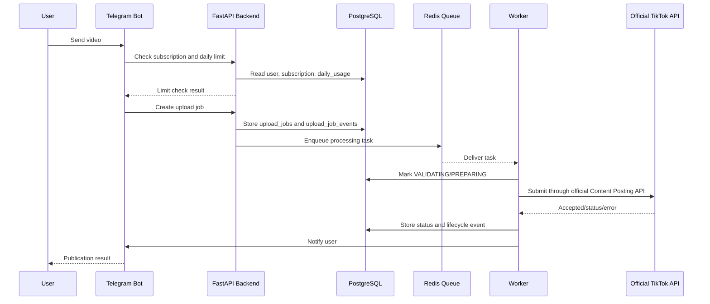
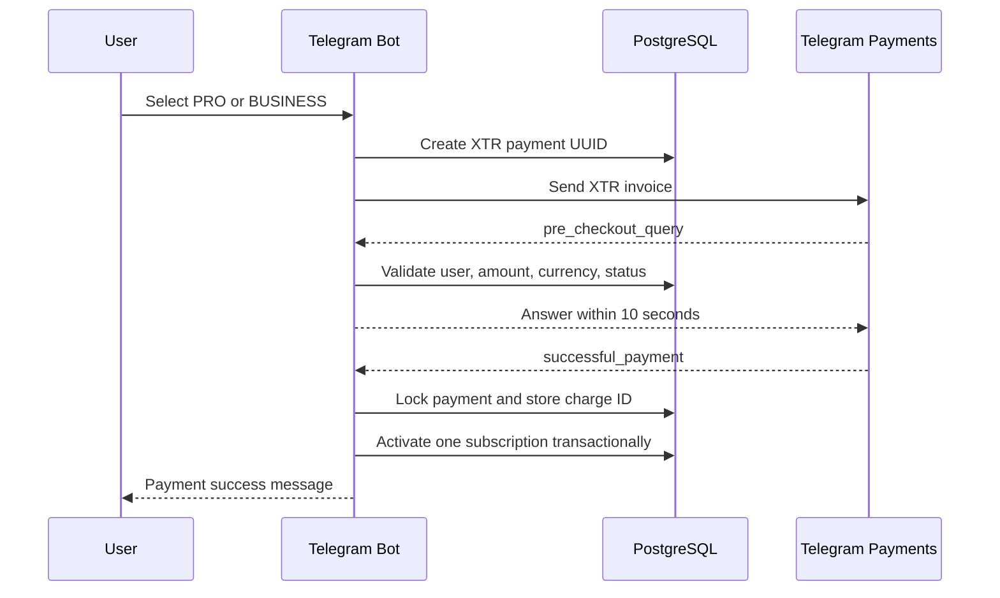

# Sequence Flows

The high-level component map is documented in [Project Component Map](component-map.md).

## Video Publication Flow

Rules:

- Use Request ID and Correlation ID across bot, API, worker, and logs.
- Create `upload_jobs` before enqueueing processing.
- Record every status transition.
- Retry only temporary failures.
- Consume daily usage only after official TikTok API acceptance.
- Do not retry automatically for authorization, permission, platform, or regional restrictions.

## Telegram Stars Payment Flow

Rules:

- FREE does not create a payment.
- Only `successful_payment` activates an in-bot subscription.
- Sending an invoice and accepting pre-checkout do not activate a subscription.
- Duplicate payment updates and charge IDs are idempotent.
- Payment status and subscription activation must be transactional.
- Never log bot tokens or sensitive payment data.

The separately approved Robokassa callback flow remains documented in
[Robokassa Setup](robokassa.md). Future SBP behavior is defined in
[SBP Merchant Payments](sbp.md); neither is presented as an alternative in-bot checkout for digital
subscriptions.

## Cross-Cutting Requirements

- All service-to-service operations must be logged with sanitized context.
- Use UTC timestamps in logs and database events.
- Use correlation IDs for linked operations.
- Persist webhook events before processing.
- Keep retries idempotent.
- Follow [Queue and Retry Policy](queue-retry-policy.md), [Observability and Diagnostics](observability-diagnostics.md), and [Error Codes and Exception Handling](error-handling.md).
